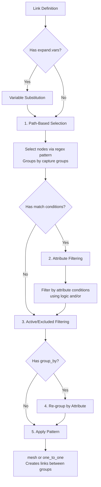
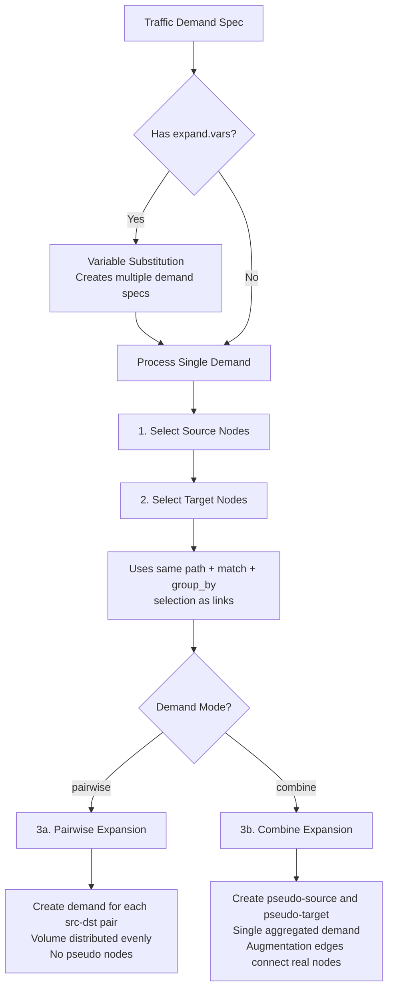

# NetGraph DSL Reference

Complete reference documentation for the NetGraph scenario DSL.

> For a quick start guide and common patterns, see the main [SKILL.md](../SKILL.md).
> For complete working examples, see [EXAMPLES.md](EXAMPLES.md).

## Syntax Overview

### Template and Expansion Syntaxes

NetGraph DSL uses three distinct template syntaxes in different contexts:

| Syntax | Example | Where | Purpose |
|--------|---------|-------|---------|
| **Brackets** `[1-3]` | `dc[1-3]/rack[a,b]` | Group names, risk groups | Generate multiple entities |
| **Variables** `$var` | `pod${p}/leaf` | Links, demands | Template expansion |
| **Format** `{n}` | `srv{n}` | `template` | Node naming |

**Important**: These syntaxes are NOT interchangeable:

- `[1-3]` works in group names and risk groups (definitions and memberships), not components
- `${var}` requires `expand.vars` dict; only works in link `source`/`target` and demand `source`/`target`
- `{n}` is the only placeholder available in `template` (Python format syntax)

### Endpoint Naming Conventions

| Context | Fields | Terminology |
|---------|--------|-------------|
| Links, link_rules | `source`, `target` | Graph edge |
| Traffic demands, workflow steps | `source`, `target` | Max-flow |

### Expansion Controls in Traffic Demands

Traffic demands have three expansion-related fields:

| Field | Values | Default | Purpose |
|-------|--------|---------|---------|
| `mode` | `combine`, `pairwise` | `combine` | How source/target nodes pair |
| `group_mode` | `flatten`, `per_group`, `group_pairwise` | `flatten` | How grouped nodes expand |
| `expand.mode` | `cartesian`, `zip` | `cartesian` | How `expand.vars` combine |

See detailed sections below for each mechanism.

## Entity Creation Architecture

The DSL implements two fundamentally different selection patterns optimized for different use cases. Understanding these patterns is essential for effective scenario authoring.

### Two Selection Models

The DSL uses distinct selection strategies depending on the operation:

**1. Path-Based Node Selection** (link rules, traffic demands, workflow steps)

- Uses regex patterns on hierarchical node names
- Supports capture group-based grouping
- Supports attribute-based grouping (`group_by`)
- Supports attribute filtering (`match` conditions)
- Supports `active_only` filtering

**2. Condition-Based Entity Selection** (failure rules, membership rules, risk group generation)

- Works on nodes/links; failure + membership can also target risk_groups
- Optional regex `path` filter on entity names/IDs (no capture grouping)
- Attribute filtering via `match.conditions` for failure/membership; generate uses `group_by` only

These patterns share common primitives (condition evaluation, match specification) but serve different purposes and should not be confused.

### Link Creation Flow

Link definitions create links between nodes using path-based selection with optional filtering:



**Processing Steps:**

1. **Path Selection**: Regex pattern matches nodes by hierarchical name
   - Capture groups create initial grouping
   - If no path specified, selects all nodes
2. **Attribute Filtering**: Optional `match` conditions filter nodes
   - Uses `logic: "and"` or `"or"` (default: `"or"`)
   - Supports operators: `==`, `!=`, `<`, `>`, `contains`, `in`, etc.
3. **Active Filtering**: Filters disabled nodes based on context
   - Link default: `active_only=false` (creates links to disabled nodes)
4. **Attribute Grouping**: Optional `group_by` overrides regex capture grouping
5. **Pattern Application**: Creates links between selected node groups
   - `mesh`: Every source to every target
   - `one_to_one`: Pairwise with wrap-around

**Key Characteristics:**

- `default_active_only=False` (links are created to disabled nodes)
- `match.logic` defaults to `"or"` (inclusive matching)
- Supports variable expansion via `expand.vars`

### Traffic Demand Creation Flow

Traffic demands follow a similar pattern but with important differences:



**Key Differences from Links:**

1. **Active-only default**: `default_active_only=True` (only active nodes participate)
2. **Two selection phases**: Source nodes first, then target nodes (both use same selector logic)
3. **Expansion modes**:
   - **Pairwise**: Creates individual demands for each (source, target) pair
   - **Combine**: Creates pseudo nodes and a single aggregated demand
4. **Group modes**: Additional layer (`flatten`, `per_group`, `group_pairwise`) for handling grouped selections

**Processing Steps:**

1. Select source nodes using unified selector (path + match + group_by)
2. Select target nodes using unified selector
3. Apply mode-specific expansion:
   - **Pairwise**: Volume evenly distributed across all pairs
   - **Combine**: Single demand with pseudo nodes for aggregation

### Risk Group Creation Flow

Risk groups use the condition-based selection model:

```mermaid
flowchart TD
    Start[Risk Groups Definition] --> Three[Three Creation Methods]
    Three --> Direct[1. Direct Definition]
    Three --> Member[2. Membership Rules]
    Three --> Generate[3. Generate Blocks]

    Direct --> DirectDesc[Simply name the risk group<br/>Entities reference it explicitly]

    Member --> MemberScope[Specify scope<br/>node, link, or risk_group]
    MemberScope --> MemberCond[Optional path filter<br/>Match conditions (logic defaults to and)]
    MemberCond --> MemberExec[Scan entities of that scope<br/>Apply path + match]

    Generate --> GenScope[Specify scope<br/>node or link only]
    GenScope --> GenGroupBy[Specify group_by attribute]
    GenGroupBy --> GenExec[Collect unique values<br/>Create risk group for each value<br/>Add entities with that value]
```

**Creation Methods:**

1. **Direct Definition**: Explicitly name risk groups, entities reference them
2. **Membership Rules**: Auto-assign entities based on attribute matching
3. **Generate Blocks**: Auto-create risk groups from unique attribute values

**Key Characteristics:**

- **Optional path filter**: Regex `path` narrows entities before matching
- **Membership uses `match.conditions`**; generate uses `group_by` only
- **`match.logic` defaults to "and"** for membership (stricter matching)
- **Hierarchical support**: Risk groups can contain other risk groups as children

### Comparison Table

| Feature | Links | Traffic Demands | Risk Groups |
|---------|-------|----------------|-------------|
| Selection Type | Path-based | Path-based | Condition-based |
| Regex Patterns | Yes | Yes | Yes (path filter) |
| Capture Groups | Yes | Yes | No |
| `group_by` | Yes | Yes | Yes (generate only) |
| `match` Conditions | Yes | Yes | Yes (membership/failure) |
| `active_only` Default | False | True | N/A |
| `match.logic` Default | "or" | "or" | "and" (membership) |
| Variable Expansion | Yes | Yes | No |
| Entity Scope | Nodes only | Nodes only | Nodes, links, risk_groups (generate: node/link) |

### Shared Evaluation Primitives

All selection mechanisms share common evaluation primitives:

1. **Condition evaluation**: `evaluate_condition()` handles all operators
   - Comparison: `==`, `!=`, `<`, `<=`, `>`, `>=`
   - String/collection: `contains`, `not_contains`, `in`, `not_in`
   - Existence: `exists`, `not_exists`

2. **Condition combining**: `evaluate_conditions()` applies `"and"`/`"or"` logic

3. **Attribute flattening**: Unified access to entity attributes
   - `flatten_node_attrs()`: Merges node.attrs with top-level fields
   - `flatten_link_attrs()`: Merges link.attrs with top-level fields
   - `flatten_risk_group_attrs()`: Merges risk_group.attrs with top-level fields

4. **Dot-notation support**: `resolve_attr_path()` handles nested attributes
   - Example: `hardware.vendor` resolves to `attrs["hardware"]["vendor"]`

5. **Variable expansion**: `expand_templates()` handles `$var` and `${var}` substitution
   - Supports `cartesian` and `zip` expansion modes

### Context-Aware Defaults

The DSL uses context-aware defaults to optimize for common use cases:

| Context | Selection Type | Active Only | Match Logic | Rationale |
|---------|---------------|-------------|-------------|-----------|
| Links | Path-based | False | "or" | Create links to all nodes, including disabled |
| Demands | Path-based | True | "or" | Only route traffic through active nodes |
| Node Rules | Path-based | False | "or" | Modify all matching nodes |
| Workflow Steps | Path-based | True | "or" | Analyze only active topology |
| Membership Rules | Condition-based | N/A | "and" | Precise matching for risk assignment |
| Failure Rules | Condition-based | N/A | "or" | Inclusive matching for failure scenarios |
| Generate Blocks | Condition-based | N/A | N/A | No conditions, groups by values |

These defaults ensure intuitive behavior while remaining overridable when needed.

## Top-Level Keys

| Key | Required | Purpose |
|-----|----------|---------|
| `network` | Yes | Network topology (nodes, links) |
| `blueprints` | No | Reusable topology templates |
| `components` | No | Hardware component library |
| `risk_groups` | No | Failure correlation groups |
| `vars` | No | YAML anchors for value reuse |
| `demands` | No | Traffic demand definitions |
| `failures` | No | Failure simulation policies |
| `workflow` | No | Analysis execution steps |
| `seed` | No | Master seed for reproducible random operations |

## Network Metadata

```yaml
network:
  name: "My Network"       # Optional: network name
  version: "1.0"           # Optional: version string or number
  nodes: ...
  links: ...
```

## Network Topology

### Direct Node Definitions

```yaml
network:
  nodes:
    Seattle:
      disabled: false           # Optional: disable node
      risk_groups: ["RG1"]      # Optional: failure correlation
      attrs:                    # Optional: custom attributes
        coords: [47.6062, -122.3321]
        role: core
        hardware:
          component: "SpineRouter"
          count: 1
```

**Allowed node keys**: `disabled`, `attrs`, `risk_groups`, `count`, `template`, `blueprint`, `params`, `nodes`

### Direct Link Definitions

```yaml
network:
  links:
    - source: Seattle
      target: Portland
      capacity: 100.0          # Direct property
      cost: 10
      disabled: false
      risk_groups: ["RG_Seattle_Portland"]
      attrs:
        distance_km: 280
        media_type: fiber
        hardware:
          source:
            component: "800G-ZR+"
            count: 1
            exclusive: false   # Optional: unsharable usage (rounds up)
          target:
            component: "800G-ZR+"
            count: 1
      count: 2                 # Optional: parallel links
```

**Allowed link keys**: `source`, `target`, `pattern`, `count`, `capacity`, `cost`, `disabled`, `risk_groups`, `attrs`, `expand`

**Link hardware per-end fields**: `component`, `count`, `exclusive`

### Node Groups

Groups create multiple nodes from a template (distinguished by having `count` field):

```yaml
network:
  nodes:
    servers:
      count: 4
      template: "srv{n}"
      disabled: false
      risk_groups: ["RG_Servers"]
      attrs:
        role: compute
```

Creates: `servers/srv1`, `servers/srv2`, `servers/srv3`, `servers/srv4`

**Group-specific keys**: `count`, `template`

### Nested Inline Nodes

Create hierarchical structures without blueprints using inline `nodes`:

```yaml
network:
  nodes:
    datacenter:
      attrs:
        region: west
      nodes:
        rack1:
          count: 2
          template: "srv{n}"
          attrs:
            role: compute
        rack2:
          count: 2
          template: "srv{n}"
```

Creates: `datacenter/rack1/srv1`, `datacenter/rack1/srv2`, `datacenter/rack2/srv1`, `datacenter/rack2/srv2`

**Key points:**

- Child nodes inherit parent `attrs`, `disabled`, and `risk_groups`
- Child-specific values override inherited ones
- Can be nested to any depth
- Useful for simple hierarchies without reusable blueprints

**Allowed keys for nested containers**: `nodes`, `attrs`, `disabled`, `risk_groups`

### Bracket Expansion

Create multiple similar groups using bracket notation:

```yaml
network:
  nodes:
    dc[1-3]/rack[a,b]:
      count: 4
      template: "srv{n}"
```

**Expansion types**:

- Numeric ranges: `[1-4]` -> 1, 2, 3, 4
- Explicit lists: `[a,b,c]` -> a, b, c
- Mixed: `[1,3,5-7]` -> 1, 3, 5, 6, 7

Multiple brackets create Cartesian product.

**Scope**: Bracket expansion applies to:

- **Group names** under `network.nodes` and `blueprints.*.nodes`
- **Risk group names** in top-level `risk_groups` definitions (including children)
- **Risk group membership arrays** on nodes, links, and groups

It does NOT apply to: component names, direct node names without `count`, or other string fields.

**Risk group expansion examples**:

```yaml
# Definition expansion - creates DC1_Power, DC2_Power, DC3_Power
risk_groups:
  - name: "DC[1-3]_Power"

# Membership expansion - assigns to RG1, RG2, RG3
network:
  nodes:
    Server:
      risk_groups: ["RG[1-3]"]
```

### Path Patterns

Path patterns in selectors and rules are **regex patterns** matched against node names using `re.match()` (anchored at start).

**Key behaviors**:

- Paths are matched from the **start** of the node name (no implicit `.*` prefix)
- Node names are hierarchical: `group/subgroup/node1`
- Leading `/` is stripped before matching (has no functional effect)
- All paths are relative to the current scope

**Examples**:

| Pattern | Matches | Does NOT Match |
|---------|---------|----------------|
| `leaf` | `leaf/leaf1`, `leaf/leaf2` | `pod1/leaf/leaf1` |
| `pod1/leaf` | `pod1/leaf/leaf1` | `pod2/leaf/leaf1` |
| `.*leaf` | `leaf/leaf1`, `pod1/leaf/leaf1` | (matches any path containing "leaf") |
| `pod[12]/leaf` | `pod1/leaf/leaf1`, `pod2/leaf/leaf1` | `pod3/leaf/leaf1` |

**Path scoping**:

- **At top-level** (`network.links`): Parent path is empty, so patterns match against full node names. `/leaf` and `leaf` are equivalent.
- **In blueprints**: Paths are relative to instantiation path. If `pod1` uses a blueprint with `source: /leaf`, the pattern becomes `pod1/leaf`.

### Link Rules (with patterns)

```yaml
network:
  links:
    - source: /leaf
      target: /spine
      pattern: mesh
      capacity: 100
      cost: 1
      count: 1
```

**Patterns**:

- `mesh`: Full connectivity (every source to every target)
- `one_to_one`: Pairwise with modulo wrap. Sizes must have multiple factor (4-to-2 OK, 3-to-2 ERROR)

### Link Selectors

Filter nodes using attribute conditions:

```yaml
network:
  links:
    - source:
        path: "/datacenter"
        match:
          logic: and           # "and" or "or" (default varies by context)
          conditions:
            - attr: role
              op: "=="
              value: leaf
            - attr: tier
              op: ">="
              value: 2
      target:
        path: "/datacenter"
        match:
          conditions:
            - attr: role
              op: "=="
              value: spine
      pattern: mesh
      capacity: 100
```

**Condition operators**:

| Operator | Description |
|----------|-------------|
| `==` | Equal |
| `!=` | Not equal |
| `<`, `<=`, `>`, `>=` | Numeric comparison |
| `contains` | String/list contains value |
| `not_contains` | String/list does not contain |
| `in` | Value in list |
| `not_in` | Value not in list |
| `exists` | Attribute exists and is not None |
| `not_exists` | Attribute missing or None |

### Variable Expansion in Links

Use `$var` or `${var}` syntax in link `source`/`target` fields:

```yaml
network:
  links:
    - source: "plane${p}/rack"
      target: "spine${s}"
      expand:
        vars:
          p: [1, 2]
          s: [1, 2, 3]
        mode: cartesian
      pattern: mesh
      capacity: 100
```

**Expansion modes**:

- `cartesian` (default): All combinations (2 * 3 = 6 expansions)
- `zip`: Pair by index (lists must have equal length)

**Expansion limit**: Maximum 10,000 expansions per template. Exceeding this raises an error.

## Blueprints

Reusable topology templates:

```yaml
blueprints:
  clos_pod:
    nodes:
      leaf:
        count: 4
        template: "leaf{n}"
        attrs:
          role: leaf
      spine:
        count: 2
        template: "spine{n}"
        attrs:
          role: spine
    links:
      - source: /leaf
        target: /spine
        pattern: mesh
        capacity: 100
        cost: 1
```

### Blueprint Usage

```yaml
network:
  nodes:
    pod1:
      blueprint: clos_pod
      attrs:                    # Merged into all subgroup nodes
        location: datacenter_east
      params:                   # Override blueprint defaults
        leaf.count: 6
        spine.template: "core{n}"
        leaf.attrs.priority: high
```

Creates: `pod1/leaf/leaf1`, `pod1/spine/spine1`, etc.

**Parameter override syntax**: `<group>.<field>` or `<group>.attrs.<nested_key>`

### Blueprint Path Scoping

All paths are relative to the current scope. In blueprints, paths resolve relative to the instantiation path:

```yaml
blueprints:
  my_bp:
    links:
      - source: /leaf   # Becomes pod1/leaf when instantiated as pod1
        target: spine   # Also becomes pod1/spine (leading / is optional)
        pattern: mesh
```

**Note**: Leading `/` is stripped and has no functional effect. Both `/leaf` and `leaf` produce the same result. The `/` serves as a visual convention indicating "from scope root".

## Node and Link Rules

Modify nodes/links after initial creation:

```yaml
network:
  node_rules:
    - path: "^pod1/spine/.*$"  # Regex pattern
      disabled: true
      risk_groups: ["Maintenance"]
      attrs:
        maintenance_mode: active

  link_rules:
    - source: "^pod1/leaf/.*$"
      target: "^pod1/spine/.*$"
      bidirectional: true       # Match both directions (default: true)
      capacity: 200
      attrs:
        upgraded: true
```

### Node Rule Fields

- `path`: Regex pattern for matching node names (default: `".*"`)
- `match`: Optional attribute conditions to filter nodes (see below)
- `expand`: Optional variable expansion (see [Variable Expansion](#variable-expansion-in-rules))
- `disabled`, `risk_groups`, `attrs`: Properties to set on matching nodes

**Node rule with match conditions:**

```yaml
node_rules:
  - path: ".*"
    match:
      logic: and              # "and" or "or" (default: "or")
      conditions:
        - {attr: role, op: "==", value: compute}
        - {attr: tier, op: ">=", value: 2}
    disabled: true
```

### Link Rule Fields

- `source`, `target`: Regex patterns for matching link endpoints
- `bidirectional`: If `true` (default), matches both A→B and B→A directions
- `link_match`: Optional conditions to filter by the link's own attributes
- `expand`: Optional variable expansion (see [Variable Expansion](#variable-expansion-in-rules))
- Direct properties: `capacity`, `cost`, `disabled`, `risk_groups`, `attrs`

**Link rule with link_match:**

```yaml
link_rules:
  - source: "^pod1/.*$"
    target: "^pod2/.*$"
    link_match:
      logic: and
      conditions:
        - {attr: capacity, op: ">=", value: 400}
        - {attr: type, op: "==", value: fiber}
    cost: 99                  # Only high-capacity fiber links updated
```

### Variable Expansion in Rules

Use `expand` to apply a rule across multiple patterns:

```yaml
node_rules:
  - path: "${dc}_srv1"
    expand:
      vars:
        dc: [dc1, dc2, dc3]
      mode: cartesian
    attrs:
      tagged: true

link_rules:
  - source: "${src}_srv"
    target: "${tgt}_srv"
    expand:
      vars:
        src: [dc1, dc2]
        tgt: [dc2, dc3]
      mode: zip               # Pairs by index: dc1->dc2, dc2->dc3
    capacity: 200
```

**Processing order**:

1. Groups and direct nodes created
2. **Node rules applied**
3. Blueprint links and network links expanded
4. Direct links created
5. **Link rules applied**

## Components Library

Define hardware components for cost/power modeling:

```yaml
components:
  SpineRouter:
    component_type: chassis
    description: "64-port spine router"
    capex: 50000.0              # Cost per instance
    power_watts: 2500.0         # Typical power usage
    power_watts_max: 3000.0     # Peak power usage
    capacity: 64000.0           # Gbps
    ports: 64
    attrs:
      vendor: "Example Corp"
    children:
      LineCard400G:
        component_type: linecard
        capex: 8000.0
        power_watts: 400.0
        capacity: 12800.0
        ports: 32
        count: 4

  Optic400G:
    component_type: optic
    description: "400G pluggable optic"
    capex: 2500.0
    power_watts: 12.0
    capacity: 400.0
```

**Component fields**:

| Field | Description |
|-------|-------------|
| `component_type` | Category: `chassis`, `linecard`, `optic`, etc. |
| `description` | Human-readable description |
| `capex` | Cost per instance |
| `power_watts` | Typical power consumption (watts) |
| `power_watts_max` | Peak power consumption (watts) |
| `capacity` | Capacity in Gbps |
| `ports` | Number of ports |
| `count` | Instance count (for children) |
| `attrs` | Additional metadata |
| `children` | Nested child components |

**Usage in nodes/links**:

```yaml
network:
  nodes:
    spine1:
      attrs:
        hardware:
          component: "SpineRouter"
          count: 2
```

## Risk Groups

Risk groups define hierarchical failure correlation using three methods: direct definition, membership rules, and dynamic generation. Groups can model any failure domain: physical infrastructure, geographic regions, vendor dependencies, or custom correlation patterns.

### Direct Definition

```yaml
risk_groups:
  # Full object form with hierarchy
  - name: "Region_West"
    disabled: false             # Optional: disable on load
    attrs:
      type: geographic
    children:
      - name: "Site_Seattle"
        children:
          - name: "Cluster_SEA_01"
      - name: "Site_Portland"

  # String shorthand (equivalent to {name: "CustomGroup"})
  - "CustomGroup"
```

**Risk group fields**: `name` (required), `disabled`, `attrs`, `children`, `membership`, `generate`

### Membership Rules

Dynamically assign entities to risk groups based on attribute conditions:

```yaml
risk_groups:
  - name: HighCapacityLinks
    membership:
      scope: link              # Required: node, link, or risk_group
      match:
        logic: and             # "and" or "or" (default: "and")
        conditions:
          - attr: capacity
            op: ">="
            value: 1000

  - name: CoreNodes
    membership:
      scope: node
      match:
        logic: and
        conditions:
          - attr: role
            op: "=="
            value: core
          - attr: tier
            op: ">="
            value: 2
```

**Key points:**

- `scope`: Type of entities to match (`node`, `link`, or `risk_group`)
- `match.logic`: Defaults to `"and"` (stricter than other contexts)
- `match.conditions`: Uses same operators as selectors
- Entities are added to risk group during network build
- Supports dot-notation for nested attributes (e.g., `hardware.vendor`)

### Generate Blocks

Automatically create risk groups from unique attribute values:

```yaml
risk_groups:
  - generate:
      scope: link              # Required: node or link (not risk_group)
      group_by: connection_type # Attribute to group by (supports dot-notation)
      name: "LinkType_${value}"
      attrs:                   # Optional: static attrs for generated groups
        generated: true

  - generate:
      scope: node
      group_by: region
      name: "Region_${value}"
```

**Generate block fields:**

| Field | Required | Description |
|-------|----------|-------------|
| `scope` | Yes | `node` or `link` (cannot generate from risk_groups) |
| `group_by` | Yes | Attribute name (supports dot-notation) |
| `name` | Yes | Template with `${value}` placeholder |
| `path` | No | Regex to filter entities before grouping |
| `attrs` | No | Static attributes for generated groups |

**Using path to filter entities:**

```yaml
risk_groups:
  - generate:
      scope: node
      path: "^prod_.*"         # Only production nodes
      group_by: env
      name: "Env_${value}"
```

This creates risk groups only from nodes matching the path pattern. For example, if you have `prod_srv1`, `prod_srv2` (env: production), and `dev_srv1` (env: development), only `Env_production` is created because `dev_srv1` doesn't match `^prod_.*`.

**Key points:**

- Creates one risk group per unique attribute value
- Entities with null/missing attribute are skipped
- Generated groups are created during network build
- Use `path` to narrow scope before grouping

### Validation

Risk group references are validated at scenario load time:

**Undefined References:** All risk group names referenced by nodes and links must exist in the `risk_groups` section. Validation errors list affected entities and undefined groups:

```yaml
# This will fail validation
network:
  nodes:
    Router1:
      risk_groups: ["PowerZone_A"]  # References undefined risk group

risk_groups:
  - name: "PowerZone_B"  # Only PowerZone_B is defined
```

**Circular Hierarchies:** Parent-child relationships cannot form cycles:

```yaml
# This will fail validation
risk_groups:
  - name: "GroupA"
    children:
      - name: "GroupB"
        children:
          - name: "GroupA"  # Error: circular reference
```

## Traffic Demands

```yaml
demands:
  production:
    - source: "^dc1/.*"
      target: "^dc2/.*"
      volume: 1000
      demand_placed: 0.0      # Optional: pre-placed portion
      mode: combine
      group_mode: flatten     # How to handle grouped nodes
      priority: 1
      flow_policy: SHORTEST_PATHS_ECMP
      attrs:
        service: web

    - source:
        path: "^datacenter/.*"
        match:
          conditions:
            - attr: role
              op: "=="
              value: leaf
      target:
        group_by: metro
      volume: 500
      mode: pairwise
      priority: 2
```

### Traffic Modes

| Mode | Description |
|------|-------------|
| `combine` | Single aggregate flow between source/target groups via pseudo nodes |
| `pairwise` | Individual flows between all source-target node pairs |

### Group Modes

When selectors use `group_by`, `group_mode` controls how grouped nodes produce demands:

| Group Mode | Description |
|------------|-------------|
| `flatten` | Flatten all groups into single source/target sets (default) |
| `per_group` | Create separate demands for each group |
| `group_pairwise` | Create pairwise demands between groups |

### Flow Policies

Flow policies can be specified as preset strings or inline configuration objects.

**Preset strings:**

| Preset | Description |
|--------|-------------|
| `SHORTEST_PATHS_ECMP` | IP/IGP routing with equal-split ECMP |
| `SHORTEST_PATHS_WCMP` | IP/IGP routing with weighted ECMP (by capacity) |
| `TE_WCMP_UNLIM` | MPLS-TE / SDN with unlimited tunnels |
| `TE_ECMP_16_LSP` | MPLS-TE with 16 ECMP LSPs per demand |
| `TE_ECMP_UP_TO_256_LSP` | MPLS-TE with up to 256 ECMP LSPs |

**Inline configuration objects:**

For advanced scenarios, you can specify a custom flow policy as an inline object:

```yaml
demands:
  custom:
    - source: A
      target: B
      volume: 100
      flow_policy:
        path_alg: SPF
        flow_placement: PROPORTIONAL
```

Inline objects are preserved and passed to the analysis engine. The supported fields depend on the underlying NetGraph-Core FlowPolicyConfig. Common fields include:

- `path_alg`: Path algorithm (`SPF`, etc.)
- `flow_placement`: Flow distribution strategy (`PROPORTIONAL`, `EQUAL_BALANCED`)

**Note:** Preset strings are recommended for most use cases. Inline objects provide flexibility for specialized routing behaviors but require knowledge of the underlying configuration options.

### Variable Expansion in Demands

```yaml
demands:
  inter_dc:
    - source: "^${src_dc}/.*"
      target: "^${dst_dc}/.*"
      volume: 100
      expand:
        vars:
          src_dc: [dc1, dc2]
          dst_dc: [dc2, dc3]
        mode: cartesian
```

## Failure Policies

Failure policies define how nodes, links, and risk groups fail during Monte Carlo simulations.

### Structure

```yaml
failures:
  policy_name:
    attrs: {}                        # Optional metadata
    expand_groups: false             # Expand to shared-risk entities
    expand_children: false           # Fail child risk groups recursively
    modes:                           # Required: weighted failure modes
      - weight: 1.0                  # Mode selection weight
        attrs: {}                    # Optional mode metadata
        rules: []                    # Rules applied when mode is selected
```

### Mode Selection

Exactly one mode is selected per failure iteration based on normalized weights:

```yaml
modes:
  - weight: 0.3   # 30% probability of selection
    rules: [...]
  - weight: 0.5   # 50% probability
    rules: [...]
  - weight: 0.2   # 20% probability
    rules: [...]
```

- Modes with zero or negative weight are never selected
- If all weights are non-positive, falls back to the first mode

### Rule Structure

```yaml
rules:
  - scope: link                # Required: node, link, or risk_group
    path: "^edge/.*"           # Optional regex on entity name/id
    match:
      conditions: []           # Optional: filter conditions
      logic: or                # Condition logic: and | or (default: or)
    mode: all                  # Selection: all | choice | random (default: all)
    probability: 1.0           # For random: [0.0, 1.0]
    count: 1                   # For choice: number to select
    weight_by: null            # For choice: attribute for weighted sampling
```

### Rule Modes

| Mode | Description | Parameters |
|------|-------------|------------|
| `all` | Select all matching entities | None |
| `choice` | Random sample from matches | `count`, optional `weight_by` |
| `random` | Each match selected with probability | `probability` in [0, 1] |

### Condition Logic

When multiple `match.conditions` are specified:

| Logic | Behavior |
|-------|----------|
| `or` | Entity matches if **any** condition is true |
| `and` | Entity matches if **all** conditions are true |

If `match` is omitted or `match.conditions` is empty, all entities of the given scope match.

**Context-specific defaults**:

| Context | Default `logic` | Rationale |
|---------|-----------------|-----------|
| Link `match` | `"or"` | Inclusive: match any condition |
| Demand `match` | `"or"` | Inclusive: match any condition |
| Membership rules | `"and"` | Precise: must match all conditions |
| Failure rules | `"or"` | Inclusive: match any condition |

### Weighted Sampling (choice mode)

When `weight_by` is set for `mode: choice`:

```yaml
- scope: link
  mode: choice
  count: 2
  weight_by: capacity   # Sample proportional to capacity attribute
```

- Uses Efraimidis-Spirakis algorithm for weighted sampling without replacement
- Entities with non-positive or missing weights are sampled uniformly after positive-weight items
- Falls back to uniform sampling if all weights are non-positive

### Risk Group Expansion

```yaml
expand_groups: true
```

When enabled, after initial failures are selected, expands to fail all entities that share a risk group with any failed entity (BFS traversal).

```yaml
expand_children: true
```

When enabled and a risk_group is marked as failed, recursively fails all child risk groups.

### Complete Example

```yaml
failures:
  weighted_modes:
    attrs:
      description: "Balanced failure simulation"
    expand_groups: true
    expand_children: false
    modes:
      # 30% chance: fail 1 risk group weighted by distance
      - weight: 0.3
        rules:
          - scope: risk_group
            mode: choice
            count: 1
            weight_by: distance_km

      # 50% chance: fail 1 non-core node weighted by capacity
      - weight: 0.5
        rules:
          - scope: node
            mode: choice
            count: 1
            match:
              logic: and
              conditions:
                - attr: role
                  op: "!="
                  value: core
            weight_by: attached_capacity_gbps

      # 20% chance: random link failures with 1% probability each
      - weight: 0.2
        rules:
          - scope: link
            mode: random
            probability: 0.01
```

### Entity Scopes

| Scope | Description |
|-------|-------------|
| `node` | Match against node attributes |
| `link` | Match against link attributes |
| `risk_group` | Match against risk group names/attributes |

## Workflow Steps

```yaml
workflow:
  - type: NetworkStats
    name: baseline_stats

  - type: MaximumSupportedDemand
    name: msd_baseline
    demand_set: production
    acceptance_rule: hard
    alpha_start: 1.0
    growth_factor: 2.0
    resolution: 0.05

  - type: TrafficMatrixPlacement
    name: tm_placement
    demand_set: production
    failure_policy: weighted_modes
    iterations: 1000
    parallelism: 8
    alpha_from_step: msd_baseline
    alpha_from_field: data.alpha_star

  - type: MaxFlow
    name: capacity_matrix
    source: "^(dc[1-3])$"
    target: "^(dc[1-3])$"
    mode: pairwise
    failure_policy: single_link
    iterations: 500
    baseline: true

  - type: CostPower
    name: cost_analysis
    include_disabled: true
    aggregation_level: 2
```

### Step Types

| Type | Description |
|------|-------------|
| `BuildGraph` | Export graph to JSON (node-link format) |
| `NetworkStats` | Compute basic statistics (node/link counts, degrees) |
| `MaxFlow` | Monte Carlo capacity analysis between node groups |
| `TrafficMatrixPlacement` | Monte Carlo demand placement for a named matrix |
| `MaximumSupportedDemand` | Search for maximum supportable demand scaling (`alpha_star`) |
| `CostPower` | Cost and power estimation from components |

### BuildGraph Parameters

```yaml
- type: BuildGraph
  name: build_graph
  add_reverse: true   # Add reverse edges for bidirectional connectivity
```

### NetworkStats Parameters

```yaml
- type: NetworkStats
  name: stats
  include_disabled: false           # Include disabled nodes/links in stats
  excluded_nodes: []                # Optional: temporary node exclusions
  excluded_links: []                # Optional: temporary link exclusions
```

### MaxFlow Parameters

Baseline (no failures) is always run first as a reference. The `iterations` parameter specifies how many failure scenarios to run.

```yaml
- type: MaxFlow
  name: capacity_analysis
  source: "^servers/.*"
  target: "^storage/.*"
  mode: combine              # combine | pairwise
  failure_policy: policy_name
  iterations: 1000
  parallelism: auto          # or integer
  seed: 42                   # Optional: for reproducibility
  shortest_path: false       # Restrict to shortest paths only
  require_capacity: true     # Path selection considers capacity
  flow_placement: PROPORTIONAL  # PROPORTIONAL | EQUAL_BALANCED
  store_failure_patterns: false
  include_flow_details: false   # Cost distribution per flow
  include_min_cut: false        # Min-cut edge list per flow
```

### TrafficMatrixPlacement Parameters

Baseline (no failures) is always run first as a reference. The `iterations` parameter specifies how many failure scenarios to run.

```yaml
- type: TrafficMatrixPlacement
  name: tm_placement
  demand_set: default
  failure_policy: policy_name
  iterations: 100
  parallelism: auto
  placement_rounds: auto     # or integer
  seed: 42                   # Optional: for reproducibility
  include_flow_details: true
  include_used_edges: false
  store_failure_patterns: false
  # Alpha scaling options
  alpha: 1.0                 # Explicit scaling factor
  # Or reference another step's output:
  alpha_from_step: msd_step_name
  alpha_from_field: data.alpha_star
```

### MaximumSupportedDemand Parameters

```yaml
- type: MaximumSupportedDemand
  name: msd
  demand_set: default
  acceptance_rule: hard      # Currently only "hard" supported
  alpha_start: 1.0           # Starting alpha for search
  growth_factor: 2.0         # Growth factor for bracketing (> 1.0)
  alpha_min: 0.000001        # Minimum alpha bound
  alpha_max: 1000000000.0    # Maximum alpha bound
  resolution: 0.01           # Convergence resolution
  max_bracket_iters: 32
  max_bisect_iters: 32
  seeds_per_alpha: 1         # Seeds per alpha (majority vote)
  placement_rounds: auto
```

### CostPower Parameters

```yaml
- type: CostPower
  name: cost_power
  include_disabled: false    # Include disabled nodes/links
  aggregation_level: 2       # Hierarchy level for aggregation (split by /)
```

## Selector Reference

Selectors work across links, demands, and workflows.

### Selection Patterns

The DSL uses two distinct selection patterns:

**Path-based Node Selection** (links, demands, workflows):

- Works on node entities
- Uses regex patterns on hierarchical node names (`path`)
- Supports capture group-based grouping
- Supports attribute-based grouping (`group_by`)
- Supports attribute filtering (`match` conditions)
- Supports `active_only` filtering

**Condition-based Entity Selection** (failure rules, membership rules):

- Works on nodes, links, or risk_groups (`scope`)
- Uses only attribute-based filtering (`conditions`)
- No path/regex patterns (operates on all entities of specified type)
- See Failure Policies section for details

### String Pattern (Regex)

```yaml
source: "^dc1/spine/.*$"
```

Patterns use Python `re.match()`, anchored at start.

### Selector Object

```yaml
source:
  path: "^dc1/.*"           # Regex on node.name
  group_by: metro           # Group by attribute value
  match:                    # Filter by conditions
    logic: and
    conditions:
      - attr: role
        op: "=="
        value: spine
  active_only: true         # Exclude disabled nodes
```

At least one of `path`, `group_by`, or `match` must be specified.

### Context-Aware Defaults for active_only

The `active_only` field has context-dependent defaults:

| Context | Default | Rationale |
|---------|---------|-----------|
| `links` | `false` | Links to disabled nodes are created |
| `node_rules` | `false` | Rules can target disabled nodes |
| `demand` | `true` | Traffic only between active nodes |
| `workflow` | `true` | Analysis uses active nodes only |

### Capture Groups for Labeling

```yaml
# Single capture group
source: "^(dc[1-3])/.*"     # Groups: dc1, dc2, dc3

# Multiple capture groups join with |
source: "^(dc\\d+)/(spine|leaf)/.*"  # Groups: dc1|spine, dc1|leaf
```

## YAML Anchors

Use `vars` section for reusable values:

```yaml
vars:
  default_cap: &cap 10000
  base_attrs: &attrs {cost: 100, region: "dc1"}
  spine_config: &spine_cfg
    hardware:
      component: "SpineRouter"
      count: 1

network:
  nodes:
    spine1: {attrs: {<<: *attrs, <<: *spine_cfg, capacity: *cap}}
    spine2: {attrs: {<<: *attrs, <<: *spine_cfg, capacity: *cap, region: "dc2"}}
```

Anchors are resolved during YAML parsing, before schema validation.
