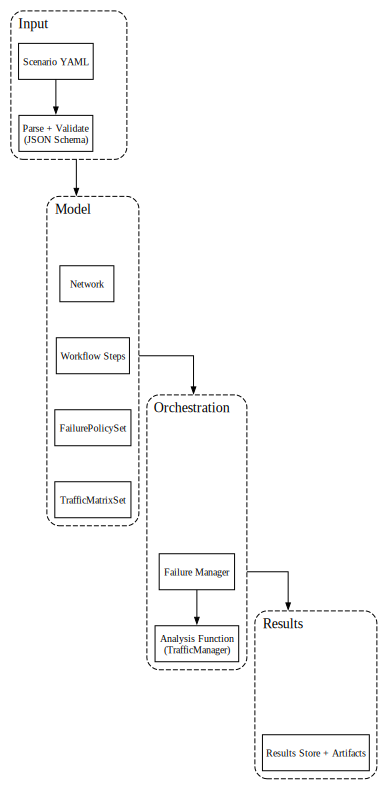

# NetGraph Design and Implementation

This document describes NetGraph's internal design: scenario DSL, data models, execution flow, algorithms, manager components, and result handling. It focuses on architecture and key implementation details.

## Overview

NetGraph is a network scenario analysis engine using a **hybrid Python+C++ architecture**. It takes a scenario (defined in a YAML DSL) as input, builds a directed multigraph model of the network, and runs a configurable workflow of analysis steps (like traffic placement or max-flow capacity) to produce structured results.

### Architecture Layers

**Python Layer (NetGraph):**

- CLI and API: Entry points to load scenarios and invoke analyses
- Scenario DSL Parser: Validates and expands the YAML scenario into an internal model
- Domain Model: In-memory representation of nodes, links, risk groups, etc., with selection and grouping utilities
- Managers: Orchestrators for higher-level behaviors (demand expansion, failure enumeration)
- Workflow Engine: Composes steps into end-to-end analyses, storing outputs in a results store
- Results Store: Collects outputs and metadata from each step, enabling structured JSON export
- Adapter Layer: Translates between Python domain objects and C++ graph representations

**C++ Layer (NetGraph-Core):**

- StrictMultiDiGraph: Immutable directed multigraph with CSR adjacency representation
- Shortest Paths (SPF): Dijkstra's algorithm with multipath support and configurable edge selection
- K-Shortest Paths: Yen's algorithm for finding k-shortest simple paths
- Max-Flow: Successive shortest paths with blocking flow augmentation and configurable flow placement policies
- Backend Interface: Abstraction for algorithm execution (CPU backend provided)

### Integration Points

The Python layer uses an adapter (`ngraph.adapters.core`) to:

1. Build Core graphs from Network instances with optional exclusions
2. Map node names (str) ↔ NodeId (int32)
3. Map link IDs (str) ↔ EdgeId/ext_edge_id (int64)
4. Translate results (costs, flows, paths) back to scenario-level objects

Core algorithms release the GIL during execution, enabling concurrent Python threads to execute analysis in parallel with minimal Python-level overhead.

### Execution Flow

The diagram below shows the architecture and end-to-end execution flow from scenario input through both Python and C++ layers to final results. The Python layer handles scenario loading, workflow orchestration, and result aggregation, while compute-intensive graph algorithms execute in C++ with the GIL released for parallel execution.



## Scenario DSL and Input Expansion

NetGraph scenarios are defined in YAML using a declarative DSL (see [DSL Reference](dsl.md)). The DSL allows concise specification of network topologies, traffic demands, failure policies, and analysis workflows. Before execution, scenario files are validated against a JSON Schema to catch errors early (unknown keys, type mismatches), enforcing strict definitions.

Key elements of the DSL include:

- **Seed**: A master random seed for the scenario to ensure deterministic behavior across runs.

- **Blueprints**: Reusable templates for subsets of the topology. A blueprint defines internal node types, roles, and optional internal links. Blueprints enable defining a complex multi-node topology once and instantiating it multiple times with different parameters.

- **Groups**: Definitions of groups of nodes in the topology, either explicitly or via patterns. Groups can use a blueprint (use_blueprint) with parameters, or define a number of nodes (node_count) with a naming template.

- **Adjacency**: Rules to generate links between groups of nodes. Instead of enumerating every link, an adjacency rule specifies source and target selectors (by path pattern), a wiring pattern (e.g. mesh for full mesh or one_to_one for paired links), number of parallel links (link_count), and link parameters (capacity, cost, attributes like distance, hardware, risk group tags, etc.). Advanced matching allows filtering nodes by attributes with logical conditions (AND/OR) to apply adjacency rules to selected nodes only. A single rule can thus expand into many concrete links.

- **Overrides**: Optional modifications applied after the initial expansion. node_overrides or link_overrides can match specific nodes or links (by path or endpoints) and change their attributes or disable them. This allows fine-tuning or simulating removals without changing the base definitions.

- **Risk Groups**: Named shared-risk groups (potentially nested) that nodes or links can belong to. These are used in failure scenarios to correlate failures (e.g. all links in a risk group fail together).

- **Traffic Matrices**: Demand definitions specifying source node sets, sink node sets (by regex or attribute path selectors), and demand volume. Each demand can also include priority or custom flow placement policy.

- **Failure Policies**: Definitions of failure scenarios or modes, possibly with weights (probabilities). For example, a policy might say "with 5% chance, fail any single core node" or "fail all links in risk_group X". The failure manager uses these policies to generate specific failure combinations for simulation.

- **Workflow**: An ordered list of analysis steps to execute. Each step has a step_type (the analysis to perform, such as "MaxFlow" or "TrafficMatrixPlacement"), a unique name, and parameters (like number of iterations, etc.). The workflow definition orchestrates the analysis pipeline.

### DSL Expansion Process

The loader validates and expands DSL definitions into concrete nodes and links. Unknown fields or schema violations cause an immediate error before any expansion. After schema validation, blueprints are resolved (each blueprint group becomes actual Node objects), group name patterns are expanded into individual names, and adjacency rules are iterated over matching source-target node sets to create Link objects. All nodes and links are then validated in runtime to ensure they are valid (e.g., no duplicate node names, all link endpoints exist).

## Data Model

Once the scenario is parsed and expanded, NetGraph represents the network with a set of core model classes. These define the in-memory representation of the scenario topology and enforce structural invariants (unique node names, valid link endpoints).

### Node

A Node represents a network node (vertex). Each node has:

- a unique name (string identifier),

- a disabled flag (if the node is turned off in the scenario),

- a set of risk_groups (associating the node with any failure domains), and

- an attrs dictionary for arbitrary metadata (e.g., region, device type, hardware info)

### Link

A Link represents a directed link between a source and target node. Each link has:

- source and target node names,

- capacity (float, e.g. in some bandwidth unit),

- cost (float, e.g. distance or latency metric),

- disabled flag,

- risk_groups set,

- attrs dict for metadata (e.g. distance_km, fiber type), and

- an auto-generated unique id

The id is constructed as "source|target|<random_base64>", ensuring each link has a distinct identifier. The model stores each link as directed (source -> target). When the analysis graph is built, a reverse edge is added by default so algorithms see bidirectional connectivity.

### RiskGroup

A RiskGroup represents a named failure domain or shared-risk link group (SRLG). Risk groups can be hierarchical (a risk group may have children risk groups). Each RiskGroup has:

- a name,

- list of children RiskGroups (which inherit the failure domain property),

- disabled flag (if the entire group is considered initially failed in the scenario), and

- an attrs dict for any metadata

Hierarchical risk groups allow, for example, defining a large domain composed of smaller sub-domains. A failure event could disable an entire group, implicitly affecting all its descendants.

### Network

A Network is the container class that holds all nodes, links, and top-level risk groups for the scenario. The Network class maintains:

- nodes: Dict[name, Node],

- links: Dict[id, Link],

- risk_groups: Dict[name, RiskGroup],

Network is the container for scenario topology. It enforces invariants during construction: adding a link validates that source and target nodes exist; adding a node rejects duplicates by name. Components are never removed from the Network; the `disabled` flag marks them inactive. The Network also maintains a selection cache for `select_node_groups_by_path` to avoid repeated regex/attribute queries.

### Node and Link Selection

A powerful feature of the model is the ability to select groups of nodes by pattern, which is used by algorithms to choose source/sink sets matching on their structured names or attributes. Network.select_node_groups_by_path(pattern) accepts either a regex or an attribute query:

If the pattern is of the form `attr:<name>`, it groups nodes by the value of the given attribute name. For example, `attr:role` might group nodes by their role attribute (like "core", "leaf", etc.), returning a dict mapping each distinct value to the list of nodes with that value. Nodes missing the attribute are excluded.

Otherwise, the pattern is treated as an anchored regular expression on the node's name. If the regex contains capturing groups, the concatenated capture groups form the group label; otherwise, the entire pattern string is used as the label. For instance, the pattern `r"(\w+)-(\d+)"` on node names could produce group labels like "metroA-1" etc. If no nodes match, an empty mapping is returned (with a debug log) instead of an error, so higher-level logic can handle it.

This selection mechanism allows workflow steps and API calls to refer to nodes flexibly (using human-readable patterns instead of explicit lists), which is particularly useful in large topologies.

### Disabled Elements

Nodes or links marked as disabled=True represent elements present in the design but out of service for the analysis. The base model keeps them in the collection but solver functions filter them out when selecting active nodes. This design preserves topology information (e.g., you know a link exists but is just turned off) and allows easily enabling it later if needed.

### Filtered Analysis (Exclusions)

To simulate failures or other what-if scenarios without modifying the base network, NetGraph uses analysis-time exclusions. Instead of creating a stateful view object, you pass sets of excluded nodes and links directly to analysis functions.

```python
# Analyze with specific exclusions
results = max_flow(
    network,
    source_path="A",
    sink_path="B",
    excluded_nodes={"Node5"},
    excluded_links={"A|B|xyz123"}
)
```

This approach avoids mutating the base graph when simulating failures (e.g., deleting nodes or toggling flags). It separates the static scenario (base network) from dynamic conditions (exclusions), enabling thread-safe parallel analyses and eliminating deep copies for each failure scenario.

Multiple concurrent analyses can run on the same base network with different exclusion sets. This is important for performing parallel simulations (e.g., analyzing many failure combinations in a Monte Carlo) efficiently.

### Graph Construction

NetGraph builds graphs through an adapter layer that translates from the Python domain model to NetGraph-Core's C++ representation.

**Python Side (`ngraph.adapters.core.build_graph`):**

- Collects nodes from Network (real + optional pseudo nodes for augmentation)
- Assigns stable node IDs (sorted by name for determinism)
- Encodes link_id + direction as ext_edge_id (packed int64)
- Constructs NumPy arrays (src, dst, capacity, cost, ext_edge_ids)
- Handles exclusions and disabled elements at build time
- Supports augmentation edges (e.g., pseudo-source/sink for multi-source max-flow)

**C++ Side (`netgraph_core.StrictMultiDiGraph`):**

- Immutable directed multigraph using Compressed Sparse Row (CSR) adjacency
- Nodes identified by NodeId (int32), edges by EdgeId (int32)
- Each edge stores capacity (float64), cost (int64), and ext_edge_id (int64)
- Edges sorted by (cost, src, dst) for deterministic algorithm behavior
- Zero-copy NumPy views for array access (capacities, costs, ext_edge_ids)
- Efficient neighbor iteration via CSR structure

**Edge Direction Handling:**

If `add_reverse=True` (default), the adapter creates bidirectional edges for each network link:

- Forward edge: original link direction with ext_edge_id encoding (link_id, 'fwd')
- Reverse edge: opposite direction with ext_edge_id encoding (link_id, 'rev')

This allows algorithms to consider traffic flowing in both directions on physical links.
The Core graph itself is always directed; bidirectionality is achieved by explicit reverse edges.

**Augmentation Support:**

For algorithms requiring virtual source/sink nodes (e.g., multi-source max-flow), the adapter
adds augmentation edges with ext_edge_id = -1 (sentinel for non-network edges). These edges
are not mapped back to scenario links in results.

### Analysis Algorithms

NetGraph's core algorithms execute in C++ via NetGraph-Core. Algorithms operate on the immutable StrictMultiDiGraph and support masking (runtime exclusions via boolean arrays) for efficient repeated analysis under different failure scenarios without graph reconstruction.

All Core algorithms release the Python GIL during execution, enabling concurrent execution across multiple Python threads without GIL contention.

### Shortest-Path First (SPF) Algorithm

Implemented in C++ (`netgraph::core::shortest_paths`), using Dijkstra's algorithm
with configurable edge selection and optional multipath predecessor recording.

**Core Features:**

**Edge Selection Policies:**

The algorithm evaluates parallel edges per neighbor using `EdgeSelection` configuration:

- `multi_edge=true` (default): Include all parallel edges u→v with minimal cost among (u,v) pairs
- `multi_edge=false`: Select single edge per (u,v) pair using tie-breaking:
  - `PreferHigherResidual`: Choose edge with highest residual capacity (secondary: lowest edge ID)
  - `Deterministic`: Choose edge with lowest edge ID for reproducibility
- `require_capacity=true`: Only consider edges with residual capacity > kMinCap (used in max-flow)
- `require_capacity=false` (default): Consider all edges regardless of residual capacity

**Capacity-Aware Tie-Breaking:**

When multiple nodes or edges have equal cost, SPF uses residual capacity for tie-breaking to improve flow distribution:

- **Node-level**: Priority queue ordered by (cost, -residual, node). Among equal-cost nodes, prefers paths with higher bottleneck capacity. This naturally guides flow toward higher-capacity routes.
- **Edge-level**: When `multi_edge=false` and `tie_break=PreferHigherResidual`, selects the parallel edge with most available capacity among equal-cost options.

This tie-breaking is applied even in IP/IGP mode (`require_capacity=false`) using static capacities, improving flow distribution without altering routing topology.

**Multipath Support:**

With `multipath=True`, SPF stores all minimal-cost predecessors forming a DAG:
`pred[node] = {predecessor: [edge_ids...]}`. This DAG captures all equal-cost paths
in a compact form, used by max-flow for flow splitting.

**Early Termination:**

If `dst` is provided, SPF stops expanding after popping `dst` from the priority queue
(continuing only while heap front cost equals dst cost to capture equal-cost predecessors).
This optimization reduces work when only source-to-sink distances are needed.

**Masking:**

Optional `node_mask` and `edge_mask` boolean arrays enable runtime exclusions without
rebuilding the graph. Used by FailureManager for efficient Monte Carlo analysis.

**Complexity:**

Using binary heap with capacity-aware tie-breaking: \(O((V+E) \log V)\) time, \(O(V+E)\) space for costs, predecessors, and residual tracking.

### Pseudocode (simplified, see implementation for complete details)

```text
function SPF(graph, src, dst=None, multipath=True, edge_selection):
    costs = { src: 0 }
    pred  = { src: {} }
    min_residual_to_node = { src: infinity }  # Track bottleneck capacity for tie-breaking

    # Priority queue with node-level tie-breaking by residual capacity
    # QItem: (cost, -residual, node) - negated residual for max-heap behavior
    pq = [(0, -infinity, src)]
    best_dst_cost = None

    while pq:
        (c, neg_res, u) = heappop(pq)
        if c > costs[u]:
            continue  # stale entry

        if dst is not None and u == dst and best_dst_cost is None:
            best_dst_cost = c
        if dst is not None and u == dst:
            if not pq or pq[0][0] > best_dst_cost:
                break
            continue

        # Relax edges from u
        for v in neighbors(u):
            # Edge selection among parallel edges u->v
            min_cost = inf
            selected_edges = []

            for e_id in edges_between(u, v):
                residual_cap = residual[e_id] if has_residual else capacity[e_id]

                # Skip if capacity filtering enabled and edge has no residual
                if edge_selection.require_capacity and residual_cap < kMinCap:
                    continue

                edge_cost = cost[e_id]

                if edge_cost < min_cost:
                    min_cost = edge_cost
                    selected_edges = select_edge_by_policy(e_id, edge_selection, residual_cap)

                elif edge_cost == min_cost:
                    if edge_selection.multi_edge:
                        selected_edges.append(e_id)  # Keep all equal-cost edges
                    else:
                        # Edge-level tie-breaking for single-edge selection
                        selected_edges = tiebreak_edge(selected_edges, e_id,
                                                      edge_selection.tie_break, residual_cap)

            if not selected_edges:
                continue  # no admissible edges to v

            new_cost = c + min_cost

            # Compute bottleneck capacity: min of path residual and max edge residual
            max_edge_res = max(residual[e] for e in selected_edges)
            path_residual = min(min_residual_to_node[u], max_edge_res)

            # Relaxation: found shorter path
            if new_cost < costs[v]:
                costs[v] = new_cost
                min_residual_to_node[v] = path_residual
                pred[v] = { u: selected_edges }
                pq.push((new_cost, -path_residual, v))  # Node-level tie-breaking by capacity

            # Multipath: found equal-cost alternative
            elif multipath and new_cost == costs[v]:
                pred[v][u] = selected_edges
                # Don't update min_residual_to_node in multipath (collecting all paths)

        if best_dst_cost is not None and (not pq or pq[0][0] > best_dst_cost):
            break

    return costs, pred


# Tie-breaking policies for edge selection when multi_edge=false:
function tiebreak_edge(current_edges, new_edge, tie_break, new_residual):
    if tie_break == PreferHigherResidual:
        # Select edge with highest residual capacity
        if new_residual > current_best_residual + epsilon:
            return [new_edge]
        elif abs(new_residual - current_best_residual) <= epsilon:
            # Secondary tie-break: deterministic by edge ID
            return [min(new_edge, current_edges[0])]
    else:  # Deterministic
        # Select edge with smallest ID for reproducibility
        return [min(new_edge, current_edges[0])]
```

**Key Tie-Breaking Mechanisms:**

1. **Node-level tie-breaking**: When multiple nodes have equal cost in the priority queue, prefer nodes reachable via paths with higher bottleneck (residual) capacity. This naturally distributes flows across equal-cost paths based on available capacity.

2. **Edge-level tie-breaking** (when `multi_edge=false`):
   - `PreferHigherResidual`: Among parallel equal-cost edges (u,v), select the one with highest residual capacity
   - `Deterministic`: Select edge with smallest ID for reproducible results

3. **Multipath behavior**: When `multipath=true`, all equal-cost predecessors are retained without capacity-based filtering, enabling flow splitting across all equal-cost paths.

### Maximum Flow Algorithm

Implemented in C++ (`netgraph::core::max_flow`), using successive shortest paths with
blocking flow augmentation. The algorithm blends Edmonds-Karp (augment along shortest
paths) and Dinic (push blocking flows on a level graph) with cost awareness and
configurable flow splitting across equal-cost parallel edges.

**Goal:** Compute maximum feasible flow between source and sink under edge capacity constraints.

**Multi-source/multi-sink:** Handled by the Python adapter layer (`ngraph.solver.maxflow`)
which creates pseudo-source and pseudo-sink nodes with large-capacity, zero-cost edges
to/from real endpoints. The C++ algorithm operates on single source and single sink.

**Routing Semantics:** The algorithm's behavior is controlled by `require_capacity` and `shortest_path`:

- `require_capacity=true` + `shortest_path=false` (SDN/TE): SPF filters to edges with residual capacity, routes adapt iteratively during placement
- `require_capacity=false` + `shortest_path=true` (IP/IGP): SPF uses all edges based on cost, single-pass flow placement over fixed equal-cost paths

See "Routing Semantics: IP/IGP vs SDN/TE" section for detailed explanation.

The residual network is maintained via `FlowState`, which tracks per-edge flow and computes residual capacities on demand. For each edge u→v:

- Forward residual capacity: `capacity(u,v) - flow(u,v)`
- Reverse residual capacity (for flow cancellation): `flow(u,v)`

SPF operates over the residual graph by requesting edges with `require_capacity=true`, which filters to edges with positive residual capacity. The `FlowState` provides a residual capacity view without graph mutation.

Note: Reverse residual arcs for flow cancellation are distinct from physical reverse edges added via `add_reverse=True` during graph construction. Physical reverse edges model bidirectional links with independent capacity; residual reverse arcs enable flow augmentation/cancellation.

The core loop finds augmenting paths using the cost-aware SPF described above:

Run SPF from source to sink with `multi_edge=true` and `require_capacity=true` (filters to edges with positive residual capacity). This computes shortest-path distances and a predecessor DAG over forward residual edges. The edge cost can represent distance, latency, or preference; SPF selects paths minimizing cumulative cost.

If the pseudo-sink is not reached (i.e., no augmenting path exists), stop: the max flow is achieved.

Otherwise, determine how much flow can be sent along the found paths:

Using the predecessor DAG from SPF, `FlowState.place_on_dag` computes blocking flow considering parallel edges and the splitting policy. For PROPORTIONAL: builds reversed residual graph, assigns BFS levels, uses DFS to push flow with capacity-proportional splits. For EQUAL_BALANCED: performs topological traversal with equal splits, computes global scale factor to prevent oversubscription.

This yields flow amount `f` and per-edge flow assignments tracking which edges carry flow and their utilization.

The algorithm then augments the flow: `FlowState` increases each edge's flow by its assigned portion. Per-edge flows and residual capacities are updated for the next iteration.

Add f to the total flow counter.

If `f` is below tolerance `kMinFlow` (negligible flow placed due to numerical limits or exhausted capacity), terminate iteration.

Repeat to find the next augmenting path (back to step 1).

If `shortest_path=True`, the algorithm performs only one augmentation pass and returns (useful when the goal is a single cheapest augmentation rather than maximum flow).

After the loop, the C++ algorithm computes a FlowSummary which includes:

- total_flow: the sum of flow from source to sink achieved

- edge_flows: per-edge flow assignments (optional, populated when requested)

- residual_capacity: remaining capacity on each edge = capacity - flow (optional, populated when requested)

- reachable_nodes: the set of nodes reachable from the source in the final residual network (optional, identifies the source side of the min-cut)

- min_cut: the list of edges that are saturated and go from reachable to non-reachable (these form the minimum cut)

- cost_distribution: flow volume placed at each path cost tier. Core returns parallel arrays (`costs`, `flows`); Python wrapper converts to `Dict[Cost, Flow]` mapping in `FlowSummary.cost_distribution`.

This is returned along with the total flow value.

### Routing Semantics: IP/IGP vs SDN/TE

NetGraph models two fundamentally different routing paradigms through the `require_capacity` and `shortest_path` parameters:

**IP/IGP Semantics (`require_capacity=false` + `shortest_path=true`):**

Traditional IP routing with Interior Gateway Protocols (OSPF, IS-IS):

- Routes computed based on link costs/metrics only, ignoring available capacity
- Single SPF computation determines equal-cost paths; forwarding is fixed until topology/cost change
- Traffic follows predetermined paths even as links saturate
- Models best-effort forwarding with potential packet loss when demand exceeds capacity
- No iterative augmentation: flow placed in single pass over fixed equal-cost DAG
- Use case: Simulating production IP networks, validating IGP designs

**SDN/TE Semantics (`require_capacity=true` + `shortest_path=false`, default):**

Software-Defined Networking and Traffic Engineering:

- Routes adapt dynamically to residual link capacities during flow placement
- SPF recomputed after each flow placement iteration, excluding saturated links
- Iterative augmentation continues until max-flow achieved or capacity exhausted
- Flow placement respects capacity constraints, never oversubscribing links
- Models centralized traffic engineering with real-time capacity awareness
- Use case: Optimal demand placement, capacity planning, failure impact analysis

This distinction is fundamental: IP networks route on cost alone with fixed forwarding tables (congestion managed via queuing/drops), while TE systems route dynamically on both cost and available capacity (congestion avoided via admission control). The `require_capacity` parameter controls whether SPF filters to available capacity; `shortest_path` controls whether routes are recomputed iteratively or fixed after initial SPF.

### Flow Placement Strategies

Beyond routing semantics, NetGraph controls how flow splits across equal-cost parallel edges through `FlowPlacement`:

- **PROPORTIONAL** (default, models WCMP/Weighted ECMP):
  - Splits flow across parallel equal-cost edges proportional to residual capacity
  - Example: Two 100G links get 50/50 split; one 100G + one 10G get 91/9 split
  - Maximizes utilization by preferring higher-capacity paths
  - Used in networks with heterogeneous link speeds (common in fabrics with multi-generation hardware)
  - Can be used iteratively (e.g., successive max-flow augmentations)

- **EQUAL_BALANCED** (models traditional ECMP):
  - Splits flow equally across all parallel equal-cost edges regardless of capacity
  - Example: Two 100G links get 50/50; one 100G + one 10G still attempt 50/50 (10G saturates first)
  - Models IP hash-based load balancing (5-tuple hashing distributes flows uniformly)
  - Single-pass admission: computes one global scale factor to avoid oversubscription
  - For IP ECMP simulation: use with `require_capacity=false` + `shortest_path=true`

`FlowState.place_on_dag` implements single-pass placement over a fixed SPF DAG:

- **PROPORTIONAL**: Constructs reversed residual graph from predecessor DAG. Uses Dinic-style BFS leveling and DFS push from sink to source. Within each edge group (parallel edges between node pair), splits flow proportionally to residual capacity. Distributes pushed flow back to underlying edges maintaining proportional ratios. Can be called iteratively on updated residuals.

- **EQUAL_BALANCED**: Performs topological traversal (Kahn's algorithm) from source to sink over forward DAG. Assigns equal splits across all outgoing parallel edges from each node. Computes global scale factor as `min(edge_capacity / edge_assignment)` across all edges to prevent oversubscription. Applies scale uniformly and stops. This models single-pass ECMP admission where the forwarding DAG doesn't change mid-flow.

**Configuration Examples:**

```python
# IP/ECMP: Traditional router behavior (cost-based routing, equal splits)
max_flow(network, src, dst,
         flow_placement=FlowPlacement.EQUAL_BALANCED,
         shortest_path=True,  # Single SPF tier
         require_capacity=False)  # Ignore capacity when routing

# SDN/TE with WCMP: Capacity-aware routing with proportional splits
max_flow(network, src, dst,
         flow_placement=FlowPlacement.PROPORTIONAL,
         shortest_path=False,  # Iterative augmentation
         require_capacity=True)  # Adapt routes to capacity

# WCMP: Fixed equal-cost paths with bandwidth-weighted splits
max_flow(network, src, dst,
         flow_placement=FlowPlacement.PROPORTIONAL,
         shortest_path=True,  # Single tier of equal-cost paths
         require_capacity=False)  # Fixed paths regardless of utilization
```

These configurations enable realistic modeling of diverse forwarding behaviors: from traditional IP networks with best-effort delivery to modern SDN deployments with capacity-aware traffic engineering.

### Pseudocode (simplified max-flow loop)

```text
function MAX_FLOW(graph, S, T, placement=PROPORTIONAL, require_capacity=True):
    flow_state = FlowState(graph)  # Tracks per-edge flow and residuals
    total_flow = 0
    cost_distribution = []

    while True:
        # Configure edge selection for SPF
        edge_selection = EdgeSelection(
            multi_edge=True,
            require_capacity=require_capacity,
            tie_break=Deterministic
        )

        # Find shortest augmenting paths in residual graph
        residuals = flow_state.residual_view() if require_capacity else None
        costs, dag = SPF(graph, S, T,
                        multipath=True,
                        edge_selection=edge_selection,
                        residual=residuals)

        if T not in dag:  # No augmenting path exists
            break

        # Push blocking flow through predecessor DAG
        path_cost = costs[T]
        placed = flow_state.place_on_dag(S, T, dag, infinity, placement)

        if placed < kMinFlow:  # Negligible flow placed
            break

        total_flow += placed
        cost_distribution.append((path_cost, placed))

    # Compute min-cut, reachability, cost distribution
    min_cut = flow_state.compute_min_cut(S, node_mask, edge_mask)

    return FlowSummary(
        total_flow=total_flow,
        cost_distribution=cost_distribution,
        min_cut=min_cut,
        edge_flows=...,  # optional
        residual_capacity=...,  # optional
        reachable_nodes=...  # optional
    )
```

The flow tolerance constant `kMinFlow` (default 1/4096 ≈ 2.4e-4) determines when flow placement is considered negligible and iteration terminates.

Each augmentation phase performs one SPF \(O((V+E) \\log V)\) and one blocking-flow computation \(O(V+E)\) over the predecessor DAG. With blocking flow augmentation, the shortest path distance (in hops) increases with each phase, bounding the number of phases by \(O(V)\). This yields an overall complexity of \(O(V \\cdot (V+E) \\log V)\) = \(O(V^2 E \\log V)\) for sparse graphs where \(E = O(V)\).

Practical performance is significantly better than worst-case bounds due to early termination when residual capacity exhausts. For integer capacities, the bound becomes \(O(F \\cdot (V+E) \\log V)\) where \(F\) is the max-flow value, which dominates when \(F \ll V\).

### Managers and Workflow Orchestration

Managers handle scenario dynamics and prepare inputs for algorithmic steps.

**Demand Expansion** (`ngraph.exec.demand.builder`): Builds traffic matrix sets from DSL definitions, expanding source/sink patterns into concrete node groups.

- Deterministic expansion: source/sink node lists sorted alphabetically; no randomization
- Supports `combine` mode (aggregate via pseudo nodes) and `pairwise` mode (individual (src,dst) pairs with volume split)
- Demands sorted by ascending priority before placement
- Priority-aware round-robin scheduler with configurable rounds (`"auto"` performs up to 3 passes)
- Non-mutating: operates on Core flow graphs with exclusions; Network remains unmodified

**Failure Manager** (`ngraph.exec.failure.manager`): Applies a `FailurePolicy` to compute exclusion sets and runs analyses with those exclusions.

- Parallel execution via `ThreadPoolExecutor` with zero-copy network sharing across worker threads
- Deterministic results when seed is provided (each iteration derives `seed + iteration_index`)
- Optional baseline execution (no failures) for comparing degraded vs. intact capacity
- Automatic parallelism adjustment: Forces serial execution when analysis function defined in `__main__` (notebook context) to avoid pickling failures
- Thread-safe analysis: Network shared by reference; exclusion sets passed per-iteration

Both the demand expansion logic and failure manager separate policy (how to expand demands or pick failures) from core algorithms. They prepare concrete inputs (expanded demands or exclusion sets) for each workflow iteration.

### Workflow Engine and Steps

NetGraph workflows (see Workflow Reference) are essentially recipes of analysis steps to run in sequence. Each step is typically a pure function: it takes the current model and possibly prior results, performs an analysis, and stores its outputs. The workflow engine coordinates these steps, using a Results store to record data.

Common built-in steps:

- BuildGraph: validates network topology and stores node-link JSON representation via NetworkX `MultiDiGraph`. Stores graph structure under `data.graph` and parameters under `data.context`. Primarily for validation and export; Core graph building happens in analysis functions.

- NetworkStats: computes node/link counts, capacity statistics, cost statistics, and degree statistics. Supports optional `excluded_nodes`/`excluded_links` and `include_disabled`.

- TrafficMatrixPlacement: runs Monte Carlo placement using a named traffic matrix and the Failure Manager. Supports `baseline`, `iterations`, `parallelism`, `placement_rounds`, `store_failure_patterns`, `include_flow_details`, `include_used_edges`, and `alpha` or `alpha_from_step` (default `data.alpha_star`). Produces `data.flow_results` per iteration.

- MaxFlow: runs Monte Carlo maximum-flow analysis between node groups using the Failure Manager. Supports `mode` (combine/pairwise), `baseline`, `iterations`, `parallelism`, `shortest_path`, `flow_placement`, and optional `include_flow_details`/`include_min_cut`. Produces `data.flow_results` per iteration.

- MaximumSupportedDemand (MSD): uses bracketing and bisection on alpha to find the maximum multiplier such that alpha * demand is feasible. Stores `data.alpha_star`, `data.context`, `data.base_demands`, and `data.probes`.

- CostPower: aggregates platform and per-end optics capex/power by hierarchy level (0..N). Respects `include_disabled` and `aggregation_level`. Stores `data.levels` and `data.context`.

Each step is implemented in the code (in ngraph.workflow module) and has a corresponding step_type name. Steps are pure functions that don't modify the Network. They take inputs, often including references to prior steps' results (the workflow engine allows one step to use another step's output). For instance, a placement step might need the value of alpha* from an MSD step; the workflow definition can specify that link.

### Results storage

The Results object is a container that the workflow passes through steps. When a step runs, it "enters" a scope in the Results (by step name) and writes any outputs to either metadata or data within that scope.

For example, the MaxFlow step named "maxflow_between_metros" will put the total flow and details under `results.steps["maxflow_between_metros"]["data"]` and perhaps record parameters in metadata. The Results store also captures each step's execution metadata (like step order, type, seeds) in a workflow registry. At the end of the workflow, a single nested dictionary can be exported via Results.to_dict() containing all step outputs in a structured way.

This design ensures consistency (every step has metadata and data keys) and JSON serialization (handles custom objects via to_dict() when available, converts keys to strings). The results often include artifacts like tables or lists of flows for reporting.

### Design Elements and Comparisons

NetGraph's design includes several features that differentiate it from traditional network analysis tools:

- Declarative Scenario DSL: A YAML DSL with blueprints and programmatic expansion allows abstract definitions (e.g., a fully meshed Clos) to be expanded into concrete nodes and links. Strict schema validation ensures that scenarios are well-formed and rejects unknown or invalid fields.

- Runtime Exclusions vs graph copying: Analysis-time exclusions avoid copying large structures for each scenario. The design separates static topology from dynamic failure states.

- Stable edge IDs: Links have auto-generated unique IDs (`source|target|<base64_uuid>`) that remain stable throughout analysis, simplifying correlation of results to original links.

- Dual routing semantics: Models both IP/IGP (cost-only, fixed paths via `require_capacity=false` + `shortest_path=true`) and SDN/TE (capacity-aware, iterative via `require_capacity=true` + `shortest_path=false`)

- Configurable flow placement: Proportional (WCMP-style, capacity-weighted) and Equal-Balanced (ECMP-style, uniform) splitting across parallel equal-cost edges

- Cost-aware augmentation: Prefer cheapest capacity first via successive shortest paths. Does not re-route previously placed flow.

- Deterministic simulation with seeding: Random aspects (e.g., failure sampling) are controlled by explicit seeds that propagate through steps. Runs are reproducible given the same scenario and seed.

- Structured results store: Collects results with metadata in a consistent format for JSON export and downstream analysis.

### Performance Considerations

**C++ Algorithm Implementation:**

- Native C++ execution with optimized data structures (CSR adjacency, flat arrays)
- GIL released during algorithm execution, enabling concurrent analysis across Python threads
- Zero-copy NumPy integration for array inputs/outputs (via buffer protocol)
- Deterministic edge ordering for reproducible results
- Cache-friendly CSR representation for efficient neighbor traversal

**Graph Construction:**

Efficient construction of Core graphs from Python Network objects ensures low overhead even when re-building for different failure scenarios.

**Monte Carlo Deduplication:**

FailureManager collapses identical failure patterns into single executions. Runtime
scales with unique patterns U rather than requested iterations I; often U << I for
common failure policies.

**Complexity:**

- SPF: \(O((V+E) \log V)\) using binary heap
- Max-flow: \(O(V^2 E \log V)\) worst-case for successive shortest paths with blocking flow
  - Practical performance dominated by \(O(F \cdot (V+E) \log V)\) for integer capacities where \(F\) is max-flow value
  - Early termination when residual capacity exhausts provides significant speedup in typical networks

**Scalability:**

Benchmarks on structured topologies (Clos, grid) and realistic network graphs demonstrate scalability to networks with thousands of nodes and tens of thousands of edges. C++ execution with CSR adjacency and GIL release provides order-of-magnitude speedups over pure Python graph libraries for compute-intensive analysis.

## Summary

NetGraph's hybrid architecture combines:

**Python Layer:**

- Declarative scenario DSL with schema validation
- Domain model (Network, Node, Link, RiskGroup)
- Runtime exclusions for non-destructive failure simulation
- Workflow orchestration and result aggregation
- Managers for demand expansion and failure enumeration

**C++ Layer:**

- High-performance graph algorithms (SPF, K-shortest paths, max-flow)
- Immutable StrictMultiDiGraph with CSR adjacency
- Configurable flow placement policies (ECMP/WCMP simulation)
- Runtime masking for efficient repeated analysis

**Integration:**

- Adapter layer for seamless Python ↔ C++ translation
- Stable node/edge ID mapping for result traceability
- NumPy array interface for efficient data transfer
- GIL release during computation for concurrent thread execution

This design adapts standard algorithms to network engineering use cases (flow splitting,
failure simulation, cost-aware routing) while achieving high performance through native
C++ execution and ergonomic interfaces through Python APIs.

## Cross-references

- [DSL Reference](dsl.md)
- [Workflow Reference](workflow.md)
- [CLI Reference](cli.md)
- [API Reference](api.md)
- [Auto-Generated API Reference](api-full.md)
