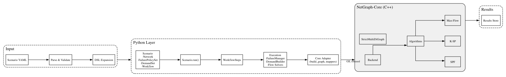

# NetGraph Design and Implementation

NetGraph's internal design: scenario DSL, data models, execution flow, algorithms, manager components, and result handling.

## Overview

NetGraph is a network scenario analysis engine using a **hybrid Python+C++ architecture**. It takes a scenario (defined in a YAML DSL) as input, builds a directed multigraph model of the network, and runs a configurable workflow of analysis steps (like traffic placement or max-flow capacity) to produce structured results.

### Architecture Layers

**Python Layer (NetGraph):**

- CLI and API: Entry points to load scenarios and invoke analyses
- Scenario DSL Parser: Validates and expands the YAML scenario into an internal model
- Domain Model: In-memory representation of nodes, links, risk groups, etc., with selection and grouping utilities
- Managers: Orchestrators for higher-level behaviors (demand expansion, failure enumeration)
- Workflow Engine: Composes steps into end-to-end analyses, storing outputs in a results store
- Results Store: Collects outputs and metadata from each step, enabling structured JSON export
- Analysis bridge: `AnalysisContext` builds Core graphs from the model, manages name/ID mapping, and executes Core algorithms
- NetworkExplorer: Network hierarchy traversal and hardware cost/power aggregation

**C++ Layer (NetGraph-Core):**

- StrictMultiDiGraph: Immutable directed multigraph with CSR adjacency representation
- Shortest Paths (SPF): Dijkstra's algorithm with multipath support and configurable edge selection
- K-Shortest Paths: Yen's algorithm for finding k-shortest simple paths
- Max-Flow: Successive shortest paths with blocking flow augmentation and configurable flow placement policies
- Backend Interface: Abstraction for algorithm execution (CPU backend provided)

### Package Structure

```text
ngraph/
├── analysis/       # AnalysisContext, FailureManager, placement
├── model/          # Network, Node, Link, demand/, failure/, flow/, selectors/
├── dsl/            # YAML parsing (blueprints/, selectors/, expansion/)
├── workflow/       # WorkflowStep implementations
├── results/        # Results store and flow result types
├── schemas/        # JSON Schema for scenario validation
├── types/          # Enums, DTOs, type aliases
├── profiling/      # Performance profiling
├── lib/            # NetworkX integration
├── utils/          # Utilities (ids, yaml, seeds)
├── scenario.py     # Scenario orchestrator
├── explorer.py     # NetworkExplorer
└── cli.py          # Command-line interface
```

### Package Layering

Packages import strictly downward in this order; a lower layer never imports a higher one:

```text
types, utils  ->  model  ->  dsl  ->  analysis  ->  workflow  ->  scenario  ->  cli
```

Two deliberate exceptions:

- `model` may use the dependency-free string-expansion helpers in `ngraph.dsl.expansion` (bracket patterns in risk-group references and demand `expand:` blocks). No other `model -> dsl` import is allowed; selector schema types and evaluation live in `ngraph.model.selectors`, and `ngraph.dsl.selectors` re-exports them for backward compatibility. Enforced by `tests/model/test_layering.py`.
- `workflow` references `Scenario` only under `TYPE_CHECKING` (workflow steps execute against a `Scenario`); the runtime import goes downward, from `scenario` to `workflow`.

The package root also does not eagerly import `ngraph.cli` (enforced by `tests/cli/test_package_layering.py`); the console entry point and `python -m ngraph` import it explicitly.

Deferred (function-local) imports are used for optional dependencies (networkx, jsonschema), opt-in profiling, and a few narrow internal cases (`ngraph.model.failure.parser` defers `ngraph.dsl.expansion`; `FailureManager._process_sensitivity_results` defers `ngraph.results.flow`) — not as a general layering workaround; outside those cases, if a module needs a lower layer, it imports it at module level.

### Integration Points

The Python layer uses the `analyze()` function and `AnalysisContext` class (`ngraph.analysis`) to:

1. Build Core graphs from Network instances with optional pseudo-nodes for source/sink groups
2. Map node names (str) to NodeId (int32) and link IDs (str) to EdgeId/ext_edge_id (int64)
3. Execute analysis methods (max_flow, shortest_paths, sensitivity) with boolean masking
4. Translate results (costs, flows, paths) back to scenario-level objects

Core algorithms release the GIL during execution, so concurrent Python threads run analysis in parallel with minimal Python-level overhead.

**Primary API:**

```python
from ngraph import analyze, Mode

# One-off analysis (unbound context)
flow = analyze(network).max_flow("^src$", "^dst$", mode=Mode.COMBINE)

# Efficient repeated analysis (bound context)
ctx = analyze(network, source="^src$", sink="^dst$", mode=Mode.COMBINE)
baseline = ctx.max_flow()
degraded = ctx.max_flow(excluded_links=failed_links)
```

`AnalysisContext` encapsulates all graph building and exposes the underlying graph components as properties for workflow steps and the FailureManager.

### Execution Flow

The diagram below traces a scenario from input through both layers to final results: the Python layer loads the scenario, orchestrates the workflow, and aggregates results, while compute-intensive graph algorithms execute in C++ with the GIL released.



## Scenario DSL and Input Expansion

NetGraph scenarios are defined in YAML using a declarative DSL (see [DSL Reference](dsl.md)) covering network topologies, traffic demands, failure policies, and analysis workflows. Before execution, scenario files are validated against a JSON Schema, so unknown keys and type mismatches fail early.

Key elements of the DSL include:

- **Seed**: A master random seed for the scenario to ensure deterministic behavior across runs.

- **Blueprints**: Reusable templates for subsets of the topology. A blueprint defines internal node types, roles, and optional internal links. Blueprints enable defining a complex multi-node topology once and instantiating it multiple times with different parameters.

- **Node Groups**: Definitions of node groups in the topology, either explicitly or via patterns. Groups can use a blueprint (`blueprint`) with parameters (`params`), or define a number of nodes (`count`) with a naming template (`template`).

- **Links**: Rules to generate links between node groups. Instead of enumerating every link, a link rule specifies source and target selectors (by path pattern), a wiring pattern (e.g. mesh for full mesh or one_to_one for paired links), number of parallel links (`count`), and link properties (capacity, cost, attributes like distance, hardware, risk group tags, etc.). Link properties are specified at the top level, not inside a wrapper. Matching can also filter nodes by attributes with logical conditions (AND/OR) so a rule applies to selected nodes only. A single rule can thus expand into many concrete links.

- **Rules**: Optional modifications applied after the initial expansion. `node_rules` or `link_rules` can match specific nodes or links (by path or endpoints) and change their attributes or disable them. This allows fine-tuning or simulating removals without changing the base definitions.

- **Risk Groups**: Named shared-risk groups (potentially nested) that nodes or links can belong to. These are used in failure scenarios to correlate failures (e.g. all links in a risk group fail together).

- **Demands**: Traffic demand definitions specifying source node sets, target node sets (by regex or attribute path selectors), and volume. Each demand can also include priority or custom flow placement policy.

- **Failure Policies**: Definitions of failure scenarios or modes, possibly with weights (probabilities). For example, a policy might say "with 5% chance, fail any single core node" or "fail all links in risk_group X". The failure manager uses these policies to generate specific failure combinations for simulation.

- **Workflow**: An ordered list of analysis steps to execute. Each step has a `type` (the analysis to perform, such as "MaxFlow" or "TrafficMatrixPlacement"), a unique name, and parameters (like number of iterations, etc.). The workflow definition orchestrates the analysis pipeline.

### DSL Expansion Process

The loader validates and expands DSL definitions into concrete nodes and links. Unknown fields or schema violations cause an immediate error before any expansion. After schema validation, blueprints are resolved (each blueprint group becomes actual Node objects), group name patterns are expanded into individual names, and adjacency rules are iterated over matching source-target node sets to create Link objects. The resulting nodes and links are then checked at runtime for duplicate node names and missing link endpoints.

## Data Model

Once the scenario is parsed and expanded, NetGraph holds it in a set of core model classes. They are the in-memory representation of the scenario topology and enforce its structural invariants: unique node names, valid link endpoints.

### Node

A Node represents a network node (vertex). Each node has:

- a unique name (string identifier),

- a disabled flag (if the node is turned off in the scenario),

- a set of risk_groups (associating the node with any failure domains), and

- an attrs dictionary for arbitrary metadata (e.g., region, device type, hardware info)

### Link

A Link represents a directed link between a source and target node. Each link has:

- source and target node names,

- capacity (float, e.g. in some bandwidth unit),

- cost (float, e.g. distance or latency metric),

- disabled flag,

- risk_groups set,

- attrs dict for metadata (e.g. distance_km, fiber type), and

- a unique id assigned when the link is added to a Network

The id is deterministic: `Network.add_link` assigns "source|target|<seq>", where <seq> is a per-(source, target) insertion sequence number, so ids and their sort order are stable across identical scenario builds (a provisional uuid-suffixed id exists only on links never added to a Network). The model stores each link as directed (source -> target). When the analysis graph is built, a reverse edge is added by default so algorithms see bidirectional connectivity.

### RiskGroup

A RiskGroup represents a named failure domain or shared-risk link group (SRLG). Risk groups can be hierarchical (a risk group may have children risk groups). Each RiskGroup has:

- a name,

- list of children RiskGroups (which inherit the failure domain property),

- disabled flag (if the entire group is considered initially failed in the scenario), and

- an attrs dict for any metadata

Hierarchy lets a large domain be composed of smaller sub-domains: a failure event that disables a group implicitly affects all its descendants.

### Network

A Network is the container class that holds all nodes, links, and top-level risk groups for the scenario. The Network class maintains:

- nodes: Dict[name, Node],

- links: Dict[id, Link],

- risk_groups: Dict[name, RiskGroup],

Network enforces invariants during construction: adding a link validates that source and target nodes exist; adding a node rejects duplicates by name. Components are never removed from the Network; the `disabled` flag marks them inactive. The Network also maintains a selection cache for `select_node_groups_by_path` to avoid repeated regex queries; cached results are copied on return (fresh dict and lists, shared Node objects), and the cache is invalidated when nodes are added.

### Node and Link Selection

A single selector system picks groups of nodes by structured name or by attribute; algorithms use it to choose source/sink sets. Selector evaluation (schema types, condition evaluation, node selection, attribute flattening) lives in `ngraph.model.selectors`; `ngraph.dsl.selectors` provides YAML-facing parsing and re-exports the evaluation names for backward compatibility.

**Selector Forms:**

Selectors can be specified as:

1. **String pattern**: A regex matched against node names (anchored at start via `re.match()`)
2. **Selector object**: A dict with `path`, `group_by`, and/or `match` fields

**String Pattern Behavior:**

When using a regex pattern, if the regex contains capturing groups, the non-None captures joined with "|" form the group label; otherwise, the entire pattern string is used as the label. For instance, the pattern `r"(\w+)-(\d+)"` on node name "metroA-1" produces the group label "metroA|1".

**Attribute-based Grouping:**

Use `group_by` in a selector object to group nodes by an attribute value:

```yaml
source:
  group_by: "role"
```

This groups nodes by the value of `node.attrs["role"]` (e.g., "core", "leaf"), returning a dict mapping each distinct value to the list of nodes with that value. Nodes missing the attribute are excluded.

**Attribute-based Filtering:**

Use `match` in a selector object to filter nodes by attribute conditions:

```yaml
source:
  path: "^dc1/.*"
  match:
    conditions:
      - attr: "tier"
        op: "=="
        value: "leaf"
```

Workflow steps and API calls therefore refer to nodes by readable pattern instead of by explicit list, which matters most in large topologies.

### Disabled Elements

Nodes or links marked as disabled=True represent elements present in the design but out of service for the analysis. The base model keeps them in the collection but analysis functions filter them out when selecting active nodes. This preserves topology information — the link still exists, it is just turned off — and re-enabling it is a flag change.

### Filtered Analysis (Exclusions)

To simulate failures or other what-if scenarios without modifying the base network, NetGraph uses analysis-time exclusions. Instead of creating a stateful view object, you pass sets of excluded nodes and links directly to analysis functions.

```python
# Analyze with specific exclusions
results = analyze(network).max_flow(
    "^A$",
    "^B$",
    excluded_nodes={"Node5"},
    excluded_links={"A|B|xyz123"}
)
```

This approach avoids mutating the base graph when simulating failures (e.g., deleting nodes or toggling flags). It separates the static scenario (base network) from dynamic conditions (exclusions), enabling thread-safe parallel analyses and eliminating deep copies for each failure scenario.

**Implementation:** Exclusions are applied via boolean masks passed to Core algorithms. The graph is built once without exclusions, and masks disable specific elements at algorithm execution time. For repeated analysis (Monte Carlo, FailureManager) this enables O(|excluded|) mask updates rather than O(V+E) graph rebuilding. One-off calls on an unbound context build a temporary bound context per call and apply exclusions the same way.

Multiple concurrent analyses can run on the same base network with different exclusion sets, which is what makes parallel Monte Carlo over many failure combinations practical.

### Graph Construction

NetGraph builds graphs through `AnalysisContext` which translates from the Python domain model to NetGraph-Core's C++ representation.

**Python Side (`ngraph.analysis.AnalysisContext`):**

There is one construction method:

- `AnalysisContext.from_network()`: Constructs an immutable context with Core graph, mappers, algorithms instance, and pre-computed disabled topology. Bound contexts and contexts with custom augmentations build the Core graph eagerly (pseudo node IDs must be resolved at bind time); plain unbound contexts defer the Core build until first use. Exclusions are applied at algorithm call time via boolean masks rather than during graph construction.

**Graph Construction Steps:**

- Collects nodes from Network (real + optional pseudo nodes for augmentation)
- Assigns stable node IDs (sorted by name for determinism)
- Encodes link_id + direction as ext_edge_id (packed int64)
- Constructs NumPy arrays (src, dst, capacity, cost, ext_edge_ids)
- Validates inputs: link capacities must be below the internal pseudo-edge capacity `LARGE_CAPACITY` (1e15), and costs must be non-negative integers whose total across all edges stays below 2^62. Core SPF accumulates path costs in int64 with INT64_MAX as the unreachable sentinel, so accumulated path costs — not just per-edge values — must stay in range; bounding the total of all edge costs bounds every path. Violations raise `ValueError` instead of silently corrupting results
- Supports augmentation edges (e.g., pseudo-source/sink for multi-source max-flow)

**AnalysisContext Internals:**

`AnalysisContext` encapsulates pre-built graph components as internal attributes:

- `_handle`, `_multidigraph`: Core graph structures
- `_node_mapper`, `_edge_mapper`: Name ↔ ID translation
- `_algorithms`: Core Algorithms instance
- `_disabled_node_ids`, `_disabled_link_ids`: Pre-computed disabled topology
- `_link_id_to_edge_indices`: Pre-computed mapping for O(|excluded|) mask building
- `_pseudo_context`: Optional context for pseudo source/sink node mappings

When analyzing many failure scenarios, the graph is built once via `AnalysisContext.from_network()` and exclusions are applied via boolean masks. The public mask builders (`build_node_mask`/`build_edge_mask`, also usable by custom analysis functions that call Core primitives directly) automatically include disabled nodes/links, ensuring disabled topology is always excluded. Nothing is rebuilt per iteration, which is where the Monte Carlo speedup comes from.

**Disabled Topology Handling:**

Disabled nodes and links from the Network are pre-computed during `AnalysisContext.from_network()` and stored in the context. The mask builders automatically include these disabled elements alongside any per-iteration exclusions.

**C++ Side (`netgraph_core.StrictMultiDiGraph`):**

- Immutable directed multigraph using Compressed Sparse Row (CSR) adjacency
- Nodes identified by NodeId (int32), edges by EdgeId (int32)
- Each edge stores capacity (float64), cost (int64), and ext_edge_id (int64)
- Edges sorted by (cost, src, dst) for deterministic algorithm behavior
- Zero-copy NumPy views for array access (capacities, costs, ext_edge_ids)
- Neighbor iteration walks a contiguous CSR range

**Edge Direction Handling:**

If `add_reverse=True` (default), graph construction creates bidirectional edges for each network link:

- Forward edge: original link direction with ext_edge_id encoding (link_id, 'fwd')
- Reverse edge: opposite direction with ext_edge_id encoding (link_id, 'rev')

This allows algorithms to consider traffic flowing in both directions on physical links.
The Core graph itself is always directed; bidirectionality is achieved by explicit reverse edges.

**Augmentation Support:**

For algorithms requiring virtual source/sink nodes (e.g., multi-source max-flow), the adapter
adds augmentation edges with ext_edge_id = -1 (sentinel for non-network edges). These edges
are not mapped back to scenario links in results.

### Analysis Algorithms

NetGraph's core algorithms execute in C++ via NetGraph-Core. They operate on the immutable StrictMultiDiGraph and support masking (runtime exclusions via boolean arrays), so repeated analysis under different failure scenarios needs no graph reconstruction.

All Core algorithms release the Python GIL during execution, so multiple Python threads run them concurrently without GIL contention.

### Shortest-Path First (SPF) Algorithm

Implemented in C++ (`netgraph::core::shortest_paths`), using Dijkstra's algorithm
with configurable edge selection and optional multipath predecessor recording.

**Edge Selection Policies:**

The algorithm evaluates parallel edges per neighbor using `EdgeSelection` configuration:

- `multi_edge=true` (default): Include all parallel edges u→v with minimal cost among (u,v) pairs
- `multi_edge=false`: Select single edge per (u,v) pair using tie-breaking:
  - `PreferHigherResidual`: Choose edge with highest residual capacity (secondary: lowest edge ID)
  - `Deterministic`: Choose edge with lowest edge ID for reproducibility
- `require_capacity=true`: Only consider edges with residual capacity ≥ kMinCap (used in max-flow)
- `require_capacity=false` (default): Consider all edges regardless of residual capacity (supplying a residual view to SPF implicitly enables the same capacity filter)

**Capacity-Aware Tie-Breaking:**

When multiple nodes or edges have equal cost, SPF uses residual capacity for tie-breaking to improve flow distribution:

- **Node-level**: Priority queue ordered by (cost, -residual, node). Among equal-cost nodes, prefers paths with higher bottleneck capacity. This naturally guides flow toward higher-capacity routes.
- **Edge-level**: When `multi_edge=false` and `tie_break=PreferHigherResidual`, selects the parallel edge with most available capacity among equal-cost options.

This tie-breaking is applied even in IP/IGP mode (`require_capacity=false`) using static capacities, improving flow distribution without altering routing topology.

**Multipath Support:**

With `multipath=True`, SPF stores all minimal-cost predecessors forming a DAG:
`pred[node] = {predecessor: [edge_ids...]}`. This DAG captures all equal-cost paths
in a compact form, used by max-flow for flow splitting.

**Early Termination:**

If `dst` is provided, SPF stops expanding after popping `dst` from the priority queue
(continuing only while heap front cost equals dst cost to capture equal-cost predecessors).
This optimization reduces work when only source-to-sink distances are needed.

**Masking:**

Optional `node_mask` and `edge_mask` boolean arrays enable runtime exclusions without
rebuilding the graph. Used by FailureManager for Monte Carlo analysis.

**Complexity:**

Using binary heap with capacity-aware tie-breaking: \(O((V+E) \log V)\) time, \(O(V+E)\) space for costs, predecessors, and residual tracking.

### Pseudocode (simplified, see implementation for complete details)

```text
function SPF(graph, src, dst=None, multipath=True, edge_selection):
    costs = { src: 0 }
    pred  = { src: {} }
    min_residual_to_node = { src: infinity }  # Track bottleneck capacity for tie-breaking

    # Priority queue with node-level tie-breaking by residual capacity
    # QItem: (cost, -residual, node) - negated residual for max-heap behavior
    pq = [(0, -infinity, src)]
    best_dst_cost = None

    while pq:
        (c, neg_res, u) = heappop(pq)
        if c > costs[u]:
            continue  # stale entry

        if dst is not None and u == dst and best_dst_cost is None:
            best_dst_cost = c
        if dst is not None and u == dst:
            if not pq or pq[0][0] > best_dst_cost:
                break
            continue

        # Relax edges from u
        for v in neighbors(u):
            # Edge selection among parallel edges u->v
            min_cost = inf
            selected_edges = []

            for e_id in edges_between(u, v):
                residual_cap = residual[e_id] if has_residual else capacity[e_id]

                # Skip if capacity filtering enabled and edge has no residual
                if edge_selection.require_capacity and residual_cap < kMinCap:
                    continue

                edge_cost = cost[e_id]

                if edge_cost < min_cost:
                    min_cost = edge_cost
                    selected_edges = select_edge_by_policy(e_id, edge_selection, residual_cap)

                elif edge_cost == min_cost:
                    if edge_selection.multi_edge:
                        selected_edges.append(e_id)  # Keep all equal-cost edges
                    else:
                        # Edge-level tie-breaking for single-edge selection
                        selected_edges = tiebreak_edge(selected_edges, e_id,
                                                      edge_selection.tie_break, residual_cap)

            if not selected_edges:
                continue  # no admissible edges to v

            new_cost = c + min_cost

            # Compute bottleneck capacity: min of path residual and max edge residual
            max_edge_res = max(residual[e] for e in selected_edges)
            path_residual = min(min_residual_to_node[u], max_edge_res)

            # Relaxation: found shorter path, or (single-path mode) an
            # equal-cost path with higher bottleneck capacity
            if new_cost < costs[v] or (not multipath and new_cost == costs[v]
                                       and path_residual > min_residual_to_node[v] + epsilon):
                costs[v] = new_cost
                min_residual_to_node[v] = path_residual
                pred[v] = { u: selected_edges }
                pq.push((new_cost, -path_residual, v))  # Node-level tie-breaking by capacity

            # Multipath: found equal-cost alternative
            elif multipath and new_cost == costs[v]:
                pred[v][u] = selected_edges
                # Don't update min_residual_to_node in multipath (collecting all paths)

        if best_dst_cost is not None and (not pq or pq[0][0] > best_dst_cost):
            break

    return costs, pred


# Tie-breaking policies for edge selection when multi_edge=false:
function tiebreak_edge(current_edges, new_edge, tie_break, new_residual):
    if tie_break == PreferHigherResidual:
        # Select edge with highest residual capacity
        if new_residual > current_best_residual + epsilon:
            return [new_edge]
        elif abs(new_residual - current_best_residual) <= epsilon:
            # Secondary tie-break: deterministic by edge ID
            return [min(new_edge, current_edges[0])]
    else:  # Deterministic
        # Select edge with smallest ID for reproducibility
        return [min(new_edge, current_edges[0])]
```

**Key Tie-Breaking Mechanisms:**

1. **Node-level tie-breaking**: When multiple nodes have equal cost in the priority queue, prefer nodes reachable via paths with higher bottleneck (residual) capacity. This naturally distributes flows across equal-cost paths based on available capacity.

2. **Edge-level tie-breaking** (when `multi_edge=false`):
   - `PreferHigherResidual`: Among parallel equal-cost edges (u,v), select the one with highest residual capacity
   - `Deterministic`: Select edge with smallest ID for reproducible results

3. **Multipath behavior**: When `multipath=true`, all equal-cost predecessors are retained without capacity-based filtering, enabling flow splitting across all equal-cost paths.

### Maximum Flow Algorithm

Implemented in C++ (`netgraph::core::max_flow`), using successive shortest paths with
blocking flow augmentation. The algorithm blends Edmonds-Karp (augment along shortest
paths) and Dinic (push blocking flows on a level graph) with cost awareness and
configurable flow splitting across equal-cost parallel edges.

**Goal:** Compute maximum feasible flow between source and sink under edge capacity constraints.

**Multi-source/multi-sink:** Handled by `AnalysisContext` which creates pseudo-source and pseudo-sink nodes with large-capacity, zero-cost edges to/from real endpoints. The C++ algorithm operates on single source and single sink.

**Routing Semantics:** The algorithm's behavior is controlled by `require_capacity` and `shortest_path`:

- `require_capacity=true` + `shortest_path=false` (SDN/TE): SPF filters to edges with residual capacity, routes adapt iteratively during placement
- `require_capacity=false` + `shortest_path=true` (IP/IGP): SPF uses all edges based on cost, single-pass flow placement over fixed equal-cost paths

See "Routing Semantics: IP/IGP vs SDN/TE" section for detailed explanation.

The residual network is maintained via `FlowState`, which tracks per-edge flow and computes residual capacities on demand. For each edge u→v:

- Forward residual capacity: `capacity(u,v) - flow(u,v)`
- Reverse residual capacity: `flow(u,v)` (traversed to return previously placed flow during the completion phase, and for residual reachability when computing the min-cut and reachable set)

SPF operates over the residual graph by requesting edges with `require_capacity=true`, which filters to edges with positive residual capacity. The `FlowState` provides a residual capacity view without graph mutation.

Note: Reverse residual arcs are distinct from physical reverse edges added via `add_reverse=True` during graph construction. Physical reverse edges model bidirectional links with independent capacity; reverse residual arcs are bookkeeping over a single edge's flow. The cost-tier SPF loop traverses forward residual edges only, so it cannot cancel an earlier placement and may stop below the true maximum. A completion phase then runs BFS augmentation over the full residual graph, traversing arcs backwards to return previously placed flow, which makes the result a true maximum flow whose min-cut matches it. The completion phase applies only to max-flow semantics — `PROPORTIONAL` placement with `require_capacity=True` and `shortest_path=False`; `EQUAL_BALANCED` (ECMP admission) and `require_capacity=False` (fixed-cost IP routing) are placement models rather than max-flow computations and keep the tier-loop result. Dinic-style reverse edges additionally allow redistribution within a single tier's placement.

The core loop finds augmenting paths using the cost-aware SPF described above:

Run SPF from source to sink with `multi_edge=true`, `tie_break=Deterministic`, and the configured `require_capacity` (when true, SPF receives the residual view and filters to edges with residual capacity ≥ kMinCap). This computes shortest-path distances and a predecessor DAG over forward residual edges. The edge cost can represent distance, latency, or preference; SPF selects paths minimizing cumulative cost.

If the sink is not reached (i.e., no augmenting path exists), stop: the max flow is achieved.

Otherwise, `FlowState.place_on_dag` computes a blocking flow over the predecessor DAG from SPF, considering parallel edges and the splitting policy. For PROPORTIONAL: builds reversed residual graph, assigns BFS levels, uses DFS to push flow with capacity-proportional splits. For EQUAL_BALANCED: performs topological traversal with equal splits, computes global scale factor to prevent oversubscription. This yields flow amount `f` and per-edge flow assignments tracking which edges carry flow and their utilization.

`FlowState` then increases each edge's flow by its assigned portion, updating per-edge flows and residual capacities for the next iteration, and `f` is added to the total flow counter. If `f` is below tolerance `kMinFlow` (negligible flow placed due to numerical limits or exhausted capacity), iteration terminates; otherwise the loop repeats from the SPF step to find the next augmenting path.

If `shortest_path=True`, the algorithm performs only one augmentation pass and returns (useful when the goal is a single cheapest augmentation rather than maximum flow).

After the loop, the C++ algorithm computes a FlowSummary which includes:

- total_flow: the sum of flow from source to sink achieved

- edge_flows: per-edge flow assignments (optional, populated when requested)

- residual_capacity: remaining capacity on each edge = capacity - flow (optional, populated when requested)

- reachable_nodes: the set of nodes reachable from the source in the final residual network (optional, identifies the source side of the min-cut)

- min_cut: the list of edges that are saturated and go from reachable to non-reachable (these form the minimum cut)

- cost_distribution: flow volume keyed by cost. Tier-loop entries are the cost of the shortest-path DAG the flow was placed on; completion-phase entries are marginal costs (the augmenting path's forward edge costs minus the cost of the flow it cancels), so a key need not correspond to any traversable path. Core returns parallel arrays (`costs`, `flows`); AnalysisContext converts these to the `Dict[Cost, Flow]` mapping in `MaxFlowResult.cost_distribution`.

The summary is returned along with the total flow value.

### Routing Semantics: IP/IGP vs SDN/TE

NetGraph models two fundamentally different routing paradigms through the `require_capacity` and `shortest_path` parameters:

**IP/IGP Semantics (`require_capacity=false` + `shortest_path=true`):**

Traditional IP routing with Interior Gateway Protocols (OSPF, IS-IS):

- Routes computed based on link costs/metrics only, ignoring available capacity
- Single SPF computation determines equal-cost paths; forwarding is fixed until topology/cost change
- Traffic follows predetermined paths even as links saturate
- Models best-effort forwarding with potential packet loss when demand exceeds capacity
- No iterative augmentation: flow placed in single pass over fixed equal-cost DAG
- Use case: Simulating production IP networks, validating IGP designs

**SDN/TE Semantics (`require_capacity=true` + `shortest_path=false`, default):**

Software-Defined Networking and Traffic Engineering:

- Routes adapt dynamically to residual link capacities during flow placement
- SPF recomputed after each flow placement iteration, excluding saturated links
- Iterative augmentation continues until max-flow achieved or capacity exhausted
- Flow placement respects capacity constraints, never oversubscribing links
- Models centralized traffic engineering with real-time capacity awareness
- Use case: Optimal demand placement, capacity planning, failure impact analysis

This distinction is fundamental: IP networks route on cost alone with fixed forwarding tables (congestion managed via queuing/drops), while TE systems route dynamically on both cost and available capacity (congestion avoided via admission control). The `require_capacity` parameter controls whether SPF filters to available capacity; `shortest_path` controls whether routes are recomputed iteratively or fixed after initial SPF.

### Flow Placement Strategies

Beyond routing semantics, NetGraph controls how flow splits across equal-cost parallel edges through `FlowPlacement`:

- **PROPORTIONAL** (default, models WCMP/Weighted ECMP):
  - Splits flow across parallel equal-cost edges proportional to residual capacity
  - Example: Two 100G links get 50/50 split; one 100G + one 10G get 91/9 split
  - Maximizes utilization by preferring higher-capacity paths
  - Used in networks with heterogeneous link speeds (common in fabrics with multi-generation hardware)
  - Can be used iteratively (e.g., successive max-flow augmentations)

- **EQUAL_BALANCED** (models traditional ECMP):
  - Splits flow equally across all parallel equal-cost edges regardless of capacity
  - Example: Two 100G links get 50/50; one 100G + one 10G still attempt 50/50 (10G saturates first)
  - Models IP hash-based load balancing (5-tuple hashing distributes flows uniformly)
  - Single-pass admission: computes one global scale factor to avoid oversubscription
  - For IP ECMP simulation: use with `require_capacity=false` + `shortest_path=true`

`FlowState.place_on_dag` implements placement over a fixed SPF DAG (the DAG never changes within a call):

- **PROPORTIONAL**: Constructs reversed residual graph from predecessor DAG. Uses Dinic-style BFS leveling and DFS push from sink to source. Within each edge group (parallel edges between node pair), splits flow proportionally to residual capacity. Distributes pushed flow back to underlying edges maintaining proportional ratios. Can be called iteratively on updated residuals.

- **EQUAL_BALANCED**: Performs topological traversal (Kahn's algorithm) from source to sink over forward DAG. Assigns equal splits across all outgoing parallel edges from each node. Computes global scale factor as `min(edge_residual / edge_assignment)` across all edges to prevent oversubscription. Applies scale uniformly and stops. This models single-pass ECMP admission where the forwarding DAG doesn't change mid-flow.

**Configuration Examples:**

```python
# IP/ECMP: Traditional router behavior (cost-based routing, equal splits)
analyze(network).max_flow(src, dst,
    flow_placement=FlowPlacement.EQUAL_BALANCED,
    shortest_path=True,  # Single SPF tier
    require_capacity=False)  # Ignore capacity when routing

# SDN/TE with WCMP: Capacity-aware routing with proportional splits
analyze(network).max_flow(src, dst,
    flow_placement=FlowPlacement.PROPORTIONAL,
    shortest_path=False,  # Iterative augmentation
    require_capacity=True)  # Adapt routes to capacity

# WCMP: Fixed equal-cost paths with bandwidth-weighted splits
analyze(network).max_flow(src, dst,
    flow_placement=FlowPlacement.PROPORTIONAL,
    shortest_path=True,  # Single tier of equal-cost paths
    require_capacity=False)  # Fixed paths regardless of utilization
```

### Flow Policy Presets

For traffic matrix placement, `FlowPolicyPreset` values bundle the routing semantics above into named configurations that map to real-world network behaviors:

| Preset | Behavior | Use Case |
| -------- | ---------- | ---------- |
| `SHORTEST_PATHS_ECMP` | IP/IGP with hash-based ECMP | Traditional routers (OSPF/IS-IS), equal splits across equal-cost paths |
| `SHORTEST_PATHS_WCMP` | IP/IGP with weighted ECMP | Routers with WCMP support, proportional splits based on link capacity |
| `TE_WCMP_UNLIM` | MPLS-TE / SDN with WCMP | Capacity-aware TE with unlimited tunnels, iterative placement |
| `TE_ECMP_16_LSP` | MPLS-TE with 16 LSPs | Fixed 16 ECMP tunnels per demand, models RSVP-TE with LSP limits |
| `TE_ECMP_UP_TO_256_LSP` | MPLS-TE with up to 256 LSPs | Scalable TE with tunnel limit, models SR-TE or large-scale RSVP |

**Detailed Configuration Mapping (preset internals):**

| Preset | `require_capacity` | `multi_edge` | `max_flow_count` | `flow_placement` |
| -------- | -------------------- | -------------- | ------------------ | ------------------ |
| `SHORTEST_PATHS_ECMP` | `false` | `true` | `1` | `EQUAL_BALANCED` |
| `SHORTEST_PATHS_WCMP` | `false` | `true` | `1` | `PROPORTIONAL` |
| `TE_WCMP_UNLIM` | `true` | `true` | unlimited | `PROPORTIONAL` |
| `TE_ECMP_16_LSP` | `true` | `false` | `16` | `EQUAL_BALANCED` |
| `TE_ECMP_UP_TO_256_LSP` | `true` | `false` | `256` | `EQUAL_BALANCED` |

**Key parameters (preset-managed):**

- `require_capacity`: When `false`, paths are selected based on link costs alone (models IP/IGP routing). When `true`, paths adapt to residual capacity during placement (models SDN/TE). See [Routing Semantics](#routing-semantics-ipigp-vs-sdnte) for details.
- `multi_edge`: When `true`, uses all parallel equal-cost edges (hop-by-hop ECMP); when `false`, each flow uses a single path (tunnel/LSP semantics).
- `max_flow_count`: Internal per-preset limit on flows/LSPs for TE presets; not a user-facing parameter.
- `flow_placement`: `EQUAL_BALANCED` splits equally across paths; `PROPORTIONAL` splits by residual capacity.

**Example: Modeling IP vs MPLS Networks**

```yaml
# IP network with traditional ECMP (e.g., data center leaf-spine)
demands:
  dc_traffic:
    - source: ^rack1/
      target: ^rack2/
      volume: 1000.0
      flow_policy: SHORTEST_PATHS_ECMP

# MPLS-TE network with capacity-aware tunnel placement
demands:
  backbone_traffic:
    - source: ^metro1/
      target: ^metro2/
      volume: 5000.0
      flow_policy: TE_WCMP_UNLIM
```

### Pseudocode (simplified max-flow loop)

```text
function MAX_FLOW(graph, S, T, placement=PROPORTIONAL, require_capacity=True,
                  shortest_path=False):
    flow_state = FlowState(graph)  # Tracks per-edge flow and residuals
    total_flow = 0
    cost_distribution = {}  # path_cost -> flow

    while True:
        # Configure edge selection for SPF
        edge_selection = EdgeSelection(
            multi_edge=True,
            require_capacity=require_capacity,
            tie_break=Deterministic
        )

        # Find shortest augmenting paths in residual graph
        residuals = flow_state.residual_view() if require_capacity else None
        costs, dag = SPF(graph, S, T,
                        multipath=True,
                        edge_selection=edge_selection,
                        residual=residuals)

        if T not in dag:  # No augmenting path exists
            break

        # Push blocking flow through predecessor DAG
        path_cost = costs[T]
        placed = flow_state.place_on_dag(S, T, dag, infinity, placement)

        if placed < kMinFlow:  # Negligible flow placed
            break

        total_flow += placed
        cost_distribution[path_cost] += placed  # merged by exact cost

        if shortest_path:  # Single augmentation pass (IP/IGP mode)
            break

    # Completion phase: max-flow semantics only. The tier loop above walks
    # forward residual edges, so it can stop below the true maximum.
    if placement == PROPORTIONAL and require_capacity and not shortest_path:
        while True:
            # BFS over the full residual graph, including reverse arcs that
            # return previously placed flow
            path = BFS_AUGMENTING_PATH(flow_state.residual_view(), S, T)
            if path is None:
                break
            placed = flow_state.augment(path)
            if placed < kMinFlow:
                break
            total_flow += placed
            # Marginal cost: forward edge costs minus the cost of cancelled flow
            cost_distribution[marginal_cost(path)] += placed

    # Compute min-cut, reachability, cost distribution
    min_cut = flow_state.compute_min_cut(S, node_mask, edge_mask)

    return FlowSummary(
        total_flow=total_flow,
        cost_distribution=cost_distribution,
        min_cut=min_cut,
        edge_flows=...,  # optional
        residual_capacity=...,  # optional
        reachable_nodes=...  # optional
    )
```

The flow tolerance constant `kMinFlow` (1/4096 ≈ 2.4e-4) determines when flow placement is considered negligible and iteration terminates.

Each augmentation phase performs one SPF \(O((V+E) \log V)\) and one placement pass over the tier's predecessor DAG. For EQUAL_BALANCED the placement is a single topological pass \(O(V+E)\); for PROPORTIONAL it is a complete Dinic max-flow over the tier DAG (repeated BFS level construction, level-restricted blocking-flow DFS, and a group rebuild from the updated residual), worst case \(O(V^2 E)\). The tier loop never removes placed flow, so each phase permanently saturates at least one edge before the next SPF runs, bounding the number of phases by \(O(E)\); with PROPORTIONAL placement the tier's path cost also strictly increases between phases, so phases are further bounded by the number of distinct path-cost values. The resulting loose worst-case bound is \(O(E \cdot (V^2 E + (V+E) \log V))\). The completion phase that follows is Edmonds-Karp at \(O(V E^2)\), which this bound dominates.

Practical performance is significantly better than these worst-case bounds: iteration stops as soon as the residual network disconnects source from sink, the phase count in practice equals the small number of cost tiers actually used, and the `kMinFlow` threshold additionally caps the number of phases at \(F / k_{MinFlow}\) for total flow \(F\).

### Managers and Workflow Orchestration

Managers handle scenario dynamics and prepare inputs for algorithmic steps.

**Demand Expansion** (`ngraph.analysis.demand`): Expands `TrafficDemand` specs (built from DSL definitions by `ngraph.model.demand.builder`) into concrete placement demands, resolving source/target selectors into node groups.

- Deterministic expansion: node selection follows the network's stable node ordering; no randomization
- Supports `combine` mode (aggregate via pseudo source/sink nodes attached with large-capacity, zero-cost augmentation edges) and `pairwise` mode (individual (src,dst) pairs, self-pairs excluded, volume split evenly across pairs)
- `group_mode` controls grouping: `flatten` (default, merge all groups then apply mode), `per_group`, and `group_pairwise`; volume is split evenly across groups or group pairs
- In combine mode, nodes selected on both sides are excluded from the target set (prevents a zero-cost pseudo-node bypass); a demand or group whose target set empties is skipped
- Validation: duplicate demand ids and pseudo-endpoint collisions raise `ValueError` (either would silently merge distinct demands' attachment edges)
- Demands sorted by ascending priority before placement (lower value = higher priority)
- Placement uses SPF caching for simple policies (ECMP, WCMP, TE_WCMP_UNLIM), FlowPolicy for complex multi-flow policies
- Non-mutating: operates on Core flow graphs with exclusions; Network remains unmodified

**Failure Manager** (`ngraph.analysis.failure_manager`): Applies a `FailurePolicy` to compute exclusion sets and runs analyses with those exclusions.

- Parallel execution via `ThreadPoolExecutor` with zero-copy network sharing across worker threads; nothing is pickled, so functions defined in `__main__` or notebooks run at full parallelism
- Deterministic results when seed is provided (each iteration derives `seed + iteration_index`); with `seed=None`, the failure policy's own seed is used as a fallback when present
- Baseline execution: a no-failure baseline is always run first as a separate reference for comparing degraded vs. intact capacity
- Deduplication: identical exclusion patterns execute once and are weighted by multiplicity (`occurrence_count` on results; `metadata["occurrence_counts"]` aligned with the results list). Stored failure traces describe each pattern's representative (first) iteration; this weighting assumes deterministic analysis functions (the built-ins are)
- Thread-safe analysis: Network shared by reference; exclusion sets passed per-iteration
- Automatic graph pre-building: Before parallel iterations, the engine calls the analysis function's `prepare_inputs(network, kwargs)` hook (carried by all built-in analysis functions) once per run and merges the returned kwargs — typically a pre-built `AnalysisContext`, plus the precomputed demand expansion and resolved IDs for demand placement — into every iteration's call; per-iteration exclusions are applied via O(|excluded|) mask operations. Custom analysis functions opt in by setting a `prepare_inputs` attribute; functions without it run with their kwargs unchanged, and passing `context` explicitly skips the hook.

Both the demand expansion logic and failure manager separate policy (how to expand demands or pick failures) from core algorithms. They prepare concrete inputs (expanded demands or exclusion sets) for each workflow iteration.

### Workflow Engine and Steps

A NetGraph workflow (see Workflow Reference) is an ordered recipe of analysis steps. Each step is a pure function: it takes the current model and possibly prior results, performs an analysis, and stores its outputs. The workflow engine runs the steps in sequence and records their data in a Results store.

Common built-in steps:

- BuildGraph: validates network topology and stores node-link JSON representation via NetworkX `MultiDiGraph`. Stores graph structure under `data.graph` and parameters under `data.context`. Primarily for validation and export; Core graph building happens in analysis functions.

- NetworkStats: computes node/link counts, capacity statistics, cost statistics, and degree statistics. Supports optional `excluded_nodes`/`excluded_links` and `include_disabled`.

- TrafficMatrixPlacement: runs Monte Carlo placement using a named demand set and the Failure Manager; a no-failure baseline always runs first. Supports `iterations`, `parallelism`, `store_failure_patterns`, `include_flow_details`, `include_used_edges`, and `alpha` or `alpha_from_step` (default field `data.alpha_star`). Produces `data.baseline` and `data.flow_results` (unique failure patterns with `occurrence_count`). (`placement_rounds` is deprecated and accepted only as a no-op for backward compatibility.)

- MaxFlow: runs Monte Carlo maximum-flow analysis between node groups using the Failure Manager; a no-failure baseline always runs first. Supports `mode` (combine/pairwise), `iterations`, `parallelism`, `shortest_path`, `require_capacity`, `flow_placement`, and optional `include_flow_details`/`include_min_cut`. Produces `data.baseline` and `data.flow_results` (unique failure patterns with `occurrence_count`).

- MaximumSupportedDemand (MSD): uses bracketing and bisection on alpha to find the maximum multiplier such that alpha * volume is feasible. Stores `data.alpha_star`, `data.context`, `data.base_demands`, and `data.probes`.

- CostPower: aggregates platform and per-end optics capex/power by hierarchy level (0..N). Respects `include_disabled` and `aggregation_level`. Stores `data.levels` and `data.context`. Performs no hardware capacity/ports validation and completes even on networks the explorer's strict validation would reject; hardware validation is available via `NetworkExplorer` (strict validation) or the `ngraph inspect` command.

Each step is implemented in the `ngraph.workflow` module and has a corresponding `type` name. Steps do not modify the Network. Their inputs often include references to prior steps' results: a placement step might need the value of alpha* from an MSD step, and the workflow definition names that link.

### Results storage

The Results object is a container that the workflow passes through steps. When a step runs, it "enters" a scope in the Results (by step name) and writes any outputs to either metadata or data within that scope.

For example, the MaxFlow step named "maxflow_between_metros" will put the total flow and details under `results.steps["maxflow_between_metros"]["data"]` and perhaps record parameters in metadata. The Results store also captures each step's execution metadata (like step order, type, seeds) in a workflow registry. At the end of the workflow, a single nested dictionary can be exported via Results.to_dict() containing all step outputs in a structured way.

This design ensures consistency (every step has metadata and data keys) and JSON serialization (handles custom objects via to_dict() when available, converts keys to strings). The results often include artifacts like tables or lists of flows for reporting.

### Design Elements and Comparisons

NetGraph's design includes several features that differentiate it from traditional network analysis tools:

- Declarative Scenario DSL: A YAML DSL with blueprints and programmatic expansion allows abstract definitions (e.g., a fully meshed Clos) to be expanded into concrete nodes and links. Strict schema validation ensures that scenarios are well-formed and rejects unknown or invalid fields.

- Runtime Exclusions vs graph copying: Analysis-time exclusions avoid copying large structures for each scenario. The design separates static topology from dynamic failure states.

- Deterministic link IDs: `Network.add_link` assigns each link a unique ID (`source|target|<seq>`, a per-endpoint-pair insertion sequence) that is stable across identical scenario builds and throughout analysis, simplifying correlation of results to original links and keeping seeded failure sampling reproducible.

- Dual routing semantics: Models both IP/IGP (cost-only, fixed paths via `require_capacity=false` + `shortest_path=true`) and SDN/TE (capacity-aware, iterative via `require_capacity=true` + `shortest_path=false`)

- Configurable flow placement: Proportional (WCMP-style, capacity-weighted) and Equal-Balanced (ECMP-style, uniform) splitting across parallel equal-cost edges

- Cost-aware augmentation: Prefer cheapest capacity first via successive shortest paths. The cost-tier loop does not re-route previously placed flow; the max-flow completion phase may cancel earlier placements to reach the true maximum.

- Deterministic simulation with seeding: Random aspects (e.g., failure sampling) are controlled by explicit seeds that propagate through steps. Runs are reproducible given the same scenario and seed.

- Structured results store: Collects results with metadata in a consistent format for JSON export and downstream analysis.

### Performance Considerations

**C++ Algorithm Implementation:**

- Native C++ execution with optimized data structures (CSR adjacency, flat arrays)
- GIL released during algorithm execution, enabling concurrent analysis across Python threads
- Zero-copy NumPy integration for array inputs/outputs (via buffer protocol)
- Deterministic edge ordering for reproducible results
- Cache-friendly CSR representation for neighbor traversal

**Graph Building and Reuse:**

For Monte Carlo analysis with many failure iterations, graph construction is amortized via `AnalysisContext`:

- Context built once before iterations begin (includes all nodes and augmentation edges)
- Per-iteration exclusions applied via boolean masks rather than graph rebuilding
- Mask building is O(|excluded|) using pre-computed `link_id_to_edge_indices` mapping
- FailureManager automatically pre-builds the `AnalysisContext` before parallel execution (via the analysis function's `prepare_inputs` hook)

Graph construction involves Python processing, NumPy array creation, and C++ object initialization. Building the graph once keeps that work off the per-iteration critical path, leaving the GIL-releasing C++ algorithms to run with minimal Python overhead.

**SPF Caching for Demand Placement:**

Both TrafficMatrixPlacement and MaximumSupportedDemand (MSD) use a unified placement function (`place_demands()` in `ngraph.analysis.placement`) with SPF caching for cacheable policies (ECMP, WCMP, TE_WCMP_UNLIM):

- Initial SPF computed once per unique source; subsequent demands from the same source reuse the cached DAG
- For TE policies, DAG is recomputed when capacity constraints require alternate paths
- Complex multi-flow policies (TE_ECMP_16_LSP, TE_ECMP_UP_TO_256_LSP) use FlowPolicy directly
- MSD additionally pre-resolves node IDs once at cache build time and reuses them across all alpha probes

This reduces SPF computations from O(demands) to O(unique_sources) for workloads where many demands share the same source nodes. MSD gains the most, since it evaluates many alpha values during binary search.

**Monte Carlo Deduplication:**

FailureManager collapses identical failure patterns into single executions. Runtime
scales with unique patterns U rather than requested iterations I; often U << I for
common failure policies.

**Complexity:**

- SPF: \(O((V+E) \log V)\) using binary heap
- Max-flow: \(O(E \cdot (V^2 E + (V+E) \log V))\) worst case for the successive-shortest-paths scheme with blocking-flow placement (derived in "Maximum Flow Algorithm" above)
  - Practical performance is far better: the number of augmentation phases equals the small number of cost tiers actually used, and the `kMinFlow` threshold caps phases at \(F / k_{MinFlow}\) for total flow \(F\)
  - Early termination when the residual network disconnects source from sink provides significant speedup in typical networks

**Scalability:**

Benchmarks on structured topologies (Clos, grid) and realistic network graphs demonstrate scalability to networks with thousands of nodes and tens of thousands of edges. C++ execution with CSR adjacency and GIL release provides order-of-magnitude speedups over pure Python graph libraries for compute-intensive analysis.

## Summary

NetGraph's hybrid architecture combines:

**Python Layer:**

- Declarative scenario DSL with schema validation
- Domain model (Network, Node, Link, RiskGroup)
- Runtime exclusions for non-destructive failure simulation
- Workflow orchestration and result aggregation
- Managers for demand expansion and failure enumeration

**C++ Layer:**

- Native C++ graph algorithms (SPF, K-shortest paths, max-flow)
- Immutable StrictMultiDiGraph with CSR adjacency
- Configurable flow placement policies (ECMP/WCMP simulation)
- Runtime masking for repeated analysis without graph rebuilds

**Integration:**

- `AnalysisContext` builds Core graphs, manages name/ID mapping, and bridges Python ↔ C++
- Stable node/edge ID mapping for result traceability
- Zero-copy NumPy array interface for data transfer
- GIL release during computation for concurrent thread execution

This design adapts standard algorithms to network engineering use cases (flow splitting,
failure simulation, cost-aware routing), running them in native C++ while keeping the
scenario, workflow, and result interfaces in Python.

## Cross-references

- [DSL Reference](dsl.md)
- [Workflow Reference](workflow.md)
- [CLI Reference](cli.md)
- [API Reference](api.md)
- [Auto-Generated API Reference](api-full.md)
