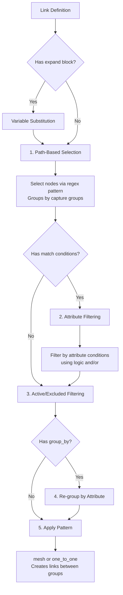
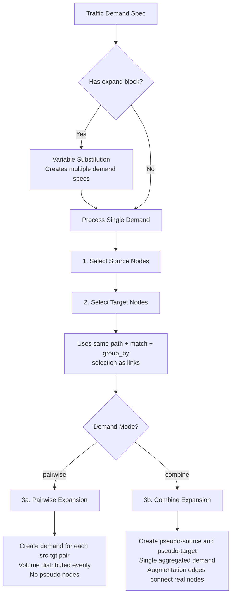
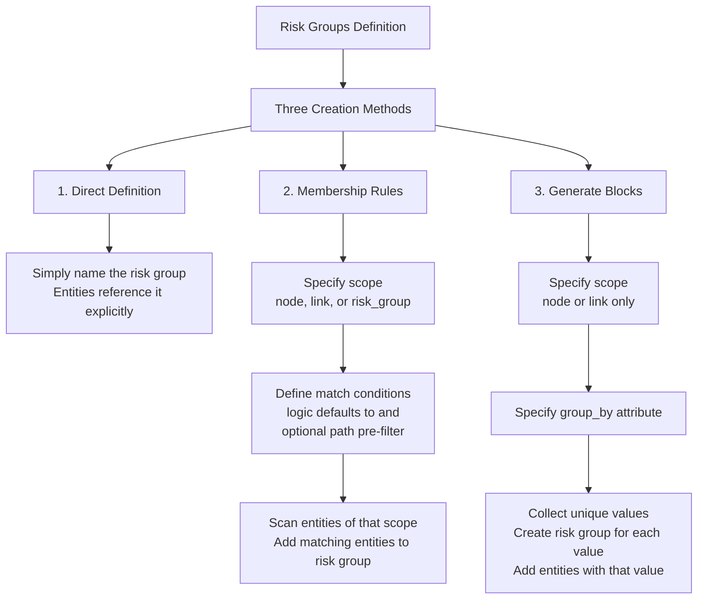

# Domain-Specific Language (DSL)

Quick links:

- [Design](design.md) — architecture, model, algorithms, workflow
- [Workflow Reference](workflow.md) — analysis workflow configuration and execution
- [CLI Reference](cli.md) — command-line tools for running scenarios
- [API Reference](api.md) — Python API for programmatic scenario creation
- [Auto-Generated API Reference](api-full.md) — complete class and method documentation

NetGraph scenarios are YAML files describing network topology, traffic demands, and analysis workflows. This document is the reference for that DSL.

## Overview

A scenario file defines a complete network simulation including:

- **Network topology**: Nodes, links, and their relationships, as well as risk groups
- **Analysis configuration**: Traffic demands, failure policies, workflows
- **Reusable components**: Blueprints, hardware definitions

Every structure can be written out directly or generated from templates and parameters.

## Template Syntaxes

The DSL uses three distinct template syntaxes in different contexts:

| Syntax | Example | Context | Purpose |
|--------|---------|---------|---------|
| `[1-3]` | `dc[1-3]/rack[a,b]` | Node/risk group names | Generate multiple groups |
| `$var` / `${var}` | `pod${p}/leaf` | Links, rules, demands | Template expansion with `expand` block |
| `{n}` | `srv-{n}` | `template` field | Node naming (1-indexed counter) |

**These syntaxes are not interchangeable.** Each works only in its designated context.

**Why different syntaxes?**

| Syntax | Operation | Key Difference |
|--------|-----------|----------------|
| `[1-3]` | Static generation | Creates multiple definitions at parse time |
| `${var}` | Template substitution | Requires explicit `expand` block with `vars` |
| `{n}` | Sequential counter | Auto-increments based on `count` |

Bracket expansion generates structure; variable expansion parameterizes rules; node naming indexes instances.

## Entity Creation Architecture

The DSL has two selection patterns. Which one applies is fixed by the operation, not chosen by the author, so it is worth knowing which is which before writing selectors.

### Two Selection Models

**1. Path-Based Node Selection** (link rules, traffic demands, workflow steps)

- Uses regex patterns on hierarchical node names
- Supports capture group-based grouping
- Supports attribute-based grouping (`group_by`)
- Supports attribute filtering (`match` conditions)
- Supports `active_only` filtering

**2. Condition-Based Entity Selection** (failure rules, membership rules, risk group generation)

- Works on nodes, links, or risk_groups (`scope`)
- Supports attribute-based filtering (`conditions`)
- Supports optional `path` regex filtering (a pre-filter for membership and generate rules; applied after condition matching for failure rules)

Both build on the same primitives (condition evaluation, match specification), but they are not interchangeable.

### Link Creation Flow

Link definitions create links between nodes using path-based selection with optional filtering:


```mermaid
flowchart TD
    Start[Link Definition] --> VarExpand{Has expand block?}
    VarExpand -->|Yes| VarSubst[Variable Substitution]
    VarSubst --> PathFilter
    VarExpand -->|No| PathFilter[1. Path-Based Selection]
    PathFilter --> PathDesc[Select nodes via regex pattern<br/>Groups by capture groups]
    PathDesc --> MatchFilter{Has match conditions?}
    MatchFilter -->|Yes| AttrFilter[2. Attribute Filtering]
    MatchFilter -->|No| ActiveFilter
    AttrFilter --> AttrDesc[Filter by attribute conditions<br/>using logic and/or]
    AttrDesc --> ActiveFilter[3. Active/Excluded Filtering]
    ActiveFilter --> GroupBy{Has group_by?}
    GroupBy -->|Yes| Regroup[4. Re-group by Attribute]
    GroupBy -->|No| Pattern
    Regroup --> Pattern[5. Apply Pattern]
    Pattern --> PatternDesc[mesh or one_to_one<br/>Creates links between groups]
```

**Processing Steps:**

1. **Path Selection**: Regex pattern matches nodes by hierarchical name
   - Capture groups create initial grouping
   - If no path specified, selects all nodes
2. **Attribute Filtering**: Optional `match` conditions filter nodes
   - Uses `logic: "and"` or `"or"` (default: `"or"`)
   - Supports operators: `==`, `!=`, `<`, `>`, `contains`, `in`, etc.
3. **Active Filtering**: Filters disabled nodes based on context
   - Links default: `active_only=false` (creates links to disabled nodes)
4. **Attribute Grouping**: Optional `group_by` overrides regex capture grouping
5. **Pattern Application**: Creates links between selected node groups
   - `mesh`: Every source to every target
   - `one_to_one`: Pairwise with wrap-around

**Key Characteristics:**

- `default_active_only=False` (links are created to disabled nodes)
- `match.logic` defaults to `"or"` (inclusive matching)
- Supports variable expansion via `expand` block

### Traffic Demand Creation Flow

Traffic demands follow a similar pattern, with these differences:


```mermaid
flowchart TD
    Start[Traffic Demand Spec] --> VarExpand{Has expand block?}
    VarExpand -->|Yes| VarSubst[Variable Substitution<br/>Creates multiple demand specs]
    VarSubst --> Process
    VarExpand -->|No| Process[Process Single Demand]
    Process --> SrcSelect[1. Select Source Nodes]
    SrcSelect --> TgtSelect[2. Select Target Nodes]
    TgtSelect --> SrcDesc[Uses same path + match + group_by<br/>selection as links]
    SrcDesc --> Mode{Demand Mode?}
    Mode -->|pairwise| Pairwise[3a. Pairwise Expansion]
    Mode -->|combine| Combine[3b. Combine Expansion]
    Pairwise --> PairDesc[Create demand for each src-tgt pair<br/>Volume distributed evenly<br/>No pseudo nodes]
    Combine --> CombDesc[Create pseudo-source and pseudo-target<br/>Single aggregated demand<br/>Augmentation edges connect real nodes]
```

**Key Differences from Links:**

1. **Active-only default**: `default_active_only=True` (only active nodes participate)
2. **Two selection phases**: Source nodes first, then target nodes (both use same selector logic)
3. **Expansion modes**:
   - **Pairwise**: Creates individual demands for each (source, target) pair
   - **Combine**: Creates pseudo nodes and a single aggregated demand
4. **Group modes**: Additional layer (`flatten`, `per_group`, `group_pairwise`) for handling grouped selections

**Processing Steps:**

1. Select source nodes using unified selector (path + match + group_by)
2. Select target nodes using unified selector
3. Apply mode-specific expansion:
   - **Pairwise**: Volume evenly distributed across all pairs
   - **Combine**: Single demand with pseudo nodes for aggregation

### Risk Group Creation Flow

Risk groups use the condition-based selection model:


```mermaid
flowchart TD
    Start[Risk Groups Definition] --> Three[Three Creation Methods]
    Three --> Direct[1. Direct Definition]
    Three --> Member[2. Membership Rules]
    Three --> Generate[3. Generate Blocks]

    Direct --> DirectDesc[Simply name the risk group<br/>Entities reference it explicitly]

    Member --> MemberScope[Specify scope<br/>node, link, or risk_group]
    MemberScope --> MemberCond[Define match conditions<br/>logic defaults to and<br/>optional path pre-filter]
    MemberCond --> MemberExec[Scan entities of that scope<br/>Add matching entities to risk group]

    Generate --> GenScope[Specify scope<br/>node or link only]
    GenScope --> GenGroupBy[Specify group_by attribute]
    GenGroupBy --> GenExec[Collect unique values<br/>Create risk group for each value<br/>Add entities with that value]
```

**Creation Methods:**

1. **Direct Definition**: Explicitly name risk groups, entities reference them
2. **Membership Rules**: Auto-assign entities based on attribute matching
3. **Generate Blocks**: Auto-create risk groups from unique attribute values

**Key Characteristics:**

- **Scope-wide scan**: Operates on all entities of the specified scope; an optional `path` regex narrows candidates by name (links match against their `source|target` form)
- **Attribute-based filtering**: Uses `conditions`; no capture-group grouping
- **Logic defaults to "and"** for membership (stricter matching)
- **Hierarchical support**: Risk groups can contain other risk groups as children

### Comparison Table

| Feature | Links | Traffic Demands | Risk Groups |
|---------|-------|-----------------|-------------|
| Selection Type | Path-based | Path-based | Condition-based |
| Regex Patterns | Yes | Yes | Yes (optional) |
| Capture Groups | Yes | Yes | No |
| `group_by` | Yes | Yes | Yes (generate only) |
| `match` Conditions | Yes | Yes | Yes (membership only) |
| `active_only` Default | False | True | N/A |
| `match.logic` Default | "or" | "or" | "and" (membership) |
| Variable Expansion | Yes | Yes | No |
| Entity Scope | Nodes only | Nodes only | Nodes, links, risk_groups |

### Shared Evaluation Primitives

Every selection mechanism evaluates conditions the same way.

**1. Condition Structure**

Each condition has three fields:

```yaml
conditions:
  - attr: "role"           # Attribute name (supports dot-notation)
    op: "=="               # Operator
    value: "leaf"          # Expected value
```

**2. Condition Operators**

| Operator | Description | Example |
|----------|-------------|---------|
| `==` | Equals | `{attr: "role", op: "==", value: "leaf"}` |
| `!=` | Not equals | `{attr: "tier", op: "!=", value: 1}` |
| `<` | Less than (numeric) | `{attr: "cost", op: "<", value: 100}` |
| `<=` | Less than or equal | `{attr: "priority", op: "<=", value: 5}` |
| `>` | Greater than (numeric) | `{attr: "capacity", op: ">", value: 1000}` |
| `>=` | Greater than or equal | `{attr: "tier", op: ">=", value: 2}` |
| `contains` | String contains or collection includes | `{attr: "name", op: "contains", value: "spine"}` |
| `not_contains` | String/collection does not include | `{attr: "tags", op: "not_contains", value: "deprecated"}` |
| `in` | Value is in provided list | `{attr: "role", op: "in", value: ["leaf", "spine"]}` |
| `not_in` | Value is not in provided list | `{attr: "dc", op: "not_in", value: ["dc3", "dc4"]}` |
| `exists` | Attribute exists and is not null | `{attr: "hardware.vendor", op: "exists"}` |
| `not_exists` | Attribute missing or null | `{attr: "deprecated", op: "not_exists"}` |

Operator semantics:

- Ordering operators (`<`, `<=`, `>`, `>=`) coerce both sides to float when possible, so `"10" > 5` is true; equality (`==`, `!=`) does **not** coerce, so `"10" == 10` is false. Keep attribute and condition value types consistent.
- For a missing or null attribute, every operator except `not_exists` returns false — including the negative ones (`!=`, `not_contains`, `not_in`). Use `not_exists` to match absent attributes.
- `in`/`not_in` require a list value. Link selectors, node/link rules, failure rules, and membership rules reject a scalar at scenario load; demand selectors reject it when the demand is first evaluated.

**3. Condition Combining (`logic`)**

- `"or"` (default in most contexts): Any condition must match
- `"and"`: All conditions must match

```yaml
match:
  logic: "and"
  conditions:
    - {attr: "role", op: "==", value: "leaf"}
    - {attr: "tier", op: ">=", value: 2}
```

**4. Attribute Access**

Conditions evaluate against a flattened view of entity attributes:
- Node top-level fields: `name`, `disabled`, `risk_groups`
- Link top-level fields: `id`, `source`, `target`, `capacity`, `cost`, `disabled`, `risk_groups`
- Custom attributes from `attrs` block (top-level fields take precedence on key conflicts)

**5. Dot-Notation for Nested Attributes**

Access nested attributes using dots:

```yaml
conditions:
  - attr: "hardware.vendor"      # Resolves to attrs["hardware"]["vendor"]
    op: "=="
    value: "Acme"
```

**6. Variable Expansion**

Template expansion (`$var`, `${var}`) is processed before condition evaluation (see [Variable Expansion](#variable-expansion)).

### Context-Aware Defaults

Defaults differ by context, chosen for the common case in each:

| Context | Selection Type | Active Only | Match Logic | Rationale |
|---------|---------------|-------------|-------------|-----------|
| Links | Path-based | False | "or" | Create links to all nodes, including disabled |
| Demands | Path-based | True | "or" | Only route traffic through active nodes |
| Node Rules | Path-based | False | "or" | Modify all matching nodes |
| Workflow Steps | Path-based | True | "or" | Analyze only active topology |
| Membership Rules | Condition-based | N/A | "and" | Precise matching for risk assignment |
| Failure Rules | Condition-based | N/A | "or" | Inclusive matching for failure scenarios |
| Generate Blocks | Condition-based | N/A | N/A | No conditions, groups by values |

The `active_only` and `match.logic` defaults can be set explicitly per selector.

## Top-Level Keys

```yaml
network: {}              # Network topology
blueprints: {}           # Reusable network templates
components: {}           # Hardware component library
risk_groups: []          # Failure correlation groups
vars: {}                 # YAML anchors and variables for reuse
demands: {}              # Traffic demand definitions
failures: {}             # Failure simulation policies
workflow: []             # Analysis execution steps
seed: 42                 # Master seed for reproducibility (integer)
```

| Key | Required | Description |
|-----|----------|-------------|
| `network` | No | Network topology: nodes, links, and rules |
| `blueprints` | No | Reusable topology templates |
| `components` | No | Hardware component library for cost/power modeling |
| `risk_groups` | No | Failure correlation groups for resilience analysis |
| `vars` | No | YAML anchors for reuse within the scenario |
| `demands` | No | Traffic demand patterns for capacity analysis |
| `failures` | No | Failure policies for simulation |
| `workflow` | No | Analysis workflow steps to execute |
| `seed` | No | Master seed (integer) for reproducible random operations |

All sections are optional. A scenario that omits `network` entirely, or sets it to an empty mapping (`network: {}`), builds with an empty topology — note that a bare `network:` with no value is a YAML null and fails schema validation; any unrecognized top-level key is rejected during JSON Schema validation with `jsonschema.ValidationError` (the schema sets `additionalProperties: false`).

**Seed:** When specified, the `seed` value is used to derive deterministic per-component seeds (via SHA-256 hashing) for failure sampling and workflow steps, ensuring reproducible results across runs. Each failure iteration creates a single isolated random number generator from its derived seed. Without a seed, results may vary between executions.

## `network` - Core Foundation

Defines network topology through nodes and links.

**Network metadata fields:**

```yaml
network:
  name: "my-network"       # Optional network name (stored in network.attrs)
  version: "1.0"           # Optional version (stored in network.attrs)
  nodes: {}                # Node definitions (see below)
  links: []                # Link definitions (see below)
```

### Direct Node and Link Definitions

**Individual Nodes:**

```yaml
network:
  nodes:
    SEA:
      disabled: true
      attrs:
        coords: [47.6062, -122.3321]
        hardware:
          component: "LeafRouter"
          count: 1
    SFO:
      attrs:
        coords: [37.7749, -122.4194]
        hardware:
          component: "SpineRouter"
          count: 1
```

Recognized keys for each node entry:

- `disabled`: boolean (optional)
- `attrs`: mapping of attributes (optional)
- `risk_groups`: list of risk-group names (optional)

**Individual Links:**

```yaml
network:
  links:
    - source: SEA
      target: SFO
      capacity: 200
      cost: 6846
      attrs:
        distance_km: 1369.13
        media_type: "fiber"
        hardware:
          source: {component: "800G-ZR+", count: 1}
          target: {component: "1600G-2xDR4", count: 1}
```

Recognized keys for each link entry:

- `source`, `target`: node names (required)
- `capacity`: link capacity (optional; default 1.0)
- `cost`: link cost (optional; default 1.0; must be an integer value — fractional costs are rejected with `ValueError` when the analysis graph is built, because the core engine requires int64 costs)
- `disabled`: boolean (optional)
- `risk_groups`: list of risk-group names (optional)
- `attrs`: mapping of attributes (optional)
- `count`: integer number of parallel links to create (optional; default 1)

### Node Groups

**Node Groups with Count/Template:**

```yaml
network:
  nodes:
    leaf:
      count: 4
      template: "leaf-{n}"
      attrs:
        role: "leaf"
    spine:
      count: 2
      template: "spine-{n}"
      attrs:
        role: "spine"
```

Creates: `leaf/leaf-1`, `leaf/leaf-2`, `leaf/leaf-3`, `leaf/leaf-4`, `spine/spine-1`, `spine/spine-2`

The `{n}` placeholder is replaced with a 1-indexed counter (1, 2, 3, ...) up to `count`. The group name becomes the parent path, and template generates child node names.

**Nested Nodes (Inline Hierarchy):**

Create hierarchical node structures without blueprints using nested `nodes`:

```yaml
network:
  nodes:
    dc1:
      nodes:                    # Inline nested hierarchy
        rack1:
          count: 4
          template: "srv-{n}"
          attrs:
            role: "server"
        rack2:
          count: 4
          template: "srv-{n}"
          attrs:
            role: "server"
        tor:
          count: 2
          template: "tor-{n}"
          attrs:
            role: "switch"
```

Creates: `dc1/rack1/srv-1`, `dc1/rack1/srv-2`, ..., `dc1/tor/tor-1`, `dc1/tor/tor-2`

Use nested nodes for one-off hierarchies. For structures repeated across the scenario, use blueprints.

**Link Definitions:**

```yaml
network:
  links:
    - source: /leaf
      target: /spine
      pattern: "mesh"           # Connect every leaf to every spine
      capacity: 3200
      cost: 1
    - source: /spine
      target: /spine
      pattern: "mesh"           # Connect every spine to every other spine
      count: 2                   # Create 2 parallel links per pair (optional)
      capacity: 1600
      cost: 1
      attrs:
        hardware:
          source: {component: "800G-DR4", count: 2}
          target: {component: "800G-DR4", count: 2}
```

### Attribute-filtered Links (selector objects)

To filter the source or target node sets by attributes, replace a string `source`/`target` with an object that has `path` and optional `match`. The condition syntax is the same as in failure policies:

```yaml
network:
  links:
    - source:
        path: "/leaf"
        match:
          logic: "and"         # default: "or"
          conditions:
            - attr: "role"
              op: "=="
              value: "leaf"
      target:
        path: "/spine"
        match:
          conditions:
            - attr: "role"
              op: "=="
              value: "spine"
      pattern: "mesh"
      capacity: 100
      cost: 1
```

Notes:

- `path` is a regex pattern matched against node names (anchored at start via Python `re.match`).
- `match.conditions` uses the shared condition operators: `==`, `!=`, `<`, `<=`, `>`, `>=`, `contains`, `not_contains`, `in`, `not_in`, `exists`, `not_exists`.
- Conditions evaluate over a flat view of node attributes combining top-level fields (`name`, `disabled`, `risk_groups`) and `node.attrs`.
- `logic` in the `match` block accepts "and" or "or" (default "or").
- Selectors filter node candidates before the link `pattern` is applied.
- Cross-endpoint predicates (e.g., comparing a source attribute to a target attribute) are not supported.
- Node rules run before link expansion; link rules run after link creation.

Path semantics:

- All paths are relative to the current scope. There is no concept of absolute paths.
- Leading `/` is stripped and has no functional effect - `/leaf` and `leaf` are equivalent.
- Within a blueprint, paths resolve relative to the instantiation path. For example, if a blueprint is used under group `pod1`, then `source: /leaf` resolves to `pod1/leaf`.
- At top-level `network.links`, the parent path is empty, so patterns match against full node names.

Example with OR logic to match multiple roles:

```yaml
network:
  links:
    - source:
        path: "/metro1/dc[1-1]"
        match:
          conditions:
            - attr: "role"
              op: "=="
              value: "dc"
      target:
        path: "/metro1/pop[1-2]"
        match:
          logic: "or"
          conditions:
            - attr: "role"
              op: "=="
              value: "leaf"
            - attr: "role"
              op: "=="
              value: "core"
      pattern: "mesh"
```

**Connectivity Patterns:**

- `mesh`: Full connectivity between all source and target nodes
- `one_to_one`: Pairwise connections. Compatible sizes means max(|S|,|T|) must be an integer multiple of min(|S|,|T|); mapping wraps modulo the smaller set (e.g., 4x2 and 6x3 valid; 3x2 invalid). Self-pairs are skipped, so `one_to_one` between a group and itself creates no links — use `mesh` to interconnect a group with itself.

### Bracket Expansion

Create multiple similar node groups using bracket notation:

```yaml
network:
  nodes:
    dc[1-3]/rack[a,b]:     # Creates dc1/racka, dc1/rackb, dc2/racka, etc.
      count: 4
      template: "srv-{n}"
```

**Expansion Types:**

- Numeric ranges: `[1-4]` -> 1, 2, 3, 4
- Explicit lists: `[red,blue,green]` -> red, blue, green
- Mixed expressions: `[1,3,5-7]` -> 1, 3, 5, 6, 7
- Multiple brackets: Cartesian product of all brackets

```yaml
# Multiple brackets produce cartesian product
dc[1-2]/rack[a,b]:   # Creates: dc1/racka, dc1/rackb, dc2/racka, dc2/rackb
```

**Scope:** Bracket expansion applies to:

- **Node names** under `network.nodes` and `blueprints.*.nodes` — including direct single-node entries without count/template (`SEA[1-2]: {}` creates nodes `SEA1` and `SEA2`)
- **Risk group names** in top-level `risk_groups` definitions (including children)
- **Risk group membership arrays** on nodes, links, node groups, and in node/link rules

Component names and other string fields treat brackets as literal characters. (Link `source`/`target` strings are regexes, where `[...]` is a character class, not bracket expansion.)

**Risk Group Expansion Examples:**

```yaml
# Definition expansion - creates DC1_Power, DC2_Power, DC3_Power
risk_groups:
  - name: "DC[1-3]_Power"
  - name: "RG[1-3]"        # Defines RG1, RG2, RG3 (referenced below)

# Membership expansion - assigns to RG1, RG2, RG3
network:
  nodes:
    Server:
      risk_groups: ["RG[1-3]"]
```

**Limitations and Workarounds:**

| Pattern | Behavior | Workaround |
|---------|----------|------------|
| `[01-03]` | Produces `1, 2, 3` (no leading zeros) | Use explicit list: `[01,02,03]` |
| `[A-C]` | Error (letter ranges not supported) | Use explicit list: `[A,B,C]` |
| `[1-10]` | Produces `1, 2, ..., 10` | Works correctly |

The range syntax `[start-end]` only supports integers. For letters, mixed sequences, or zero-padded numbers, use comma-separated explicit lists.

### Variable Expansion

Use `$var` or `${var}` syntax with an `expand` block for template substitution. Variables are recursively substituted in all string fields within the block, including nested `attrs`.

**Type preservation:** A value consisting of exactly one placeholder (e.g. `value: "${t}"`) is replaced by the variable's native value, preserving its type — so `match` conditions compare correctly against numeric node/link attributes. Placeholders embedded in longer strings (e.g. `"dc${dc}_internal"`) interpolate as text and always produce strings. A bare placeholder bound to a non-string variable used where a path selector is required (e.g. `source: "${n}"` with `n: [1, 2]`) raises `ValueError` instead of being silently stringified; use an embedded form such as `"dc${n}/leaf"` for selector strings.

**Supported contexts:**

- Link definitions (`network.links`)
- Link rules (`network.link_rules`)
- Node rules (`network.node_rules`)
- Traffic demands (`demands.*`)

**Expansion modes:**

| Mode | Behavior | Example |
|------|----------|---------|
| `cartesian` (default) | All combinations of variable values | `p:[1,2]`, `r:[a,b]` → 4 expansions |
| `zip` | Pair values by index (lists must have equal length) | `a:[1,2]`, `b:[x,y]` → 2 expansions |

**Warning — cartesian expansion and reversed pairs:** Each variable combination of an `expand` block is an independent link definition. Reversed-pair deduplication applies only within one combination, so cartesian expansion over symmetric variable lists (e.g. `vars: {a: [1, 2], b: [1, 2]}` with `source: "dc${a}/gw"`, `target: "dc${b}/gw"`) creates *both* orientations as separate parallel links, doubling capacity. To mesh one node set, prefer a single mesh definition with a regex selector (e.g. `source: "dc[0-9]+/gw"`, `target: "dc[0-9]+/gw"`, `pattern: mesh`), which deduplicates reversed pairs.

**Example in links:**

```yaml
links:
  - source: "plane${p}/rack${r}"
    target: "spine${s}"
    expand:
      vars:
        p: [1, 2]
        r: ["a", "b"]
        s: [1, 2, 3]
      mode: "cartesian"  # 2 × 2 × 3 = 12 link definitions
    pattern: "mesh"

  - source: "server${idx}"
    target: "switch${idx}"
    expand:
      vars:
        idx: [1, 2, 3, 4]
      mode: "zip"        # 4 paired link definitions
    pattern: "one_to_one"
```

**Variables in nested attributes:**

```yaml
links:
  - source: "${dc}/leaf"
    target: "${dc}/spine"
    expand:
      vars:
        dc: ["dc1", "dc2"]
    attrs:
      datacenter: "${dc}"      # Also substituted
      corridor: "${dc}_internal"
    pattern: "mesh"
```

**Limits:** Expansion is capped at 10,000 items per block to prevent accidental combinatorial explosion.

## `blueprints` - Reusable Templates

Templates for network segments, instantiated as many times as needed:

```yaml
blueprints:
  leaf_spine:
    nodes:
      leaf:
        count: 4
        template: "leaf-{n}"
      spine:
        count: 2
        template: "spine-{n}"
    links:
      - source: /leaf
        target: /spine
        pattern: mesh
        capacity: 40
        cost: 1

network:
  nodes:
    pod1:
      blueprint: leaf_spine
    pod2:
      blueprint: leaf_spine
      params:                    # Override blueprint parameters
        leaf.count: 6
        spine.template: "core-{n}"
```

**Blueprint Features:**

- Define nodes and link rules once, reuse multiple times
- Override parameters using dot notation during instantiation
- Hierarchical naming: `pod1/leaf/leaf-1`, `pod2/spine/core-1`

**Parameter override rules:**

- Override keys must be of the form `<group>.<field>`, where `<group>` is a literal (unexpanded) subgroup name defined in the blueprint. Unknown group prefixes or bare keys (no dot) raise `ValueError` at scenario build time.
- Override keys are matched against literal blueprint subgroup names by the longest `<group>.` prefix (not by splitting on the first dot), so subgroup names containing dots (e.g. `rack.a`) are addressable as `rack.a.count`. When one subgroup name is a dotted extension of another (e.g. `rack` and `rack.a`), the longest matching name receives the override.
- To override parameters of a nested blueprint, use a dict value under `<group>.params`:

```yaml
blueprints:
  leaf_spine:
    nodes:
      leaf:
        count: 4
      spine:
        count: 2
  two_pod_dc:
    nodes:
      pod1:
        blueprint: leaf_spine
      pod2:
        blueprint: leaf_spine

network:
  nodes:
    dc1:
      blueprint: two_pod_dc
      params:
        pod1.params:             # Dict-valued pass-through to the nested blueprint
          spine.count: 8
```

The dotted form `pod1.params.spine.count` is rejected.

## Node and Link Rules

Modify specific nodes or links after initial creation. Rules run post-expansion and can override properties, add attributes, or disable elements.

### Node Rules

```yaml
network:
  node_rules:
    # Simple path-based matching
    - path: "^pod1/spine/.*$"
      disabled: true
      attrs:
        maintenance_mode: "active"

    # Path with attribute filtering
    - path: "^dc1/.*"
      match:
        logic: "and"
        conditions:
          - attr: "role"
            op: "=="
            value: "leaf"
          - attr: "tier"
            op: ">="
            value: 2
      attrs:
        priority: "high"

    # Variable expansion for repeated rules
    - path: "^${dc}/rack1/.*"
      expand:
        vars:
          dc: ["dc1", "dc2", "dc3"]
      attrs:
        zone: "${dc}_zone1"
```

**Node rule fields:**

- `path`: Regex pattern matched against node names (optional; defaults to `.*`, matching all nodes)
- `match`: Optional attribute conditions to filter matched nodes
- `disabled`: Set node disabled state
- `attrs`: Attributes to merge into matched nodes
- `risk_groups`: Risk groups for matched nodes — **replaces** the node's existing `risk_groups` set (it does not add to it)
- `expand`: Variable expansion block for templated rules

### Link Rules

```yaml
network:
  link_rules:
    # Basic endpoint matching
    - source: "^pod1/leaf/.*$"
      target: "^pod1/spine/.*$"
      capacity: 100

    # Bidirectional matching (default: true)
    - source: ".*/spine/.*"
      target: ".*/spine/.*"
      bidirectional: true
      cost: 5
      attrs:
        link_type: "backbone"

    # Filter by link's own attributes using link_match
    - source: "^dc1/.*"
      target: "^dc2/.*"
      link_match:
        logic: "and"
        conditions:
          - attr: "link_type"
            op: "=="
            value: "inter_dc"
          - attr: "capacity"
            op: ">="
            value: 100
      cost: 10
      attrs:
        priority: "high"

    # Variable expansion
    - source: "^${src}/.*"
      target: "^${dst}/.*"
      expand:
        vars:
          src: ["dc1", "dc2"]
          dst: ["dc2", "dc3"]
        mode: "zip"
      attrs:
        corridor: "${src}_to_${dst}"
```

**Link rule fields:**

- `source`, `target`: Regex patterns or selector objects for endpoint matching (both required on every rule)
- `bidirectional`: Match links in both directions (default: `true`)
- `link_match`: Filter by link's own attributes (not endpoint attributes)
- `capacity`, `cost`, `disabled`: Override link properties (`cost` must be an integer value — fractional costs are rejected when the analysis graph is built)
- `attrs`: Attributes to merge into matched links
- `risk_groups`: Risk groups for matched links — **replaces** the link's existing `risk_groups` set (it does not add to it)
- `expand`: Variable expansion block for templated rules

**Execution order:**

1. `node_rules` run after node creation but before link expansion
2. `link_rules` run after all links are created

## `components` - Hardware Library

Define hardware components with attributes for cost and power modeling:

```yaml
components:
  SpineRouter:
    component_type: "chassis"
    description: "64-port spine router"
    capex: 50000.0
    power_watts: 2500.0
    power_watts_max: 3000.0
    capacity: 64000.0           # Gbps
    ports: 64
    attrs:
      vendor: "VendorName"
      model: "Model-9000"
    children:
      LineCard400G:
        component_type: "linecard"
        capex: 8000.0
        power_watts: 400.0
        capacity: 12800.0
        ports: 32
        count: 4

  Optic400G:
    component_type: "optic"
    description: "400G pluggable optic"
    capex: 2500.0
    power_watts: 12.0
    capacity: 400.0
    attrs:
      reach: "10km"
      wavelength: "1310nm"
```

**Component Usage:**

```yaml
network:
  nodes:
    spine-1:
      attrs:
        hardware:
          component: "SpineRouter"
          count: 2   # Optional multiplier; defaults to 1 if not set
  links:
    - source: spine-1
      target: leaf-1
      attrs:
        hardware:
          source: {component: "Optic400G", count: 4}
          target: {component: "Optic400G", count: 4}
```

## `risk_groups` - Risk Modeling

Risk groups model correlated failures as hierarchies: physical infrastructure, geographic regions, vendor dependencies, or custom domains.

### Understanding Hierarchy

Risk groups form parent-child trees that model **cascading failures**:

```yaml
risk_groups:
  - name: "Region_West"
    children:
      - name: "Site_Seattle"
      - name: "Site_Portland"
```

**Cascading semantics:** When a parent fails, all descendants also fail. This models real-world correlations where a regional outage affects all sites in that region.

**Storage model:** Children are nested within parents, not in the top-level dictionary:

```python
# Top-level only
scenario.network.risk_groups.keys()  # {'Region_West'}

# Access children via parent
region = scenario.network.risk_groups["Region_West"]
for child in region.children:
    print(child.name)  # Site_Seattle, Site_Portland
```

**Top-level-only keys:** `membership`, `disabled`, and `generate` are honored only on top-level `risk_groups` entries. Nested `children` entries allow only `name`, `attrs`, and `children`; placing any other key on a child is rejected — by the JSON schema at scenario load and by the parser with `ValueError`. Define such groups at top level and reference them by name as children.

**Entity references:** Nodes and links reference risk groups by name. To reference a group, it must be defined at top level (children alone are not sufficient):

```yaml
risk_groups:
  - name: "Site_Seattle"      # Top-level definition enables references
  - name: "Region_West"
    children:
      - name: "Site_Seattle"  # Also a child for hierarchy

network:
  nodes:
    Router_SEA:
      risk_groups: ["Site_Seattle"]
```

### Common Use Cases

Common correlation patterns:

**Physical Infrastructure** (fiber paths, power zones, cooling systems)
**Geographic/Administrative** (regions, availability zones, maintenance windows)
**Vendor/Software Dependencies** (shared components, software versions)
**Logical Grouping** (service tiers, customer segments, custom domains)

### Example 1: Physical Infrastructure (Fiber Links)

For fiber links, a hierarchy of Path -> Conduit -> Fiber Pair mirrors the physical plant.

```yaml
risk_groups:
  # Top-level definitions for referenceable groups
  - name: "Conduit_NYC_CHI_C[1-2]"
    attrs:
      type: fiber_conduit

  # Hierarchy defines cascading relationships
  - name: "Path_NYC_CHI"
    attrs:
      type: fiber_path
      distance_km: 1200
    children:
      - name: "Conduit_NYC_CHI_C[1-2]"

network:
  nodes:
    NYC: {}
    CHI: {}
  links:
    - source: NYC
      target: CHI
      risk_groups: ["Conduit_NYC_CHI_C1"]
      attrs:
        fiber:
          path_id: "NYC-CHI"
          conduit_id: "NYC-CHI-C1"
```

**Cascading behavior:**

- Fiber pair failure affects only that pair
- Conduit failure affects all pairs in that conduit
- Path failure affects all conduits in that path

### Example 2: Physical Infrastructure (Data Center Nodes)

For data center nodes, a hierarchy of Building -> Room -> Power Zone mirrors the facility.

```yaml
risk_groups:
  # Top-level definitions for referenceable groups
  - name: "PowerZone_DC1_R1_PZ[A,B]"
    attrs:
      type: power_zone

  # Hierarchy defines cascading relationships
  - name: "Building_DC1"
    attrs:
      type: building
      location: "Ashburn, VA"
    children:
      - name: "Room_DC1_R[1-3]"
        attrs:
          type: room
        children:
          - name: "PowerZone_DC1_R1_PZ[A,B]"

network:
  nodes:
    Router_DC1_R1_RK01:
      risk_groups: ["PowerZone_DC1_R1_PZA"]
      attrs:
        facility:
          building_id: "DC1"
          room_id: "DC1-R1"
          power_zone: "DC1-R1-PZ-A"
```

**Cascading behavior:**

- Power zone failure affects equipment in that zone
- Room failure affects all zones in that room
- Building failure affects entire site

### Example 3: Geographic/Administrative Grouping

For geographic or administrative modeling:

```yaml
risk_groups:
  - name: "Region_West"
    attrs:
      type: geographic
    children:
      - name: "AZ_US_West_1a"
      - name: "AZ_US_West_1b"
  - name: "MaintenanceWindow_Weekend"
    attrs:
      type: operational
      schedule: "Sat-Sun 02:00-06:00 UTC"
```

### Membership Rules

Dynamically assign entities to risk groups based on attributes:

```yaml
risk_groups:
  - name: Conduit_NYC_CHI_C1
    membership:
      scope: link
      match:
        logic: and           # "and" or "or" (default: "and")
        conditions:
          - attr: fiber.conduit_id
            op: "=="
            value: "NYC-CHI-C1"

  - name: PowerZone_DC1_R1_PZA
    membership:
      scope: node
      match:
        logic: and
        conditions:
          - attr: facility.power_zone
            op: "=="
            value: "DC1-R1-PZ-A"
```

**Note:** Membership rules default to `logic: "and"`, stricter than link/demand selectors, which default to `"or"`.

A membership rule requires `scope` plus at least one of `path` or `match`; a `match` block must contain at least one condition. The optional `path` regex pre-filters candidates by name before conditions are evaluated (links match against their `source|target` form).

### Generated Risk Groups

Automatically create risk groups from entity attributes:

```yaml
risk_groups:
  # Generate risk groups from fiber path attributes on links
  - generate:
      scope: link
      group_by: fiber.path_id
      name: Path_${value}
      attrs:
        type: fiber_path

  # Generate risk groups from facility attributes on nodes
  - generate:
      scope: node
      group_by: facility.building_id
      name: Building_${value}
      attrs:
        type: building
```

A generate block requires `scope` (`node` or `link`), `group_by` (supports dot-notation), and `name`; `name` must contain the `${value}` placeholder. An optional `path` regex pre-filters entities by name (links match against their `source|target` form). Errors raised as `ValueError`: a `group_by` attribute resolving to an unhashable value (e.g. a list), a name template rendering the same group name for two distinct attribute values, and a generated name colliding with an existing risk group. Generate blocks run after membership resolution, so membership rules cannot match generated groups.

### Validation

Risk group references are validated at scenario load time:

**Undefined Reference Detection:** All risk group names referenced by nodes and links must exist in the `risk_groups` section. This catches typos and missing definitions early:

```yaml
# This will fail validation
network:
  nodes:
    Router1:
      risk_groups: ["PowerZone_A"]  # References undefined risk group

risk_groups:
  - name: "PowerZone_B"  # Only PowerZone_B is defined
```

**Child Key Restrictions:** Nested `children` entries accept only `name`, `attrs`, and `children`. `membership`, `disabled`, and `generate` on a child entry fail schema validation at load time (and the parser raises `ValueError`), since only top-level groups are registered in `network.risk_groups` and these keys would otherwise be silently inert.

**Circular Hierarchy Detection:** Parent-child relationships cannot form cycles:

```yaml
# This will fail validation
risk_groups:
  - name: "GroupA"
    children:
      - name: "GroupB"
  - name: "GroupB"
    children:
      - name: "GroupA"  # Error: circular reference
```

Cycle detection runs over top-level groups (whose children are followed by name), including parent-child links added by membership rules with `scope: risk_group`. Detection walks only names that are registered as top-level risk groups: a direct child entry repeating its own parent's name is a self-cycle and *is* rejected, whereas a name repeated deeper than a direct child (nested under a child that is not itself a top-level group) is never followed and is not detected.

Validation errors list affected entities and undefined groups to aid debugging.

## `vars` - YAML Anchors

Defines reusable values using YAML anchors (`&name`) and aliases (`*name`) for deduplicating complex scenarios:

```yaml
vars:
  default_cap: &cap 10000
  base_attrs: &attrs {cost: 100, region: "dc1"}
  spine_config: &spine_cfg
    hardware:
      component: "SpineRouter"
      count: 1
    power_budget: 2500

network:
  nodes:
    spine-1: {attrs: {<<: *attrs, <<: *spine_cfg, capacity: *cap}}
    spine-2: {attrs: {<<: *attrs, <<: *spine_cfg, capacity: *cap, region: "dc2"}}
```

**Anchor Types:**

- **Scalar**: `&cap 10000` - Reference primitive values
- **Mapping**: `&attrs {cost: 100}` - Reference objects
- **Merge**: `<<: *attrs` - Merge properties with override capability

**Processing Behavior:**

- Anchors are resolved during YAML parsing, before schema validation
- The `vars` section itself is ignored by NetGraph runtime logic
- Anchors can be defined in any section, not just `vars`
- Merge semantics (as parsed by PyYAML): explicit keys override merged keys regardless of position; with repeated `<<:` merge keys, later merges override earlier ones, while the sequence form `<<: [*a, *b]` gives earlier entries precedence

## `demands` - Traffic Analysis

Define traffic demand patterns for capacity analysis:

```yaml
demands:
  production:
    # Simple string pattern selectors
    - source: "^servers/.*"
      target: "^storage/.*"
      volume: 1000
      mode: "combine"
      priority: 1
      flow_policy: "SHORTEST_PATHS_ECMP"

    # Dict selectors with attribute-based grouping
    - source:
        group_by: "dc"           # Group nodes by datacenter attribute
      target:
        group_by: "dc"
      volume: 500
      mode: "pairwise"
      priority: 2

    # Dict selectors with filtering
    - source:
        path: "^dc1/.*"
        match:
          conditions:
            - attr: "role"
              op: "=="
              value: "leaf"
      target:
        path: "^dc2/.*"
        match:
          conditions:
            - attr: "role"
              op: "=="
              value: "spine"
      volume: 200
      mode: "combine"
```

### Variable Expansion in Demands

Use an `expand` block to generate multiple demands from a template:

```yaml
demands:
  inter_dc:
    - source: "^${src_dc}/.*"
      target: "^${dst_dc}/.*"
      volume: 100
      mode: "combine"
      expand:
        vars:
          src_dc: ["dc1", "dc2"]
          dst_dc: ["dc2", "dc3"]
        mode: "cartesian"  # All combinations (default)

    - source: "^${dc}/leaf/.*"
      target: "^${dc}/spine/.*"
      volume: 50
      mode: "pairwise"
      expand:
        vars:
          dc: ["dc1", "dc2", "dc3"]
        mode: "zip"        # Paired by index
```

**Expansion Modes:**

- `cartesian`: All combinations of variable values (default)
- `zip`: Pair values by index (lists must have equal length)

### Demand Fields

| Field | Type | Description |
|-------|------|-------------|
| `source` | string or selector | Source node selector (required) |
| `target` | string or selector | Target node selector (required) |
| `volume` | number | Traffic demand volume (default: 0) |
| `priority` | integer | Priority class; lower = higher priority (default: 0) |
| `mode` | string | Node pairing mode: `combine` or `pairwise` (default: `combine`) |
| `group_mode` | string | How grouped nodes produce demands (default: `flatten`) |
| `flow_policy` | string or integer | Routing policy preset name (case-insensitive, or its integer value); inline policy mappings fail schema validation at scenario load |
| `attrs` | object | Arbitrary metadata |
| `expand` | object | Variable expansion block |

Each demand receives an auto-generated unique `id`; an explicit `id` key is not accepted in scenario YAML. Duplicate ids can arise only when demands are constructed programmatically, and demand expansion rejects them with `ValueError`.

### Selector Fields

The `source` and `target` fields accept either:

- A string regex pattern matched against node names
- A selector object with `path`, `group_by`, and/or `match` fields

### Traffic Modes (`mode`)

Controls how source and target node sets are paired:

- `combine`: Aggregate all sources into one virtual source, all targets into one virtual target. Produces a single flow.
- `pairwise`: Create individual flows between all source-target node pairs. Volume is distributed across pairs.

**Overlapping selections in `combine` mode:** Nodes selected by both `source` and `target` are excluded from the target side, so overlapping selections cannot route volume through a zero-cost pseudo-node bypass; placement is bounded by real network capacity. With `group_mode: flatten`, a demand whose source and target selections fully overlap leaves no targets after exclusion and expands to nothing; if no demand in the whole expansion produces anything, analysis fails with `No demands could be expanded`.

### Group Modes (`group_mode`)

When using `group_by` selectors, controls how grouped nodes produce demands:

- `flatten` (default): Flatten all groups into a single source/target set, then apply `mode`
- `per_group`: Create separate demands for each group independently. With `mode: combine`, one demand per source group with all targets combined; each source group's combined target set excludes that group's own nodes, and a source group whose target set becomes empty after this exclusion is skipped (its even share of the volume is dropped). With `mode: pairwise`, node pairs within each group label present on both source and target sides (labels must match). Volume is split evenly across source groups (combine) or shared labels (pairwise); the total expanded volume equals the configured volume unless a group is skipped due to full overlap.
- `group_pairwise`: Create demands between each ordered (source_group, target_group) label pair; pairs with identical labels are skipped

**Example with `group_mode`:**

```yaml
demands:
  inter_dc_traffic:
    # Each DC pair gets its own demand
    - source:
        group_by: "dc"
      target:
        group_by: "dc"
      volume: 1000
      mode: "combine"
      group_mode: "group_pairwise"    # Creates dc1->dc2, dc2->dc1, dc1->dc3, etc.
```

| `mode` | `group_mode` | Result |
|--------|--------------|--------|
| `combine` | `flatten` | Single aggregated demand across all nodes |
| `combine` | `per_group` | One demand per source group (targets combined) |
| `combine` | `group_pairwise` | One demand per (source_group, target_group) pair with distinct labels |
| `pairwise` | `flatten` | Individual demands for each (src_node, tgt_node) pair |
| `pairwise` | `per_group` | Pairwise within each group |
| `pairwise` | `group_pairwise` | Pairwise for each group pair combination |

In `per_group`, `group_pairwise`, and `pairwise` expansions the configured volume is split evenly at each expansion level (across groups or group pairs, then across node pairs within each), so total volume is conserved — except that a skipped expansion's share is dropped: in `combine` mode any group (or group pair) whose target set is empty after excluding shared source/target nodes is skipped, and in `pairwise` mode a group (or group pair) with no non-self node pairs is skipped. If no demands remain after exclusion, expansion fails with `No demands could be expanded`.

### Flow Policies

- `SHORTEST_PATHS_ECMP`: IP/IGP routing with hash-based ECMP; equal split across equal-cost paths
- `SHORTEST_PATHS_WCMP`: IP/IGP routing with weighted ECMP; proportional split by link capacity
- `TE_WCMP_UNLIM`: MPLS-TE / SDN with capacity-aware WCMP; unlimited tunnels
- `TE_ECMP_16_LSP`: MPLS-TE with exactly 16 ECMP LSPs per demand
- `TE_ECMP_UP_TO_256_LSP`: MPLS-TE with up to 256 ECMP LSPs per demand

See [Flow Policy Presets](design.md#flow-policy-presets) for detailed configuration mapping and real-world network behavior.

## `failures` - Failure Simulation

Define failure policies for resilience testing:

```yaml
failures:
  single_link_failure:
    modes:                       # Weighted modes; exactly one mode fires per iteration
      - weight: 1.0
        rules:
          - scope: "link"
            mode: "choice"
            count: 1

  weighted_modes:                # Example of weighted multi-mode policy
    modes:
      - weight: 0.30
        rules:
          - scope: "risk_group"
            mode: "choice"
            count: 1
            weight_by: distance_km

      - weight: 0.35
        rules:
          - scope: "link"
            mode: "choice"
            count: 3
            match:                       # Attribute conditions inside match block
              logic: "and"
              conditions:
                - attr: "link_type"
                  op: "=="
                  value: "dc_to_pop"
            weight_by: target_capacity

      - weight: 0.25
        rules:
          - scope: "node"
            path: "^dc[1-3]/.*"          # Path filter (regex)
            mode: "choice"
            count: 1
            match:
              logic: "and"
              conditions:
                - attr: "node_type"
                  op: "!="
                  value: "dc_region"
            weight_by: attached_capacity_gbps

      - weight: 0.10
        rules:
          - scope: "link"
            mode: "choice"
            count: 4
            match:
              logic: "or"                # Any condition matches
              conditions:
                - attr: "link_type"
                  op: "=="
                  value: "leaf_spine"
                - attr: "link_type"
                  op: "=="
                  value: "intra_group"
                - attr: "link_type"
                  op: "=="
                  value: "inter_group"
```

### Policy-Level Fields

| Field | Type | Default | Description |
|-------|------|---------|-------------|
| `modes` | array | required | List of weighted failure modes |
| `attrs` | object | `{}` | Policy metadata (e.g., description) |
| `expand_groups` | boolean | `false` | Also fail every entity sharing a risk group with a failed entity (members of a failed risk group are always excluded regardless; this flag adds shared-group correlation, applied identically whether the failure came from an entity rule or a risk_group rule) |

A failed risk group always cascades to its child groups recursively; cascading is inherent to the risk-group hierarchy and is not controlled by a policy flag.

**Risk group expansion example:**

```yaml
failures:
  srlg_failures:
    expand_groups: true      # Spread failures across shared risk-group memberships
    attrs:
      description: "Shared-risk link group failure simulation"
    modes:
      - weight: 1.0
        rules:
          - scope: "risk_group"
            mode: "choice"
            count: 1
```

### Selection Modes

- `all`: Select all matching entities
- `choice`: Select specific count of entities (optionally weighted)
- `random`: Select each entity independently with given probability

### Rule Fields

| Field | Type | Description |
|-------|------|-------------|
| `scope` | string | Entity type: `node`, `link`, or `risk_group` (required) |
| `mode` | string | Selection mode: `all`, `choice`, or `random` (default: `all`) |
| `count` | integer | Number of entities to select (for `choice` mode) |
| `probability` | number | Selection probability 0-1 (for `random` mode) |
| `path` | string | Regex filter on entity name (links match against their `source\|target` form) |
| `match` | object | Attribute conditions block with `logic` and `conditions` |
| `weight_by` | string | Attribute name for weighted sampling in `choice` mode |

### Notes

- Policies are mode-based. Each mode has a non-negative `weight`. One mode is chosen per iteration with probability proportional to weights, then all rules in that mode are applied and their selections are unioned.
- At least one mode must have `weight > 0`; a policy whose modes all have zero weight is rejected at scenario load. Modes with zero weight are never selected.
- Condition syntax uses the same operators as link/demand selectors. See [Condition Operators](#shared-evaluation-primitives) for the full reference.

## `workflow` - Execution Steps

Define analysis workflow steps:

```yaml
workflow:
  - type: NetworkStats
    name: network_statistics
  - type: MaximumSupportedDemand
    name: msd_baseline
    demand_set: baseline_traffic_matrix
  - type: TrafficMatrixPlacement
    name: tm_placement
    demand_set: baseline_traffic_matrix
    failure_policy: weighted_modes
    iterations: 1000
```

**Common Steps:**

- `BuildGraph`: Export graph to JSON (node-link) for external analysis
- `NetworkStats`: Compute basic statistics
- `MaxFlow`: Monte Carlo capacity analysis between node groups
- `TrafficMatrixPlacement`: Monte Carlo demand placement for a named demand set
- `MaximumSupportedDemand`: Search for `alpha_star` (scaling factor) for a named demand set
- `CostPower`: Aggregate capex and power by network hierarchy level

See [Workflow Reference](workflow.md) for detailed configuration.

## Node Selection

One selector syntax selects and groups nodes for links, demands, and workflow steps alike.

### Selector Forms

Selectors can be specified as:

1. **String pattern**: A regex matched against node names (anchored at start via `re.match()`)
2. **Selector object**: A dict with `path`, `group_by`, and/or `match` fields

At least one of `path`, `group_by`, or `match` must be specified in a selector object.

### String Pattern Examples

```yaml
# Exact match
source: "spine-1"

# Prefix match
source: "dc1/spine/"

# Wildcard patterns
source: "dc1/leaf.*"

# Anchored patterns
source: "^dc1/spine/switch-[1-3]$"

# Alternation
source: "^dc1/(spine|leaf)/.*$"
```

### Capturing Groups for Node Grouping

Regex capturing groups create node groupings for analysis:

```yaml
# Single group: (dc\d+)
# Creates groups: "dc1", "dc2", etc.

# Multiple groups: (dc\d+)/(spine|leaf)/switch-(\d+)
# Creates groups: "dc1|spine|1", "dc1|leaf|2", etc.
```

**Group Behavior:**

- Single capturing group: Group by captured value
- Multiple capturing groups: Join with `|` separator
- No capturing groups: Group by original pattern string

### Attribute-based Grouping

Use the `group_by` field to group nodes by an attribute value:

```yaml
# Group by metro attribute
source:
  group_by: "metro"

# Combine with path filtering
source:
  path: "^dc1/.*"
  group_by: "role"
```

Notes:

- `group_by` refers to a top-level field (`name`, `disabled`, `risk_groups`) or a key in `node.attrs`. Nested (dot-notation) keys are not supported.
- Nodes without the specified attribute are omitted.
- Group labels are the string form of the attribute value.

### Attribute-based Filtering

Use the `match` field to filter nodes by attribute conditions:

```yaml
source:
  path: "^dc1/.*"
  match:
    logic: "and"           # "and" or "or" (default: "or")
    conditions:
      - attr: "role"
        op: "=="
        value: "leaf"
      - attr: "tier"
        op: ">="
        value: 2
```

See [Condition Operators](#shared-evaluation-primitives) for the full list of supported operators and condition syntax.

### Active-Only Filtering

Use `active_only` to control whether disabled nodes are included:

```yaml
# Override default to include disabled nodes in demands
source:
  path: "^dc1/.*"
  active_only: false    # Include disabled nodes (overrides demand default of true)

# Override default to exclude disabled nodes in links
source:
  path: "^dc1/.*"
  active_only: true     # Exclude disabled nodes (overrides link default of false)
```

**Context defaults** (see [Context-Aware Defaults](#context-aware-defaults)):

| Context | Default `active_only` | Rationale |
|---------|----------------------|-----------|
| Links | `false` | Create links to disabled nodes |
| Demands | `true` | Only route traffic through active nodes |
| Workflow | `true` | Analyze only active topology |

### Workflow Examples

```yaml
workflow:
  - type: MaxFlow
    source:
      group_by: "metro"      # Group by metro attribute
    target: "^metro2/.*"     # String pattern
    mode: "pairwise"
```

### Link Examples

```yaml
network:
  links:
    - source:
        group_by: "role"
      target:
        path: "^dc2/leaf/.*"
      pattern: mesh
```

### Notes

- For links, risk groups, and failure policies, use `conditions` with an `attr` field in rules (see Failure Simulation).
- Blueprint scoping: In blueprints, paths are relative to the blueprint instantiation path.
