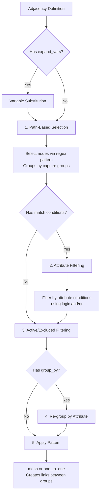
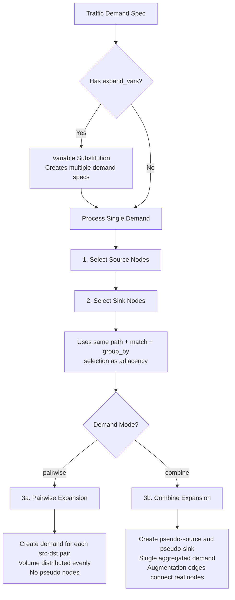

# Domain-Specific Language (DSL)

Quick links:

- [Design](design.md) — architecture, model, algorithms, workflow
- [Workflow Reference](workflow.md) — analysis workflow configuration and execution
- [CLI Reference](cli.md) — command-line tools for running scenarios
- [API Reference](api.md) — Python API for programmatic scenario creation
- [Auto-Generated API Reference](api-full.md) — complete class and method documentation

This document describes the DSL for defining network scenarios in NetGraph. Scenarios are YAML files that describe network topology, traffic demands, and analysis workflows.

## Overview

A scenario file defines a complete network simulation including:

- **Network topology**: Nodes, links, and their relationships, as well as risk groups
- **Analysis configuration**: Traffic demands, failure policies, workflows
- **Reusable components**: Blueprints, hardware definitions

The DSL enables both simple direct definitions and complex hierarchical structures with templates and parameters.

## Template Syntaxes

The DSL uses three distinct template syntaxes in different contexts:

| Syntax | Example | Context | Purpose |
|--------|---------|---------|---------|
| `[1-3]` | `dc[1-3]/rack[a,b]` | Group names | Generate multiple groups |
| `$var` / `${var}` | `pod${p}/leaf` | Adjacency, demands | Template expansion with `expand_vars` |
| `{node_num}` | `srv-{node_num}` | `name_template` | Node naming (1-indexed) |

**These syntaxes are not interchangeable.** Each works only in its designated context.

**Why different syntaxes?** Each serves a distinct purpose:

| Syntax | Operation | Key Difference |
|--------|-----------|----------------|
| `[1-3]` | Static generation | Creates multiple definitions at parse time |
| `${var}` | Template substitution | Requires explicit `expand_vars` mapping |
| `{node_num}` | Sequential counter | Auto-increments based on `node_count` |

Bracket expansion generates structure; variable expansion parameterizes rules; node naming indexes instances.

## Entity Creation Architecture

The DSL implements two fundamentally different selection patterns optimized for different use cases. Understanding these patterns is essential for effective scenario authoring.

### Two Selection Models

The DSL uses distinct selection strategies depending on the operation:

**1. Path-Based Node Selection** (adjacency rules, traffic demands, workflow steps)

- Uses regex patterns on hierarchical node names
- Supports capture group-based grouping
- Supports attribute-based grouping (`group_by`)
- Supports attribute filtering (`match` conditions)
- Supports `active_only` filtering

**2. Condition-Based Entity Selection** (failure rules, membership rules, risk group generation)

- Works on nodes, links, or risk_groups (`entity_scope`)
- Uses only attribute-based filtering (`conditions`)
- No path/regex patterns (operates on all entities of specified type)

These patterns share common primitives (condition evaluation, match specification) but serve different purposes and should not be confused.

### Adjacency Creation Flow

Adjacency rules create links between nodes using path-based selection with optional filtering:



**Processing Steps:**

1. **Path Selection**: Regex pattern matches nodes by hierarchical name
   - Capture groups create initial grouping
   - If no path specified, selects all nodes
2. **Attribute Filtering**: Optional `match` conditions filter nodes
   - Uses `logic: "and"` or `"or"` (default: `"or"`)
   - Supports operators: `==`, `!=`, `<`, `>`, `contains`, `in`, etc.
3. **Active Filtering**: Filters disabled nodes based on context
   - Adjacency default: `active_only=false` (creates links to disabled nodes)
4. **Attribute Grouping**: Optional `group_by` overrides regex capture grouping
5. **Pattern Application**: Creates links between selected node groups
   - `mesh`: Every source to every target
   - `one_to_one`: Pairwise with wrap-around

**Key Characteristics:**

- `default_active_only=False` (links are created to disabled nodes)
- `match.logic` defaults to `"or"` (inclusive matching)
- Supports variable expansion via `expand_vars`

### Traffic Demand Creation Flow

Traffic demands follow a similar pattern but with important differences:



**Key Differences from Adjacency:**

1. **Active-only default**: `default_active_only=True` (only active nodes participate)
2. **Two selection phases**: Source nodes first, then sink nodes (both use same selector logic)
3. **Expansion modes**:
   - **Pairwise**: Creates individual demands for each (source, sink) pair
   - **Combine**: Creates pseudo nodes and a single aggregated demand
4. **Group modes**: Additional layer (`flatten`, `per_group`, `group_pairwise`) for handling grouped selections

**Processing Steps:**

1. Select source nodes using unified selector (path + match + group_by)
2. Select sink nodes using unified selector
3. Apply mode-specific expansion:
   - **Pairwise**: Volume evenly distributed across all pairs
   - **Combine**: Single demand with pseudo nodes for aggregation

### Risk Group Creation Flow

Risk groups use the condition-based selection model:


**Creation Methods:**

1. **Direct Definition**: Explicitly name risk groups, entities reference them
2. **Membership Rules**: Auto-assign entities based on attribute matching
3. **Generate Blocks**: Auto-create risk groups from unique attribute values

**Key Characteristics:**

- **No path patterns**: Operates on ALL entities of specified scope
- **Only attribute-based**: Uses `conditions` exclusively
- **Logic defaults to "and"** for membership (stricter matching)
- **Hierarchical support**: Risk groups can contain other risk groups as children

### Comparison Table

| Feature | Adjacency | Traffic Demands | Risk Groups |
|---------|-----------|----------------|-------------|
| Selection Type | Path-based | Path-based | Condition-based |
| Regex Patterns | Yes | Yes | No |
| Capture Groups | Yes | Yes | No |
| `group_by` | Yes | Yes | Yes (generate only) |
| `match` Conditions | Yes | Yes | Yes (membership/generate) |
| `active_only` Default | False | True | N/A |
| `match.logic` Default | "or" | "or" | "and" (membership) |
| Variable Expansion | Yes | Yes | No |
| Entity Scope | Nodes only | Nodes only | Nodes, links, risk_groups |

### Shared Evaluation Primitives

All selection mechanisms share common evaluation primitives:

1. **Condition evaluation**: `evaluate_condition()` handles all operators
   - Comparison: `==`, `!=`, `<`, `<=`, `>`, `>=`
   - String/collection: `contains`, `not_contains`, `in`, `not_in`
   - Existence: `any_value`, `no_value`

2. **Condition combining**: `evaluate_conditions()` applies `"and"`/`"or"` logic

3. **Attribute flattening**: Unified access to entity attributes
   - `flatten_node_attrs()`: Merges node.attrs with top-level fields
   - `flatten_link_attrs()`: Merges link.attrs with top-level fields
   - `flatten_risk_group_attrs()`: Merges risk_group.attrs with top-level fields

4. **Dot-notation support**: `resolve_attr_path()` handles nested attributes
   - Example: `hardware.vendor` resolves to `attrs["hardware"]["vendor"]`

5. **Variable expansion**: `expand_templates()` handles `$var` and `${var}` substitution
   - Supports `cartesian` and `zip` expansion modes

### Context-Aware Defaults

The DSL uses context-aware defaults to optimize for common use cases:

| Context | Selection Type | Active Only | Match Logic | Rationale |
|---------|---------------|-------------|-------------|-----------|
| Adjacency | Path-based | False | "or" | Create links to all nodes, including disabled |
| Demands | Path-based | True | "or" | Only route traffic through active nodes |
| Node Overrides | Path-based | False | "or" | Modify all matching nodes |
| Workflow Steps | Path-based | True | "or" | Analyze only active topology |
| Membership Rules | Condition-based | N/A | "and" | Precise matching for risk assignment |
| Failure Rules | Condition-based | N/A | "or" | Inclusive matching for failure scenarios |
| Generate Blocks | Condition-based | N/A | N/A | No conditions, groups by values |

These defaults ensure intuitive behavior while remaining overridable when needed.

## Top-Level Keys

```yaml
network:                 # Network topology (required)
blueprints:              # Reusable network templates
components:              # Hardware component library
risk_groups:             # Failure correlation groups
vars:                    # YAML anchors and variables for reuse
traffic_matrix_set:      # Traffic demand definitions
failure_policy_set:      # Failure simulation policies
workflow:                # Analysis execution steps
```

## `network` - Core Foundation

The only required section. Defines network topology through nodes and links.

### Direct Node and Link Definitions

**Individual Nodes:**

```yaml
network:
  nodes:
    SEA:
      disabled: true
      attrs:
        coords: [47.6062, -122.3321]
        hardware:
          component: "LeafRouter"
          count: 1
    SFO:
      attrs:
        coords: [37.7749, -122.4194]
        hardware:
          component: "SpineRouter"
          count: 1
```

Recognized keys for each node entry:

- `disabled`: boolean (optional)
- `attrs`: mapping of attributes (optional)
- `risk_groups`: list of risk-group names (optional)

**Individual Links:**

```yaml
network:
  links:
    - source: SEA
      target: SFO
      link_params:
        capacity: 200
        cost: 6846
        attrs:
          distance_km: 1369.13
          media_type: "fiber"
          hardware:
            source: {component: "800G-ZR+", count: 1}
            target: {component: "1600G-2xDR4", count: 1}
```

Recognized keys for each link entry:

- `source`, `target`: node names (required)
- `link_params`: mapping with only these keys allowed: `capacity`, `cost`, `disabled`, `risk_groups`, `attrs`
- `link_count`: integer number of parallel links to create (optional; default 1)

### Group-Based Definitions

**Node Groups:**

```yaml
network:
  groups:
    leaf:
      node_count: 4
      name_template: "leaf-{node_num}"
      attrs:
        role: "leaf"
    spine:
      node_count: 2
      name_template: "spine-{node_num}"
      attrs:
        role: "spine"
```

**Adjacency Rules:**

```yaml
network:
  adjacency:
    - source: /leaf
      target: /spine
      pattern: "mesh"           # Connect every leaf to every spine
      link_params:
        capacity: 3200
        cost: 1
        # Only the following keys are allowed inside link_params:
        # capacity, cost, disabled, risk_groups, attrs
    - source: /spine
      target: /spine
      pattern: "one_to_one"     # Connect spines pairwise
      link_count: 2              # Create 2 parallel links per adjacency (optional)
      link_params:
        capacity: 1600
        cost: 1
        attrs:
          hardware:
            source: {component: "800G-DR4", count: 2}
            target: {component: "800G-DR4", count: 2}
```

### Attribute-filtered Adjacency (selector objects)

You can filter the source or target node sets by attributes using the same condition syntax as failure policies. Replace a string `source`/`target` with an object that has `path` and optional `match`:

```yaml
network:
  adjacency:
    - source:
        path: "/leaf"
        match:
          logic: "and"         # default: "or"
          conditions:
            - attr: "role"
              operator: "=="
              value: "leaf"
      target:
        path: "/spine"
        match:
          conditions:
            - attr: "role"
              operator: "=="
              value: "spine"
      pattern: "mesh"
      link_params:
        capacity: 100
        cost: 1
```

Notes:

- `path` is a regex pattern matched against node names (anchored at start via Python `re.match`).
- `match.conditions` uses the shared condition operators: `==`, `!=`, `<`, `<=`, `>`, `>=`, `contains`, `not_contains`, `any_value`, `no_value`.
- Conditions evaluate over a flat view of node attributes combining top-level fields (`name`, `disabled`, `risk_groups`) and `node.attrs`.
- `logic` in the `match` block accepts "and" or "or" (default "or").
- Selectors filter node candidates before the adjacency `pattern` is applied.
- Cross-endpoint predicates (e.g., comparing a source attribute to a target attribute) are not supported.
- Node overrides run before adjacency expansion; link overrides run after adjacency expansion.

Path semantics:

- All paths are relative to the current scope. There is no concept of absolute paths.
- Leading `/` is stripped and has no functional effect - `/leaf` and `leaf` are equivalent.
- Within a blueprint, paths resolve relative to the instantiation path. For example, if a blueprint is used under group `pod1`, then `source: /leaf` resolves to `pod1/leaf`.
- At top-level `network.adjacency`, the parent path is empty, so patterns match against full node names.

Example with OR logic to match multiple roles:

```yaml
network:
  adjacency:
    - source:
        path: "/metro1/dc[1-1]"
        match:
          conditions:
            - attr: "role"
              operator: "=="
              value: "dc"
      target:
        path: "/metro1/pop[1-2]"
        match:
          logic: "or"
          conditions:
            - attr: "role"
              operator: "=="
              value: "leaf"
            - attr: "role"
              operator: "=="
              value: "core"
      pattern: "mesh"
```

**Connectivity Patterns:**

- `mesh`: Full connectivity between all source and target nodes
- `one_to_one`: Pairwise connections. Compatible sizes means max(|S|,|T|) must be an integer multiple of min(|S|,|T|); mapping wraps modulo the smaller set (e.g., 4×2 and 6×3 valid; 3×2 invalid).

### Bracket Expansion

Create multiple similar groups using bracket notation:

```yaml
network:
  groups:
    dc[1-3]/rack[a,b]:     # Creates dc1/racka, dc1/rackb, dc2/racka, etc.
      node_count: 4
      name_template: "srv-{node_num}"
```

**Expansion Types:**

- Numeric ranges: `[1-4]` → 1, 2, 3, 4
- Explicit lists: `[red,blue,green]` → red, blue, green

**Scope:** Bracket expansion applies to:

- **Group names** under `network.groups` and `blueprints.*.groups`
- **Risk group names** in top-level `risk_groups` definitions (including children)
- **Risk group membership arrays** on nodes, links, and groups

Component names, direct node names (`network.nodes`), and other string fields treat brackets as literal characters.

**Risk Group Expansion Examples:**

```yaml
# Definition expansion - creates DC1_Power, DC2_Power, DC3_Power
risk_groups:
  - name: "DC[1-3]_Power"

# Membership expansion - assigns to RG1, RG2, RG3
network:
  nodes:
    Server:
      risk_groups: ["RG[1-3]"]
```

**Limitations and Workarounds:**

| Pattern | Behavior | Workaround |
|---------|----------|------------|
| `[01-03]` | Produces `1, 2, 3` (no leading zeros) | Use explicit list: `[01,02,03]` |
| `[A-C]` | Error (letter ranges not supported) | Use explicit list: `[A,B,C]` |
| `[1-10]` | Produces `1, 2, ..., 10` | Works correctly |

The range syntax `[start-end]` only supports integers. For letters, mixed sequences, or zero-padded numbers, use comma-separated explicit lists.

### Variable Expansion in Adjacency

Use `$var` or `${var}` syntax for template substitution:

```yaml
adjacency:
  - source: "plane${p}/rack${r}"
    target: "spine${s}"
    expand_vars:
      p: [1, 2]
      r: ["a", "b"]
      s: [1, 2, 3]
    expansion_mode: "cartesian"  # All combinations
    pattern: "mesh"

  - source: "server${idx}"
    target: "switch${idx}"
    expand_vars:
      idx: [1, 2, 3, 4]
    expansion_mode: "zip"        # Paired by index
    pattern: "one_to_one"
```

## `blueprints` - Reusable Templates

Templates for network segments that can be instantiated multiple times:

```yaml
blueprints:
  leaf_spine:
    groups:
      leaf:
        node_count: 4
        name_template: "leaf-{node_num}"
      spine:
        node_count: 2
        name_template: "spine-{node_num}"
    adjacency:
      - source: /leaf
        target: /spine
        pattern: mesh
        link_params:
          capacity: 40
          cost: 1

network:
  groups:
    pod1:
      use_blueprint: leaf_spine
    pod2:
      use_blueprint: leaf_spine
      parameters:                # Override blueprint parameters
        leaf.node_count: 6
        spine.name_template: "core-{node_num}"
```

**Blueprint Features:**

- Define groups and adjacency rules once, reuse multiple times
- Override parameters using dot notation during instantiation
- Hierarchical naming: `pod1/leaf/leaf-1`, `pod2/spine/core-1`

## Node and Link Overrides

Modify specific nodes or links after initial creation:

```yaml
network:
  node_overrides:
    - path: "^pod1/spine/.*$"           # Regex pattern matching
      disabled: true
      attrs:
        maintenance_mode: "active"
    - path: "server-[1-3]$"             # Specific node subset
      attrs:
        priority: "high"

  link_overrides:
    - source: "^pod1/leaf/.*$"
      target: "^pod1/spine/.*$"
      link_params:
        capacity: 100                   # Override capacity
    - source: ".*/spine/.*"
      target: ".*/spine/.*"
      any_direction: true               # Bidirectional matching
      link_params:
        cost: 5
        attrs:
          link_type: "backbone"

Notes:

- For `link_overrides`, only the keys `source`, `target`, `link_params`, and optional `any_direction` are allowed at the top level. All parameter changes must be nested under `link_params`.
- `any_direction` defaults to `true` if omitted.
- Ordering: `node_overrides` run after node creation (groups and direct nodes) and before any adjacency expansion; `link_overrides` run after adjacency and direct links.
```

## `components` - Hardware Library

Define hardware components with attributes for cost and power modeling:

```yaml
components:
  SpineRouter:
    component_type: "chassis"
    description: "64-port spine router"
    capex: 50000.0
    power_watts: 2500.0
    power_watts_max: 3000.0
    capacity: 64000.0           # Gbps
    ports: 64
    attrs:
      vendor: "VendorName"
      model: "Model-9000"
    children:
      LineCard400G:
        component_type: "linecard"
        capex: 8000.0
        power_watts: 400.0
        capacity: 12800.0
        ports: 32
        count: 4

  Optic400G:
    component_type: "optic"
    description: "400G pluggable optic"
    capex: 2500.0
    power_watts: 12.0
    capacity: 400.0
    attrs:
      reach: "10km"
      wavelength: "1310nm"
```

**Component Usage:**

```yaml
network:
  nodes:
    spine-1:
      attrs:
        hardware:
          component: "SpineRouter"
          count: 2   # Optional multiplier; defaults to 1 if not set
  links:
    - source: spine-1
      target: leaf-1
      link_params:
        attrs:
          hardware:
            source: {component: "Optic400G", count: 4}
            target: {component: "Optic400G", count: 4}
```

## `risk_groups` - Risk Modeling

Define hierarchical failure correlation groups for modeling correlated failures. Risk groups can represent any failure correlation pattern: physical infrastructure, geographic regions, vendor dependencies, or custom domains.

### Understanding Hierarchy

Risk groups form parent-child trees that model **cascading failures**:

```yaml
risk_groups:
  - name: "Region_West"
    children:
      - name: "Site_Seattle"
      - name: "Site_Portland"
```

**Cascading semantics:** When a parent fails, all descendants also fail. This models real-world correlations where a regional outage affects all sites in that region.

**Storage model:** Children are nested within parents, not in the top-level dictionary:

```python
# Top-level only
scenario.network.risk_groups.keys()  # {'Region_West'}

# Access children via parent
region = scenario.network.risk_groups["Region_West"]
for child in region.children:
    print(child.name)  # Site_Seattle, Site_Portland
```

**Entity references:** Nodes and links reference risk groups by name. To reference a group, it must be defined at top level (children alone are not sufficient):

```yaml
risk_groups:
  - name: "Site_Seattle"      # Top-level definition enables references
  - name: "Region_West"
    children:
      - name: "Site_Seattle"  # Also a child for hierarchy

network:
  nodes:
    Router_SEA:
      risk_groups: ["Site_Seattle"]
```

### Common Use Cases

Risk groups can model any failure correlation pattern. Below are some common examples:

**Physical Infrastructure** (fiber paths, power zones, cooling systems)
**Geographic/Administrative** (regions, availability zones, maintenance windows)
**Vendor/Software Dependencies** (shared components, software versions)
**Logical Grouping** (service tiers, customer segments, custom domains)

### Example 1: Physical Infrastructure (Fiber Links)

One common use case is modeling physical infrastructure. For fiber links, you might use a hierarchy like Path → Conduit → Fiber Pair.

```yaml
risk_groups:
  # Top-level definitions for referenceable groups
  - name: "Conduit_NYC_CHI_C[1-2]"
    attrs:
      type: fiber_conduit

  # Hierarchy defines cascading relationships
  - name: "Path_NYC_CHI"
    attrs:
      type: fiber_path
      distance_km: 1200
    children:
      - name: "Conduit_NYC_CHI_C[1-2]"

network:
  nodes:
    NYC: {}
    CHI: {}
  links:
    - source: NYC
      target: CHI
      link_params:
        risk_groups: ["Conduit_NYC_CHI_C1"]
        attrs:
          fiber:
            path_id: "NYC-CHI"
            conduit_id: "NYC-CHI-C1"
```

**Cascading behavior:**

- Fiber pair failure affects only that pair
- Conduit failure affects all pairs in that conduit
- Path failure affects all conduits in that path

### Example 2: Physical Infrastructure (Data Center Nodes)

For data center nodes, you might model facility infrastructure with a hierarchy like Building → Room → Power Zone.

```yaml
risk_groups:
  # Top-level definitions for referenceable groups
  - name: "PowerZone_DC1_R1_PZ[A,B]"
    attrs:
      type: power_zone

  # Hierarchy defines cascading relationships
  - name: "Building_DC1"
    attrs:
      type: building
      location: "Ashburn, VA"
    children:
      - name: "Room_DC1_R[1-3]"
        attrs:
          type: room
        children:
          - name: "PowerZone_DC1_R1_PZ[A,B]"

network:
  nodes:
    Router_DC1_R1_RK01:
      risk_groups: ["PowerZone_DC1_R1_PZA"]
      attrs:
        facility:
          building_id: "DC1"
          room_id: "DC1-R1"
          power_zone: "DC1-R1-PZ-A"
```

**Cascading behavior:**

- Power zone failure affects equipment in that zone
- Room failure affects all zones in that room
- Building failure affects entire site

### Example 3: Geographic/Administrative Grouping

For geographic or administrative modeling:

```yaml
risk_groups:
  - name: "Region_West"
    attrs:
      type: geographic
    children:
      - name: "AZ_US_West_1a"
      - name: "AZ_US_West_1b"
  - name: "MaintenanceWindow_Weekend"
    attrs:
      type: operational
      schedule: "Sat-Sun 02:00-06:00 UTC"
```

### Membership Rules

Dynamically assign entities to risk groups based on attributes:

```yaml
risk_groups:
  - name: Conduit_NYC_CHI_C1
    membership:
      entity_scope: link
      match:
        logic: and           # "and" or "or" (default: "and")
        conditions:
          - attr: fiber.conduit_id
            operator: "=="
            value: "NYC-CHI-C1"

  - name: PowerZone_DC1_R1_PZA
    membership:
      entity_scope: node
      match:
        logic: and
        conditions:
          - attr: facility.power_zone
            operator: "=="
            value: "DC1-R1-PZ-A"
```

**Note:** Membership rules default to `logic: "and"` (stricter than adjacency/demand selectors which default to `"or"`). This ensures precise entity matching for failure correlation.

### Generated Risk Groups

Automatically create risk groups from entity attributes:

```yaml
risk_groups:
  # Generate risk groups from fiber path attributes on links
  - generate:
      entity_scope: link
      group_by: fiber.path_id
      name_template: Path_${value}
      attrs:
        type: fiber_path

  # Generate risk groups from facility attributes on nodes
  - generate:
      entity_scope: node
      group_by: facility.building_id
      name_template: Building_${value}
      attrs:
        type: building
```

### Validation

Risk group references are validated at scenario load time:

**Undefined Reference Detection:** All risk group names referenced by nodes and links must exist in the `risk_groups` section. This catches typos and missing definitions early:

```yaml
# This will fail validation
network:
  nodes:
    Router1:
      risk_groups: ["PowerZone_A"]  # References undefined risk group

risk_groups:
  - name: "PowerZone_B"  # Only PowerZone_B is defined
```

**Circular Hierarchy Detection:** Parent-child relationships cannot form cycles:

```yaml
# This will fail validation
risk_groups:
  - name: "GroupA"
    children:
      - name: "GroupB"
        children:
          - name: "GroupA"  # Error: circular reference
```

Validation errors list affected entities and undefined groups to aid debugging.

## `vars` - YAML Anchors

Defines reusable values using YAML anchors (`&name`) and aliases (`*name`) for deduplicating complex scenarios:

```yaml
vars:
  default_cap: &cap 10000
  base_attrs: &attrs {cost: 100, region: "dc1"}
  spine_config: &spine_cfg
    hardware:
      component: "SpineRouter"
      count: 1
    power_budget: 2500

network:
  nodes:
    spine-1: {attrs: {<<: *attrs, <<: *spine_cfg, capacity: *cap}}
    spine-2: {attrs: {<<: *attrs, <<: *spine_cfg, capacity: *cap, region: "dc2"}}
```

**Anchor Types:**

- **Scalar**: `&cap 10000` - Reference primitive values
- **Mapping**: `&attrs {cost: 100}` - Reference objects
- **Merge**: `<<: *attrs` - Merge properties with override capability

**Processing Behavior:**

- Anchors are resolved during YAML parsing, before schema validation
- The `vars` section itself is ignored by NetGraph runtime logic
- Anchors can be defined in any section, not just `vars`
- Merge operations follow YAML 1.1 semantics (later keys override earlier ones)

## `traffic_matrix_set` - Traffic Analysis

Define traffic demand patterns for capacity analysis:

```yaml
traffic_matrix_set:
  production:
    # Simple string pattern selectors
    - source: "^servers/.*"
      sink: "^storage/.*"
      demand: 1000
      mode: "combine"
      priority: 1
      flow_policy_config: "SHORTEST_PATHS_ECMP"

    # Dict selectors with attribute-based grouping
    - source:
        group_by: "dc"           # Group nodes by datacenter attribute
      sink:
        group_by: "dc"
      demand: 500
      mode: "pairwise"
      priority: 2

    # Dict selectors with filtering
    - source:
        path: "^dc1/.*"
        match:
          conditions:
            - attr: "role"
              operator: "=="
              value: "leaf"
      sink:
        path: "^dc2/.*"
        match:
          conditions:
            - attr: "role"
              operator: "=="
              value: "spine"
      demand: 200
      mode: "combine"
```

### Variable Expansion in Demands

Use `expand_vars` to generate multiple demands from a template:

```yaml
traffic_matrix_set:
  inter_dc:
    - source: "^${src_dc}/.*"
      sink: "^${dst_dc}/.*"
      demand: 100
      mode: "combine"
      expand_vars:
        src_dc: ["dc1", "dc2"]
        dst_dc: ["dc2", "dc3"]
      expansion_mode: "cartesian"  # All combinations (default)

    - source: "^${dc}/leaf/.*"
      sink: "^${dc}/spine/.*"
      demand: 50
      mode: "pairwise"
      expand_vars:
        dc: ["dc1", "dc2", "dc3"]
      expansion_mode: "zip"        # Paired by index
```

**Expansion Modes:**

- `cartesian`: All combinations of variable values (default)
- `zip`: Pair values by index (lists must have equal length)

### Selector Fields

The `source` and `sink` fields accept either:

- A string regex pattern matched against node names
- A selector object with `path`, `group_by`, and/or `match` fields

### Traffic Modes

- `combine`: Single aggregate flow between source and sink groups
- `pairwise`: Individual flows between all source-sink node pairs

### Flow Policies

- `SHORTEST_PATHS_ECMP`: IP/IGP routing with hash-based ECMP; equal split across equal-cost paths
- `SHORTEST_PATHS_WCMP`: IP/IGP routing with weighted ECMP; proportional split by link capacity
- `TE_WCMP_UNLIM`: MPLS-TE / SDN with capacity-aware WCMP; unlimited tunnels
- `TE_ECMP_16_LSP`: MPLS-TE with exactly 16 ECMP LSPs per demand
- `TE_ECMP_UP_TO_256_LSP`: MPLS-TE with up to 256 ECMP LSPs per demand

See [Flow Policy Presets](design.md#flow-policy-presets) for detailed configuration mapping and real-world network behavior.

## `failure_policy_set` - Failure Simulation

Define failure policies for resilience testing:

```yaml
failure_policy_set:
  single_link_failure:
    modes:                       # Weighted modes; exactly one mode fires per iteration
      - weight: 1.0
        rules:
          - entity_scope: "link"
            rule_type: "choice"
            count: 1
  weighted_modes:                # Example of weighted multi-mode policy
    modes:
      - weight: 0.30
        rules:
          - entity_scope: "risk_group"
            rule_type: "choice"
            count: 1
            weight_by: distance_km
      - weight: 0.35
        rules:
          - entity_scope: "link"
            rule_type: "choice"
            count: 3
            conditions:
              - attr: link_type
                operator: "=="
                value: dc_to_pop
            logic: and
            weight_by: target_capacity
      - weight: 0.25
        rules:
          - entity_scope: "node"
            rule_type: "choice"
            count: 1
            conditions:
              - attr: node_type
                operator: "!="
                value: dc_region
            logic: and
            weight_by: attached_capacity_gbps
      - weight: 0.10
        rules:
          - entity_scope: "link"
            rule_type: "choice"
            count: 4
            conditions:
              - attr: link_type
                operator: "=="
                value: leaf_spine
              - attr: link_type
                operator: "=="
                value: intra_group
              - attr: link_type
                operator: "=="
                value: inter_group
              - attr: link_type
                operator: "=="
                value: internal_mesh
            logic: or
```

**Rule Types:**

- `all`: Select all matching entities
- `choice`: Select specific count of entities
- `random`: Select entities with given probability

Notes:

- Policies are mode-based. Each mode has a non-negative `weight`. One mode is chosen per iteration with probability proportional to weights, then all rules in that mode are applied and their selections are unioned.
- Each rule has `entity_scope` ("node" | "link" | "risk_group"), optional `logic` ("and" | "or"; defaults to "or"), optional `conditions`, and one of `rule_type` parameters (`count` for choice, `probability` for random). `weight_by` can be provided for weighted sampling in `choice` rules.
- Condition language is the same as used in adjacency `match` selectors (see below) and supports: `==`, `!=`, `<`, `<=`, `>`, `>=`, `contains`, `not_contains`, `any_value`, `no_value`. Conditions evaluate on a flat attribute mapping that includes top-level fields and `attrs`.

## `workflow` - Execution Steps

Define analysis workflow steps:

```yaml
workflow:
  - step_type: NetworkStats
    name: network_statistics
  - step_type: MaximumSupportedDemand
    name: msd_baseline
    matrix_name: baseline_traffic_matrix
  - step_type: TrafficMatrixPlacement
    name: tm_placement
    matrix_name: baseline_traffic_matrix
    failure_policy: weighted_modes
    iterations: 1000
```

**Common Steps:**

- `BuildGraph`: Export graph to JSON (node-link) for external analysis
- `NetworkStats`: Compute basic statistics
- `MaxFlow`: Monte Carlo capacity analysis between node groups
- `TrafficMatrixPlacement`: Monte Carlo demand placement for a named matrix
- `MaximumSupportedDemand`: Search for `alpha_star` for a named matrix

See [Workflow Reference](workflow.md) for detailed configuration.

## Node Selection

NetGraph provides a unified selector system for selecting and grouping nodes across adjacency, demands, and workflow steps.

### Selector Forms

Selectors can be specified as:

1. **String pattern**: A regex matched against node names (anchored at start via `re.match()`)
2. **Selector object**: A dict with `path`, `group_by`, and/or `match` fields

At least one of `path`, `group_by`, or `match` must be specified in a selector object.

### String Pattern Examples

```yaml
# Exact match
source: "spine-1"

# Prefix match
source: "dc1/spine/"

# Wildcard patterns
source: "dc1/leaf.*"

# Anchored patterns
source: "^dc1/spine/switch-[1-3]$"

# Alternation
source: "^dc1/(spine|leaf)/.*$"
```

### Capturing Groups for Node Grouping

Regex capturing groups create node groupings for analysis:

```yaml
# Single group: (dc\d+)
# Creates groups: "dc1", "dc2", etc.

# Multiple groups: (dc\d+)/(spine|leaf)/switch-(\d+)
# Creates groups: "dc1|spine|1", "dc1|leaf|2", etc.
```

**Group Behavior:**

- Single capturing group: Group by captured value
- Multiple capturing groups: Join with `|` separator
- No capturing groups: Group by original pattern string

### Attribute-based Grouping

Use the `group_by` field to group nodes by an attribute value:

```yaml
# Group by metro attribute
source:
  group_by: "metro"

# Combine with path filtering
source:
  path: "^dc1/.*"
  group_by: "role"
```

Notes:

- `group_by` refers to a key in `node.attrs`. Nested keys are not supported.
- Nodes without the specified attribute are omitted.
- Group labels are the string form of the attribute value.

### Attribute-based Filtering

Use the `match` field to filter nodes by attribute conditions:

```yaml
source:
  path: "^dc1/.*"
  match:
    logic: "and"           # "and" or "or" (default: "or")
    conditions:
      - attr: "role"
        operator: "=="
        value: "leaf"
      - attr: "tier"
        operator: ">="
        value: 2
```

**Supported operators:** `==`, `!=`, `<`, `<=`, `>`, `>=`, `contains`, `not_contains`, `in`, `not_in`, `any_value`, `no_value`

### Workflow Examples

```yaml
workflow:
  - step_type: MaxFlow
    source:
      group_by: "metro"      # Group by metro attribute
    sink: "^metro2/.*"       # String pattern
    mode: "pairwise"
```

### Adjacency Examples

```yaml
network:
  adjacency:
    - source:
        group_by: "role"
      target:
        path: "^dc2/leaf/.*"
      pattern: mesh
```

### Notes

- For links, risk groups, and failure policies, use `conditions` with an `attr` field in rules (see Failure Simulation).
- Blueprint scoping: In blueprints, paths are relative to the blueprint instantiation path.
